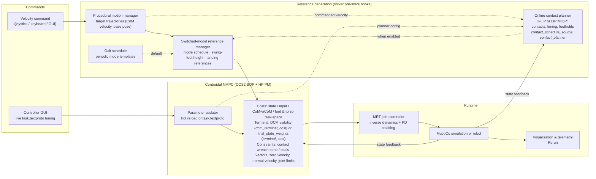

# Whole-Body Humanoid MPC

This repository contains a Whole-Body Nonlinear Model Predictive Controller (NMPC) for humanoid loco-manipulation control. This approach directly optimizes through the **full-order torque-level dynamics in real time** to generate dynamic humanoid behaviors, building upon an extended and updated version of [OCS2](https://github.com/leggedrobotics/ocs2) integrated natively into a **Bazel monorepo**.

**Interactive Velocity and Base Height Control via Joystick:**


---

## 🤖 MPC Formulations

### Centroidal Dynamics MPC
The centroidal MPC optimizes over the **whole-body kinematics** and the center of mass dynamics, with a choice to use either a Single Rigid Body Dynamics (SRBD) model or the full centroidal dynamics. This approach extends the OCS2 centroidal formulation by generalizing costs and constraints to 6-DoF contacts and arbitrary end-effectors. For theoretical background, see [Sleiman et al., *A Unified MPC Framework for Whole-Body Dynamic Locomotion and Manipulation*](https://arxiv.org/abs/2103.00946).

### Whole-Body Dynamics MPC
The **whole-body dynamics** MPC optimizes directly over contact forces, joint accelerations, and joint torques across the planning horizon. For details on the optimization and dynamic consistency formulation, see [Galliker et al., *Bipedal Locomotion with Nonlinear Model Predictive Control: Online Gait Generation using Whole-Body Dynamics*](http://ames.caltech.edu/galliker2022bipedal.pdf).

### System Overview



The reference layer decides *when* and *where* the feet touch the ground, the NMPC decides *how* the whole body moves. Two optional formulation features change the reference layer and the end of the NMPC horizon; both are selected by name in the robot's `config/mpc/task.textproto`:

| Selection | What it does |
| --- | --- |
| `dcm_terminal_cost` in `costs` | Ends the horizon with a Divergent Component of Motion (capture point) viability cost instead of the quadratic terminal cost `terminal_cost` on `final_state_weights`; the two are alternatives, and start-up refuses a list that names both. Keeps the horizon end capturable for any gait cadence. |
| `contact_schedule_source: "contact_planner"` | Replaces the periodic gait schedule (`gait_schedule`, the default, which every robot ships) with an online contact planner, selected by `planner.type` in `config/mpc/contact_planning.textproto`: the closed-form H-LIP stepper (`hlip`, both shipped robots; [humanoid_nmpc/docs/hlip_contact_planner/README.md](humanoid_nmpc/docs/hlip_contact_planner/README.md)) or the mixed-integer program (`lip_miqp`: LIP model, branch-and-bound over HPIPM relaxations). It chooses the contact sequence, the switching times and the footholds from the current state and the velocity command. Optional, off by default: the executed schedule can adapt to measured early / late touch-downs and the landing targets can follow the capture point (the `phase_resetting` and `dcm_step_adjustment` rules of the planner's `execution` list). The planner is assembled from named terms listed in `config/mpc/contact_planning.textproto`, like the NMPC from the task file's lists. |

Both replaced a top-level boolean, now the retired fields `use_dcm_terminal_cost` and `use_contact_planning`: a task file that still carries one is refused when it is read, with a message naming its replacement. The formulation and the math of both features are described in [humanoid_nmpc/docs/README.md](humanoid_nmpc/docs/README.md).

---

## 🦾 Supported Robot Models

| Robot Platform | Centroidal NMPC | Whole-Body NMPC | MuJoCo Physics Sim | Dummy Sim |
|---|:---:|:---:|:---:|:---:|
| **Unitree G1** | ✅ | ✅ | ✅ | ✅ |
| **Unitree R1** | ✅ | — | ✅ | ✅ |
| **DRC Atlas** | ✅ | — | ✅ | ✅ |
| **EngineAI SA01** | ✅ | — | ✅ | ✅ |
| **1X Neo** | *Coming Soon* | *Coming Soon* | *Coming Soon* | *Coming Soon* |

**Unitree G1:**


**DRC Atlas:**


---

## 🚀 Getting Started

### 1. Repository Setup

```bash
git clone https://github.com/1x-technologies/wb-humanoid-mpc.git
cd wb-humanoid-mpc
```

> **Note:** The repository uses **Bazel 9.x** with `bzlmod` for hermetic dependency management. There is no ROS: the robot, the MPC and the operator tools are separate processes on a ZeroMQ + Protocol Buffers bus, and Rerun draws the robot, the plan and the plots ([humanoid_nmpc/docs/distributed_runtime/README.md](humanoid_nmpc/docs/distributed_runtime/README.md)).

### 2. Environment Setup

The recommended way to develop and run the simulation is using the provided Docker container.

<details>
<summary><b>Option A: VS Code Dev Containers (Recommended)</b></summary>

1. Install the [Dev Containers](https://marketplace.visualstudio.com/items?itemName=ms-vscode-remote.remote-containers) extension in VS Code.
2. Open the repository in VS Code, press `Ctrl+Shift+P` (or `Cmd+Shift+P` on macOS), and select **Dev Containers: Reopen in Container**.
3. Once the container builds, the environment is automatically set up.

</details>

<details>
<summary><b>Option B: Docker Compose / Remote SSH (Antigravity / Cursor / Terminal)</b></summary>

1. Start the container in detached mode. The first command caps its memory at 85% of the host's RAM with no swap
   beyond it (see `tools/resource_limits/set_container_memory_limit.sh`), so a runaway build is stopped inside the
   container instead of freezing the machine:
   ```bash
   tools/resource_limits/set_container_memory_limit.sh && docker compose up -d --build
   ```
2. Attach a terminal into the container:
   ```bash
   docker compose exec app bash
   ```
3. (Optional) Run `./docker/image_build.bash` and `./docker/launch_wb_mpc.bash` helper scripts.

</details>

<details>
<summary><b>Option C: Local Installation (Ubuntu 24.04)</b></summary>

Install Pinocchio from robotpkg into `/opt/openrobots`, then the system packages and Bazelisk, as the dev image does
(`docker/Dockerfile`):
```bash
sudo sh docker/install_robotpkg.sh
grep -v '^\s*#' dependencies.txt | envsubst | xargs sudo apt-get install -y --no-install-recommends
curl -sSL -o /usr/local/bin/bazel https://github.com/bazelbuild/bazelisk/releases/latest/download/bazelisk-linux-amd64
sudo chmod +x /usr/local/bin/bazel
make install-hooks
```

</details>

---

## 🛠️ Build & Test Commands

The repository includes a top-level `Makefile` for streamlined building and testing:

```bash
# Build all Bazel targets across the monorepo
make build-all

# Run all unit and integration tests
make test-all

# Run code formatters (Clang-Format, Black, whitespace)
make format

# Run linter and verify IFTTT directives
make lint

# Clean build artifacts
make clean        # Incremental clean
make clean-all    # Deep clean including external caches
```

---

## 🖥️ Launching Simulations

### How it runs
The robot and the MPC are separate processes on a ZeroMQ + Protocol Buffers bus, as on hardware: the **robot process**
(the realtime loop: MuJoCo as its backend, the MRT joint controller, the FSM) runs on the robot's computer, the **MPC
node**, the **remote-control GUI** and the **Rerun bridge** on the laptop
([architecture](humanoid_nmpc/docs/distributed_runtime/README.md)). Simulation mirrors that: `make launch-<robot>-sim`
starts the robot process in the `robot-sim` container - the robot's own slim image and compose file, with its
`SCHED_FIFO` and locked memory, plus only the MuJoCo viewer's GL - and the laptop side in the dev container, over the
remote MPC link. Starting a container takes the host's Docker, so run the `-sim` targets **on the host** (Linux); they
build and run the laptop side inside the dev container through `docker exec` (`DEV_CONTAINER=`). The dummy-sim and
sandbox targets run anywhere.

**After the switch from ROS, recreate the dev container.** A dev container created from the old ROS image has no
Pinocchio in `/opt/openrobots` and cannot build this checkout (`tools/deploy/in_dev_container.sh` says so): rebuild it
from `docker/Dockerfile` and `docker-compose.yaml` (Dev Containers: **Rebuild Container**, or
`docker compose up -d --build --force-recreate` on the host) before using the launch and deployment targets.

### Visualization Options
- **Local Linux:** GUI windows (MuJoCo viewer / Rerun / Controller GUI) draw on the display of the shell the target
  runs in. From the host, allow the containers on it once: `xhost +SI:localuser:root +SI:localuser:$(id -un)`.
- **Remote SSH (Linux host):** Use the `-vnc` targets to stream the desktop directly to your browser. Navigate to **`http://localhost:6080/vnc.html`** and click **Connect**. See the [Visualization Guide](.devcontainer/README.md) for full details.
- **macOS (Docker Desktop):** the containers do not share a host network there, so the MuJoCo `-sim` targets do not
  run; use `make launch-<robot>-dummy-sim-vnc` and the sandbox targets, which run entirely in the dev container.
- **Rerun in a browser:** add `RERUN_SINK=serve_web` and open **`http://localhost:9090`**.

### Launch Targets

<!-- LINT.IfChange(launch_targets) -->
For every robot configuration - `g1` (Unitree G1, centroidal MPC), `wb-g1` (G1, whole-body MPC), `drc-atlas`, `r1`
(Unitree R1), `sa01` (EngineAI SA01):

```bash
make launch-drc-atlas-sim             # MuJoCo sim: robot-sim container + MPC, GUI and Rerun bridge (run on the host)
make launch-drc-atlas-sim-vnc         # ... on the VNC desktop (Browser / Remote SSH; not on macOS: Docker Desktop)
make launch-drc-atlas-dummy-sim       # the MPC against the dummy simulator (the MPC model's own rollout)
make launch-drc-atlas-dummy-sim-vnc
make launch-drc-atlas-sandbox-vnc     # the URDF in Rerun with a slider per joint (not for wb-g1: use g1)
make launch-drc-atlas-sim NETEM="delay 3ms 1ms loss 0.5%"   # the bus over a delayed, lossy link (tc netem)
make launch-drc-atlas-sim HEADLESS=true RERUN_SINK=serve_web
```

On a real robot (the robot's computer needs only Docker; [tools/deploy](tools/deploy/README.md)):

```bash
cp config/ipc/two_machine.example.textproto my_network.textproto     # both machines' addresses
make deploy-robot ROBOT=drc_atlas HOST=<robot ssh host> NETWORK=my_network.textproto SERVICE=enable
make launch-drc-atlas-mpc NETWORK=my_network.textproto               # the laptop side
make launch-drc-atlas-robot HOST=<robot ssh host>                    # or the robot side in the foreground
```

`make help` lists the targets and their variables; `make rerun-viewer` / `make rerun-web` start a bridge on its own,
`make ipc-list`, `make ipc-echo TOPIC=mpc/status` and `make ipc-hz TOPIC=robot/mpc_observation` inspect the bus.
<!-- LINT.ThenChange(//Makefile:launch_targets, //Makefile:robot_configurations) -->

> **Cleanup Tip:** Run `make kill-sims` at any time to stop what a launch target left running: its launcher, the
> robot-sim container and a NETEM qdisc.

---

## 🕹️ Interactive Controls & Simulation Lifecycle

### Supervisory Finite State Machine (FSM)
Simulations launch in a safe **Zero-Torque Mode** suspended on a virtual gantry so the robot settles safely while the MPC solver initializes:

| FSM State / Mode | Description |
|---|---|
| `ZERO_TORQUE` | Passive spawn state; solver warms up without commanding torques. |
| `JOINT_PD` | Joint-space proportional-derivative posture control tracking nominal stance. |
| `WB_MPC` / `MPC_ACTIVE` | Active Whole-Body / Centroidal MPC solver closed-loop control. |
| `LOCK_GANTRY` / `UNLOCK_GANTRY` | Suspends or releases the virtual gantry holding the floating base. |

State transitions travel on the IPC bus (`humanoid_nmpc/humanoid_mpc_ipc/include/humanoid_mpc_ipc/Topics.h`):
- **Command Topic:** `operator/fsm_command` (`humanoid_mpc_msgs.FsmCommand`: the command and a sequence number)
- **State Topic:** `robot/fsm_state` (`humanoid_mpc_msgs.FsmState`: `mode`, `gantry_locked`, `controller_resets`, `mpc_healthy`), published on every change and at 2 Hz, so a GUI that starts late learns the current state (the remote control re-centers its joysticks on a transition into a passive mode, a new lock and a new reset, see humanoid_nmpc/remote_control/README.md)

### Teleoperation & Root Height Control
- Use the **Robot Base Controller GUI** or connect an **Xbox Controller** to command velocity vectors ($v_x, v_y, \omega_z$).
- The **Height Slider** controls the **Virtual Gantry Height** when locked (allowing you to lift and lower the robot above the ground) and sets the **Desired Pelvis Height** when walking.


### 🎛️ Interactive Controller GUI & Parameter Tuning Tabs

The joystick GUI (`base_velocity_controller_gui`, [humanoid_nmpc/remote_control/README.md](humanoid_nmpc/remote_control/README.md)) features a dark-themed tabbed interface:

1. **🕹️ Base Controller:**
   - Command planar velocities ($v_x, v_y, \omega_z$) via interactive virtual joysticks or physical Xbox gamepad.
   - Adjust root pelvis height and virtual gantry suspension.
   - Switch supervisory FSM modes (`ZERO_TORQUE`, `JOINT_PD`, `GRAVITY_COMP`, `WB_MPC`, `SAFETY`).
   - Checkbox selecting the simulator's cheater contact estimator (task file `contact_estimator: "cheater_sim"` on, `"always_in_contact"` off), applied live through the parameter topic.
   - **Open Rerun viewer** starts the Rerun bridge, which opens the native viewer with the 3D scene and the plot tabs.

2. **⚙️ Joint PD Gains (`joint_pd_gains.textproto`):**
   - A slider and a numeric entry per gain of the file: the default gains and each joint's proportional ($K_p$) and derivative ($K_d$) gain.
   - **Limb Grouping:** the joints' rows are grouped into torso and spine, left and right leg, left and right arm, and head and neck.
   - **Global Scaling:** Multipliers ($\times 0.001 \dots \times 2.0$) that scale all $K_p$ and $K_d$ gains simultaneously.
   - **Robot Model Presets:** Instantly switch between Unitree G1, DRC Atlas, Unitree R1, and EngineAI SA01 gain files.
   - **💾 Save** writes the laptop's file and sends the same text to the robot's store; the status line shows the
     robot's answer.

3. **📈 MPC Parameters (`task.textproto`, and `contact_planning.textproto` for a robot with a contact planner):**
   - A slider, entry, checkbox or choice per number, bool and registry name of the two files, shown block by block in
     the order of the file: the state, input and terminal weights by coordinate and joint name (`state_weights`,
     `input_weights`, `final_state_weights`), the task-space costs, the constraints and barriers, the solver and
     horizon, and the contact planner's blocks.
   - Both formulations apply the hot fields live: the parameter updater of the running centroidal or whole-body MPC
     applies an edit before its next solve. A field the running MPC applies only at its next start is labeled
     **(restart)**; one the file's formulation does not read is labeled **not applicable** and says why.
   - **💾 Save** writes both files on the laptop and sends the task file's text to the robot's store (the
     contact-planning file is the MPC's alone).

4. **🎯 Joint Targets:** a position slider per joint, starting from the reference file's `default_joint_state`, published in `JOINT_PD` only.
5. **🎚️ Command Limits (`reference.textproto`):** the velocity command limits and reference defaults, which the running MPC reloads when the file is saved; Save also sends the file to the robot's store, which the robot reads at its next start.
6. **🏐 Dodgeball:** aims and throws a ball at the robot in simulation ([humanoid_nmpc/docs/dodgeball/README.md](humanoid_nmpc/docs/dodgeball/README.md)).

The tuning tabs are built from the schemas of their files, so a hyperparameter added to a schema appears in the GUI
with no GUI code. How they publish and save is described in the next section.

---

### ⚙️ Configuration Files and Tuning (textproto)

Every hyperparameter of the MPC, the robot's controller and the tuning GUI lives in a typed textproto, parsed strictly
into the message of its schema in [humanoid_nmpc/humanoid_mpc_config](humanoid_nmpc/humanoid_mpc_config/README.md):

| File | Message | What it sets |
|---|---|---|
| `robot_models/<robot>/<package>/config/mpc/task.textproto` | `TaskFile` | the MPC formulation (term lists, weights, constraints, solver, horizon), the robot process, the simulator, the telemetry and the visualization |
| `.../config/command/reference.textproto` | `ReferenceFile` | the command limits and filters, the default base height and joint state, the initial gait |
| `.../config/controller/joint_pd_gains.textproto` | `JointPdGainsFile` | the PD gains and torque limits of the MRT joint controllers |
| `.../config/mpc/contact_planning.textproto` | `ContactPlanningFile` | the online contact planner (DRC Atlas and EngineAI SA01) |
| `humanoid_nmpc/humanoid_common_mpc/config/command/gait.textproto` | `GaitFile` | the gaits of the procedural motion manager, shared by every robot |

Each file names its schema in its first two lines, which the parsers check and `make lint` requires. The task file
starts with the runtime flags of the robot process and the GUI:

```textproto
# proto-file: humanoid_nmpc/humanoid_mpc_config/task_file.proto
# proto-message: humanoid_mpc_config.TaskFile
telemetry_sinks: "bus"         # where the robot process sends robot/state, by name; no telemetry_sinks line turns it off
telemetry_frequency: 100       # [Hz] robot/state, decimated from the control loop
enable_online_tuning: true     # Enable runtime parameter and gain tuning in Controller GUI
# Targeted Pinocchio frames for telemetry logging (position, orientation, twist, accel, wrench)
telemetry_frames: "foot_l_contact"
telemetry_frames: "foot_r_contact"
telemetry_frames: "pelvis"
```

- **`telemetry_sinks`:** The telemetry sinks of the robot process, by name (`humanoid_nmpc/humanoid_common_mpc_app/robot/README.md`): `bus` publishes every sample on `robot/state`; a file without a `telemetry_sinks` line turns the telemetry off, and the realtime loop then samples nothing. The retired boolean `enable_telemetry` is refused with this replacement.
- **`enable_online_tuning`:** When `false`, the GUI disables all sliders, quick multipliers, and save buttons in both the **⚙️ Joint PD Gains** and **📈 MPC Parameters** tabs, displaying an orange safety badge `🔒 Online Tuning Disabled`.
- **`telemetry_frames`:** Optional targeted list of Pinocchio frames to monitor. The telemetry engine automatically computes forward kinematics, spatial twists, frame accelerations, and contact wrenches for both measured and MPC desired states.

Weights and states are addressed by name, never by index. Momenta, positions and velocities are `{x y z}` blocks, the
base orientation is tuned in Euler angles `{yaw pitch roll}`, and joints are named entries; every joint of the MPC
model is listed exactly once, and a missing, unknown or fixed joint is refused by name:

```textproto
state_weights {
  scaling: 85
  normalized_linear_momentum {
    x: 10  # h_com_x / robotMass
    y: 10  # h_com_y / robotMass
    z: 15  # h_com_z / robotMass
  }
  base_orientation {
    yaw: 0  # theta_base_z
    pitch: 0  # theta_base_y
    roll: 0  # theta_base_x
  }
  joint_positions { joint: "back_bkz" value: 5 }
  joint_positions { joint: "back_bky" value: 5 }
  # ... every other joint of the MPC model
}
```

- **Strict parsing.** A field the schema does not have, a value of the wrong type or a field given twice is an error
  that names the file, the line and the column (`task.textproto:12:3: ...`). A retired field says what replaced it:
  `use_dcm_terminal_cost`, for example, says to list `dcm_terminal_cost` under `costs`.
- **Defaults.** A field left out takes the schema's default (`[default = ...]` in the `.proto`); a repeated field left
  out is empty.
- **Named components are strings** (`costs: "dcm_terminal_cost"`, `contact_estimator: "cheater_sim"`,
  `planner { type: "hlip" }`), which their registries resolve, refusing an unknown name with the valid ones.

**Tuning by hand.** Edit a file and save it: the running stack applies the fields the schema marks hot
(`reload: RELOAD_HOT` in a field's `tuning` options; the GUI labels the others "(restart)"). The MPC, centroidal or
whole-body, polls the task, reference and contact-planning files about once a second and logs every other changed
field as taking effect at the next start. The robot process reads its own copies from its persistent store: it watches
the stored task file for its controller-side settings (`contact_estimator`, `contact_wrench_gate`), and the MRT joint
controllers watch the stored PD gains file. An editor's save therefore reaches the MPC at once and a running robot at
its next start, or at once with `bazel run //humanoid_nmpc/remote_control:push_robot_config -- <file>`. A reload is
the whole file: a field or block it leaves out takes its default, as at start-up, not the value that was running. A
file that does not parse is logged and the running values stay, and so do those of a block whose conversion is
refused.

**Tuning in the GUI.** The MPC Parameters and Joint PD Gains tabs publish every change, debounced, as the whole edited
file - a typed `humanoid_mpc_config.MpcParameterUpdate` (task and contact-planning file) on `operator/mpc_parameters`,
a `humanoid_mpc_config.JointPdGainsFile` on `operator/pd_gains` - after parsing the edited text strictly, so an edit
the schema would refuse is reported on the tab and never sent. Nothing is written to disk until **💾 Save**, which
changes only the values that were edited and keeps every other byte of the file (comments, blank lines, `LINT`
directives, the spelling of the values not edited), replaces the file atomically so that no file watcher reads half
of it, and keeps the file as it was before the first save as `<file>.bak`. Save then delivers exactly the text it
wrote to the robot's persistent store (`operator/config_save`), which checks it as at start-up, stores it atomically
and answers; the tab shows "Saved on the laptop and on the robot", the robot's refusal, or that the robot's copy is
unknown when it did not answer ([humanoid_nmpc/remote_control/README.md](humanoid_nmpc/remote_control/README.md)).
**↺ Reset All** returns to the file as loaded or last saved, and publishes it.

**Adding a hyperparameter** takes a field in its schema, with its default and, where the GUI's defaults do not fit,
its `tuning` options (slider range, unit, reload class, or the reason it gets no widget), and its conversion in C++;
the GUI shows it with no GUI code ([humanoid_nmpc/humanoid_mpc_config/README.md](humanoid_nmpc/humanoid_mpc_config/README.md),
[humanoid_nmpc/remote_control/README.md](humanoid_nmpc/remote_control/README.md)).

---

### 📊 Real-Time Visualization & Telemetry (Rerun)

The Rerun bridge (`humanoid_nmpc/humanoid_rerun_viewer`) draws the robot, the MPC's plan and the telemetry plots in
[Rerun](https://rerun.io). It only subscribes to the bus, so it runs on any machine of the network file:

```bash
# Native viewer (in the container it opens on the VNC desktop)
bazel run //humanoid_nmpc/humanoid_rerun_viewer -- --urdf robot_models/unitree_g1/g1_description/urdf/g1_29dof.urdf

# Web viewer at http://localhost:9090
bazel run //humanoid_nmpc/humanoid_rerun_viewer -- --urdf <robot.urdf> --rerun_sink serve_web
```
*(Or click **Open Rerun viewer** in the Base Controller GUI.)*

#### Plot Tabs
1. **Base Pose & Euler:** the measured floating-base position and orientation (roll, pitch, yaw) against the MPC's reference.
2. **Base Twist:** the measured base linear and angular velocities against the reference.
3. **Contact Forces:** the MPC's planned foot contact forces against the forces the simulator's foot sensors measure.
4. **Joint Dynamics:** joint positions, velocities and efforts against the applied joint targets.
5. **Generalized Coordinates (Pinocchio):** generalized coordinates and velocities, measured against the reference.
6. **Frame Kinematics & Acceleration:** the feet's vertical acceleration and velocity, measured against the reference.

Further tabs plot the complete groups: every degree of freedom (measured, reference and the MPC's plan), every tracked
frame of `telemetry_frames`, both contact wrenches and the MPC observation, and the status of the robot loop and the MPC.

#### Telemetry on the Bus
| Topic | Message | Description |
|---|---|---|
| `robot/state` | `humanoid_mpc_msgs.RobotStateSample` | the robot process's measured state, joint actions and contact wrenches, every telemetry period (`telemetry_sinks: "bus"`) |
| `viz/telemetry` | `humanoid_mpc_msgs.TelemetrySeries` | the plots' series, one message per `robot/state` sample, from the MPC node's visualization publisher |
| `viz/scene` | `humanoid_mpc_msgs.VisualizationScene` | the robot instances (measured, terminal state, terminal target) and the markers of the plan |
| `robot/mpc_observation` | `humanoid_mpc_msgs.MpcObservation` | the observation the MPC solves from (`mpc_observation_logger` records it to CSV) |
| `mpc/status`, `robot/loop_timing`, `robot/fsm_state` | `MpcStatus`, `LoopTiming`, `FsmState` | the solver's health, the realtime loop's timing and the FSM |

The entity paths and series names are tabulated in [the bridge's README](humanoid_nmpc/humanoid_rerun_viewer/README.md);
`bazel run //tools/ipc:ipc_tool -- list` shows what is on the bus.

---

### MuJoCo 3D Viewer Hotkeys & Controls
When focused in the MuJoCo simulation viewport, use these keyboard shortcuts and mouse inputs:

| Key / Input | Action | Effect |
|:---:|---|---|
| **`k`** | Toggle **Camera Tracking** | Switches between robot tracking mode (`mjCAMERA_TRACKING` locked on pelvis/torso) and free manual camera (`mjCAMERA_FREE`) |
| **`0`** | Toggle **Floor / Ground** | Shows/hides ground plane (geom group 0) |
| **`1`** | Toggle **Visual Meshes** | Shows/hides high-res surface meshes (group 1) to inspect underlying collision geoms |
| **`2`** | Toggle **Collision Primitives** | Shows/hides collision capsules, boxes, and spheres (group 2) |
| **`3` - `5`** | Toggle **Auxiliary Groups** | Shows/hides user/sensor geom groups (groups 3–5) |
| **`t`** | Toggle **Model Transparency** | Alternates between 30% alpha (x-ray mode for internal joint/actuator inspection) and 100% opaque |
| **`c`** | Toggle **Contact Points** | Renders small colored spheres at active physical collision contact points |
| **`f`** | Toggle **Contact Forces** | Renders 3D vector arrows depicting normal and friction contact forces |
| **`m`** | Toggle **Center of Mass (CoM)** | Displays CoM indicator spheres for kinematic bodies / links |
| **`i`** | Toggle **Inertia Ellipsoids** | Renders equivalent inertia ellipsoids depicting principal moments of inertia |
| **`h`** | Toggle **Convex Hulls** | Displays computed convex hulls enclosing the link meshes |
| **`o`** | Toggle **Center of Mass** | Whole-body CoM sphere, its vertical, and its shadow on the ground (`center_of_mass` in `sim_visualizations`) |
| **`z`** | Toggle **ZMP** | Zero moment point of the physical ground reaction, as a disc on the ground (`zmp`) |
| **`d`** | Toggle **DCM** | Divergent component of motion (capture point) of the measured CoM, on the ground, with its offset from the CoM's shadow (`dcm`) |
| **`b`** | Toggle **Contact Timeline** | Barcode of planned vs ground-truth contact per contact point (`contact_timeline`) |
| **`g`** | Toggle **Target Contact Patches** | Contact patch of every foot at the planner's target position and yaw (`target_contact_patches`) |
| **`p`** | **Print Cheatsheet** | Prints the hotkey and mouse control guide to the terminal |
| **Left Click + Drag** | **Orbit Camera** | Rotates camera viewpoint around the robot or focal point |
| **Right Click + Drag** | **Pan Camera** | Translates camera position horizontally and vertically |
| **Scroll / Mid Drag** | **Zoom Camera** | Zooms camera toward or away from the target |
| **Shift + Click + Drag** | **Constrained Pan/Orbit** | Constrains mouse orbit/pan motion to the horizontal plane |

---

## ACoM Training Notebook

The Angular Center of Mass (aCOM) network behind `com_and_acom_tracking_cost` and the contact planner's heading model
is a small JAX SIREN trained per robot on centroidal momentum matrices. Start Jupyter with

```bash
make train-acom-jupyter
```

open **`http://localhost:8888`**, and load [`notebooks/train_acom_siren.ipynb`](notebooks/train_acom_siren.ipynb). It
trains the network for one robot and exports the C++ weight header `AcomSirenWeights<Robot>.h`; it is a thin driver over
`humanoid_learning/acom/train_main.py`, which does the same from the command line. Only the DRC Atlas network is
validated for closed-loop use - see [`humanoid_learning/acom/README.md`](humanoid_learning/acom/README.md).

---

## 🧠 Reinforcement Learning with MuJoCo Playground (`humanoid_learning`)

The repository includes a GPU-accelerated RL and imitation learning pipeline built on **Google DeepMind's [MuJoCo Playground](https://github.com/google-deepmind/mujoco_playground)**, **MJX**, **JAX**, and **Brax**.

<details>
<summary><b>GPU Training Setup & Hardware Prerequisites</b></summary>

### 1. Host Machine Prerequisites
Ensure your host machine has an NVIDIA driver and the **[NVIDIA Container Toolkit](https://docs.nvidia.com/datacenter/cloud-native/container-toolkit/latest/install-guide.html)** installed.

Verify passthrough from the host:
```bash
docker run --rm --gpus all ubuntu nvidia-smi
```

### 2. Starting with GPU Passthrough
```bash
docker compose -f docker-compose.yaml -f docker-compose.gpu.yaml up -d
docker compose exec app bash
```

*(Non-GPU hosts automatically fall back to multi-threaded CPU execution).*

</details>

<details>
<summary><b>Training Commands & Trajectory Export</b></summary>

```bash
# Run RL unit and smoke tests
make test-rl

# Launch PPO Policy Training (MJX / Playground)
make train-rl
# Or with customized parameters:
bazel run //humanoid_learning/training:train_ppo -- --num_envs=4096 --total_timesteps=10000000

# Export recorded MPC rollouts to HDF5 demonstration datasets
make export-rollouts

# Behavioral Cloning (BC) imitation learning warmstart
make train-bc

# Export trained policy to ONNX format for C++ deployment
bazel run //humanoid_learning/export:export_onnx -- --output_path=models/humanoid_policy.onnx
```

</details>

---

## 📚 Citation

If you use Whole-Body Humanoid MPC in your academic research, please cite:

```bibtex
@misc{wholebodyhumanoidmpcweb,
   author = {Manuel Yves Galliker and Nicholas Palomo},
   title = {Whole-body Humanoid MPC: Realtime Physics-Based Procedural Loco-Manipulation Planning and Control},
   howpublished = {https://github.com/nicholaspalomo/wb_humanoid_mpc},
   year = {2026}
}
```

## 👥 Acknowledgments

This project was originally created by [Manuel Yves Galliker](https://github.com/manumerous) and open-sourced in collaboration with 1X Technologies.

Special thanks to the open-source robotics community:
- [OCS2](https://github.com/leggedrobotics/ocs2)
- [Pinocchio](https://github.com/stack-of-tasks/pinocchio)
- [HPIPM](https://github.com/giaf/hpipm)
- [MuJoCo & MuJoCo Playground](https://github.com/google-deepmind/mujoco_playground)
