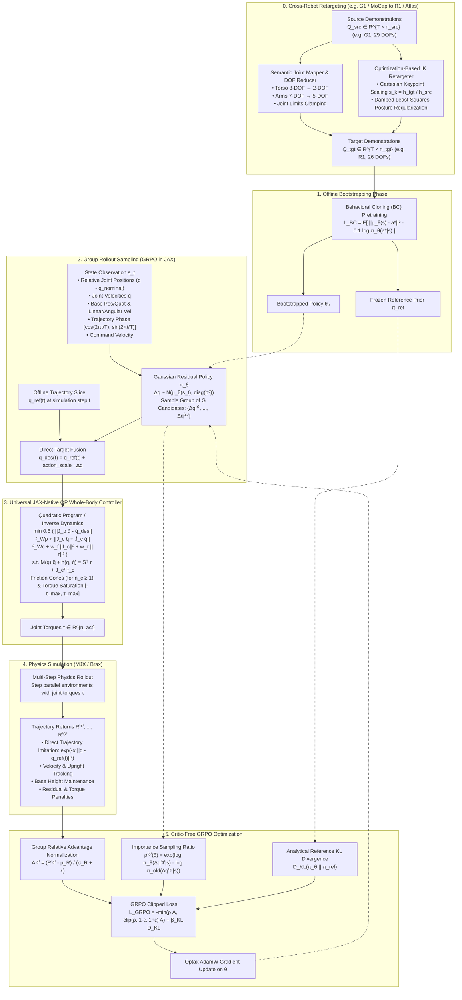

# Policy-Guided Whole-Body Control: Offline Trajectory Bootstrapped GRPO & Cross-Robot Retargeting

Implementation of **Group Relative Policy Optimization (GRPO)** for **Residual Whole-Body Control (WBC)** of general robots in **JAX / MuJoCo MJX / Brax**, bootstrapped from **offline whole-body MPC trajectories**, alongside a **Cross-Robot Kinematic & Trajectory Retargeting Framework**.

---

## 🌟 System Architecture & Block Diagram

```
+─────────────────────────────────────────────────────────────────────────────────────────────────────────────────+
│                                           System Architecture & Dataflow                                        │
│                                                                                                                 │
│   [Source Demonstrations (G1 / MoCap)] ──► [Cross-Robot Retargeting Pipeline] ──► [Target Dataset (R1 / Atlas)] │
│                                                                                           │                     │
│   [Offline Demonstration Dataset]                                                         │                     │
│          │ (HDF5/NPZ Whole-Body MPC / MoCap Rollouts: s, q_ref(t), tau_ref) ◄────────────┘                     │
│          ▼                                                                                                      │
│   [1. Behavioral Cloning (BC) Bootstrapping] ──► Initializes Policy θ_0 & Frozen Reference Prior π_ref          │
│                                                                                                                 │
│   [2. Online GRPO Sampling Loop (JAX / Brax / MJX)]:                                                            │
│      Offline Reference Trajectory q_ref(t) + Current State s_t ∈ R^{obs_dim}                                    │
│          │                                                                                                      │
│          ├─► Stochastic Gaussian Policy π_θ(Δq | s_t) ──► Samples Group of G Candidates {Δq^(1), ..., Δq^(G)}   │
│          │                                                                                                      │
│          ├─► Direct Trajectory Target Fusion: q_des^(g)(t) = q_ref(t) + action_scale * Δq^(g)                    │
│          │                                                                                                      │
│          ├─► [3. JAX-Native Quadratic Program (QP) Whole-Body Controller (WBC)]:                                │
│          │   min_{qddot, f_c, tau}  0.5 * ( ||J_p qddot - qddot_des||_Wp^2 + ||J_c qddot + Jdot_c qd||_Wc^2 +   │
│          │                                 w_f ||f_c||^2 + w_tau ||tau||^2 )                                    │
│          │   s.t.  M(q) qddot + h(q, qd) = S^T tau + J_c^T f_c   (Equations of Motion)                          │
│          │         |f_x| <= mu * f_z, |f_y| <= mu * f_z, f_z >= f_z_min  (Friction Cones for n_c contacts)        │
│          │         -tau_max <= tau <= tau_max                     (Actuator Saturation)                         │
│          │   Output: Motor Torques τ^(g) ∈ R^{n_act}                                                            │
│          │                                                                                                      │
│          ├─► [4. Physics Simulation (MuJoCo MJX / Brax)]:                                                       │
│          │   Step parallel environments ──► Trajectory returns R^(1), ..., R^(G)                                │
│          │                                                                                                      │
│          └─► [5. Critic-Free GRPO Optimization]:                                                                │
│              Adv^(g) = (R^(g) - mean({R^(j)})) / (std({R^(j)}) + eps)                                           │
│              L_GRPO = -min(ratio * Adv, clip(ratio, 1-eps, 1+eps) * Adv) + beta_KL * D_KL(pi_theta || pi_ref)   │
│              Optax AdamW Updates on Policy Parameters θ                                                         │
+─────────────────────────────────────────────────────────────────────────────────────────────────────────────────+
```

### Detailed Execution Pipeline Diagram



---

## 🦾 Cross-Robot Kinematic & Trajectory Retargeting

The retargeting framework enables mapping demonstration trajectories across embodiments with differing DOFs, link lengths, and joint limits (e.g. **Unitree G1 with 29 DOFs $\to$ Unitree R1 with 26 DOFs**, or **Human MoCap $\to$ Humanoid Robot**).

```
                                [Source Robot: G1 (29 DOFs)]
                                 • Left/Right Leg: 12 DOFs (6+6)
                                 • Waist: 3 DOFs (Yaw, Roll, Pitch)
                                 • Arms: 14 DOFs (7+7)
                                              │
                                              ▼
                             [Cross-Robot Retargeting Pipeline]
                                              │
                                ┌─────────────┴─────────────┐
                                ▼                           ▼
                      [Semantic Joint Mapper]    [Optimization-Based IK]
                      • 3-DOF Waist → 2-DOF      • Cartesian Keypoints
                      • 7-DOF Arm → 5-DOF        • Scale Factor s_k = h_tgt / h_src
                      • Axis Alignment & Clamp   • Damped Least-Squares
                                └─────────────┬─────────────┘
                                              │
                                              ▼
                                [Target Robot: R1 (26 DOFs)]
                                 • Left/Right Leg: 12 DOFs (6+6)
                                 • Waist: 2 DOFs (Roll, Yaw)
                                 • Arms: 10 DOFs (5+5)
                                 • Head: 2 DOFs (Pitch, Yaw)
```

### Mathematical Retargeting Formulation

#### 1. Semantic Anatomical Mapping with DOF Reduction
Given joint categories $\mathcal{C} = \{\text{leg}_L, \text{leg}_R, \text{torso}, \text{arm}_L, \text{arm}_R, \text{head}\}$:
$$q_{\text{tgt}, j} = \text{clip}\left( s_j \cdot q_{\text{src}, \sigma(j)}, q_{\min, j}^{\text{tgt}}, q_{\max, j}^{\text{tgt}} \right)$$
where $\sigma(j)$ is the anatomical mapping index correspondence. When the target has fewer DOFs (e.g. G1 waist pitch or wrist pitch/yaw unactuated in R1), unactuated coordinates are projected into the feasible target subspace.

#### 2. Optimization-Based Inverse Kinematics (IK)
Matches scaled Cartesian keypoints (hands, feet, pelvis, head) using forward kinematics $p_k(q)$:
$$\min_{q_{\text{tgt}}} \sum_{k \in \text{keypoints}} w_k \|p_k(q_{\text{tgt}}) - s_{\text{scale}} \cdot p_k^{\text{src}}(q_{\text{src}})\|^2 + w_{\text{prior}} \|q_{\text{tgt}} - q_{\text{prior}}\|^2 + w_{\text{smooth}} \|q_{\text{tgt}} - q_{\text{prev}}\|^2$$
$$\text{s.t.} \quad q_{\min}^{\text{tgt}} \le q_{\text{tgt}} \le q_{\max}^{\text{tgt}}$$
where $s_{\text{scale}} = \frac{h_{\text{nom}}^{\text{tgt}}}{h_{\text{nom}}^{\text{src}}}$ scales Cartesian positions proportional to standing height.

---

## 🦿 Mathematical Formulations

### 1. Model-Based Whole-Body Controller (WBC) QP

At each control step $t$, the controller solves a Quadratic Program (QP) to compute optimal generalized accelerations $\ddot{q} \in \mathbb{R}^{n_v}$, ground reaction contact forces $f_c \in \mathbb{R}^{3n_c}$, and actuator motor torques $\tau \in \mathbb{R}^{n_{\text{act}}}$:

$$\min_{\ddot{q}, f_c, \tau} \frac{1}{2} \left[ \|\ddot{q}_j - \ddot{q}_j^{\text{des}}\|_{W_p}^2 + \|J_c(q) \ddot{q} + \dot{J}_c(q, \dot{q}) \dot{q}\|_{W_c}^2 + w_f \|f_c - f_c^{\text{des}}\|^2 + w_\tau \|\tau\|^2 \right]$$

#### Posture / Residual Acceleration Target
$$\ddot{q}_j^{\text{des}} = k_p (q_{\text{des}}(t) - q_j) + k_d (\dot{q}_{\text{des}}(t) - \dot{q}_j) = k_p \left( q_{\text{ref\_offline}}(t) + \text{action\_scale} \cdot \Delta q_t - q_j \right) - k_d \dot{q}_j$$

#### Equations of Motion (Equality Constraint)
$$M(q) \ddot{q} + h(q, \dot{q}) = S^T \tau + J_c(q)^T f_c$$
where:
- $M(q) \in \mathbb{R}^{n_v \times n_v}$ is the generalized mass/inertia matrix.
- $h(q, \dot{q}) \in \mathbb{R}^{n_v}$ is the nonlinear bias vector (Coriolis, centrifugal, and gravity).
- $S = \begin{bmatrix} 0_{n_{\text{act}} \times (n_v - n_{\text{act}})} & I_{n_{\text{act}}} \end{bmatrix} \in \mathbb{R}^{n_{\text{act}} \times n_v}$ is the actuation selection matrix.
- $J_c(q) \in \mathbb{R}^{3n_c \times n_v}$ is the stance contact Jacobian for $n_c$ contact points ($n_c = 0$ for drones, $n_c = 2$ for bipeds, $n_c = 4$ for quadrupeds).

#### Contact Friction Cones & Normal Bounds (for $n_c \ge 1$)
$$|f_{c, x}^{(i)}| \le \mu f_{c, z}^{(i)}, \quad |f_{c, y}^{(i)}| \le \mu f_{c, z}^{(i)}, \quad f_{z, \min} \le f_{c, z}^{(i)} \le f_{z, \max}, \quad \forall i \in \{1, \dots, n_c\}$$

#### Actuator Torque Limits
$$-\tau_{\max} \le \tau \le \tau_{\max}$$

---

### 2. The RL Policy & Residual Formulation

The policy $\pi_\theta(\Delta q | s_t)$ outputs bounded residual joint position corrections $\Delta q \in [-1, 1]^{n_{\text{act}}}$:
$$\mu_\theta(s_t) = \tanh\left(\text{MLP}_\theta(s_t)\right), \quad \sigma = \exp(\text{clamp}(\log \sigma, -5.0, 1.0))$$
$$\Delta q \sim \mathcal{N}\left(\mu_\theta(s_t), \text{diag}(\sigma^2)\right)$$

#### Behavioral Cloning (BC) Bootstrapping Loss
Given an offline dataset of state-action demonstration transitions $\mathcal{D} = \{(s_i, a_i^*)\}_{i=1}^N$:
$$\mathcal{L}_{\text{BC}}(\theta) = \frac{1}{B} \sum_{i=1}^B \left[ \|\mu_\theta(s_i) - a_i^*\|^2 - 0.1 \log \pi_\theta(a_i^* | s_i) \right]$$
Pretraining on $\mathcal{D}$ initializes the policy parameters $\theta_0$ and creates a frozen reference policy $\pi_{\text{ref}} = \pi_{\theta_0}$.

#### Analytical KL Divergence
Between the current policy $\pi_\theta = \mathcal{N}(\mu_p, \sigma_p^2)$ and reference prior $\pi_{\text{ref}} = \mathcal{N}(\mu_q, \sigma_q^2)$:
$$D_{\text{KL}}(\pi_\theta \| \pi_{\text{ref}}) = \sum_{j=1}^{n_{\text{act}}} \left[ \log \frac{\sigma_{q, j}}{\sigma_{p, j}} + \frac{\sigma_{p, j}^2 + (\mu_{p, j} - \mu_{q, j})^2}{2 \sigma_{q, j}^2} - \frac{1}{2} \right]$$

---

### 3. Group Relative Policy Optimization (GRPO)

GRPO samples a group of $G$ candidate residual actions $\{\Delta q_i^{(1)}, \dots, \Delta q_i^{(G)}\}$ for each state $s_i$ across $B$ parallel environments.

#### Critic-Free Group Advantage Normalization
$$A_i^{(g)} = \frac{R_i^{(g)} - \bar{R}_i}{\sigma_{R, i} + \epsilon_{\text{adv}}}$$
where $\bar{R}_i = \frac{1}{G} \sum_{j=1}^G R_i^{(j)}$ and $\sigma_{R, i} = \sqrt{\frac{1}{G} \sum_{j=1}^G (R_i^{(j)} - \bar{R}_i)^2}$.

#### Clipped Surrogate Policy Objective with Reference KL Regularization
$$r_i^{(g)}(\theta) = \exp\left( \log \pi_\theta(\Delta q_i^{(g)} | s_i) - \log \pi_{\theta_{\text{old}}}(\Delta q_i^{(g)} | s_i) \right)$$
$$\mathcal{L}_{\text{GRPO}}(\theta) = -\frac{1}{B \cdot G} \sum_{i=1}^B \sum_{g=1}^G \min\left( r_i^{(g)}(\theta) A_i^{(g)}, \text{clip}(r_i^{(g)}(\theta), 1-\epsilon, 1+\epsilon) A_i^{(g)} \right) + \beta_{\text{KL}} D_{\text{KL}}(\pi_\theta \| \pi_{\text{ref}})$$

---

## 🔒 IFTTT Cross-File Linter Directives

To guarantee that adding or updating robot models keeps all search paths, CLI arguments, and retargeting mapping logic synchronized, Google `LINT.IfChange` / `LINT.ThenChange` directives guard key code regions:

1. **`supported_robots` Directive**:
   - Guarded in [`humanoid_learning/wbc/robot_model_loader.py`](wbc/robot_model_loader.py) $\leftrightarrow$ [`humanoid_learning/training/generate_robot_spec.py`](training/generate_robot_spec.py).
   - Guarantees CLI parser options always reflect all available repository robot models.
2. **`robot_limb_discovery` Directive**:
   - Guarded in [`humanoid_learning/wbc/robot_model_loader.py`](wbc/robot_model_loader.py) $\leftrightarrow$ [`humanoid_learning/retargeting/joint_mapper.py`](retargeting/joint_mapper.py).
   - Guarantees anatomical limb classification and cross-robot mapping tables stay in sync.

Run the repository IFTTT validator at any time:
```bash
python tools/hooks/check_ifttt.py
```

---

## 🛠️ Codebase Structure

```text
humanoid_learning/
├── configs/
│   ├── grpo_residual_wbc.yaml       # Centralized hyperparameters & WBC weights
│   └── robots/
│       ├── g1_29dof.yaml            # Unitree G1 robot definition (29 DOFs)
│       ├── r1.yaml                  # Unitree R1 robot definition (26 DOFs)
│       └── atlas.yaml               # Standard DRC Atlas definition (28 DOFs)
├── envs/
│   ├── base_env.py                  # Base MJX Humanoid environment
│   └── humanoid_residual_wbc_env.py # Offline trajectory residual WBC environment
├── wbc/
│   ├── __init__.py                  # WBC package exports
│   ├── robot_model_loader.py        # Dynamic MuJoCo / Pinocchio / YAML model parser
│   └── jax_wbc.py                   # Batched JAX QP Whole-Body Controller
├── retargeting/
│   ├── __init__.py                  # Retargeting package exports
│   ├── joint_mapper.py              # Semantic anatomical joint mapper & DOF reducer
│   ├── kinematic_retargeter.py      # Optimization-based IK keypoint retargeter
│   ├── trajectory_retargeter.py     # Batch dataset retargeting pipeline
│   └── retarget_dataset.py          # CLI dataset retargeting tool
├── training/
│   ├── generate_robot_spec.py       # CLI robot spec generator utility
│   ├── offline_dataset.py           # Offline HDF5/NPZ demonstration dataset loader
│   ├── policy_network.py            # Flax NNX Gaussian Residual Policy Network
│   ├── bootstrap_bc.py              # Behavioral Cloning pretraining pipeline
│   ├── train_grpo.py                # Critic-Free GRPO training loop
│   └── train_ppo.py                 # Baseline Brax PPO pipeline
└── tests/
    ├── test_jax_wbc.py              # Unit tests for WBC, Multi-Robot, Env, Policy, & GRPO
    ├── test_retargeting.py          # Unit tests for G1->R1 and G1->Atlas retargeting
    ├── test_cartpole.py             # Cartpole benchmark test
    └── test_rl_imports.py           # JAX/MJX environment smoke tests
```

---

## 🚀 Quickstart Guide

### 1. Run Unit Test Suites
```bash
# Run WBC and GRPO tests (12 tests)
PYTHONPATH=. python -m unittest humanoid_learning/tests/test_jax_wbc.py

# Run Cross-Robot Retargeting tests (5 tests)
PYTHONPATH=. python -m unittest humanoid_learning/tests/test_retargeting.py

# Run all unit tests (27 tests)
PYTHONPATH=. python -m unittest discover humanoid_learning/tests "test_*.py"
```

### 2. Generate / Inspect Robot Specification
```bash
# Generate specification for Unitree G1 (29 DOFs)
PYTHONPATH=. python humanoid_learning/training/generate_robot_spec.py --input g1

# Generate specification for Unitree R1 (26 DOFs)
PYTHONPATH=. python humanoid_learning/training/generate_robot_spec.py --input r1

# Generate specification for standard DRC Atlas (28 DOFs)
PYTHONPATH=. python humanoid_learning/training/generate_robot_spec.py --input atlas
```

### 3. Retarget Offline Demonstrations Between Robots
```bash
# Retarget G1 (29 DOFs) offline demonstrations to R1 (26 DOFs)
PYTHONPATH=. python humanoid_learning/retargeting/retarget_dataset.py \
    --source g1 \
    --target r1 \
    --input checkpoints/g1_demos.npz \
    --output checkpoints/r1_demos.npz \
    --method anatomical
```

### 4. Bootstrap Policy on Target Robot
```bash
PYTHONPATH=. python humanoid_learning/training/bootstrap_bc.py \
    --demos_path checkpoints/r1_demos.npz \
    --obs_dim 70 \
    --act_dim 26 \
    --epochs 15 \
    --output_path checkpoints/bootstrapped_r1_policy.npz
```

### 5. Launch GRPO Training on Target Robot
```bash
PYTHONPATH=. python humanoid_learning/training/train_grpo.py \
    --robot r1 \
    --num_iterations 30 \
    --group_size 4 \
    --num_envs 4 \
    --rollout_horizon 8 \
    --output_dir checkpoints/r1_grpo
```
