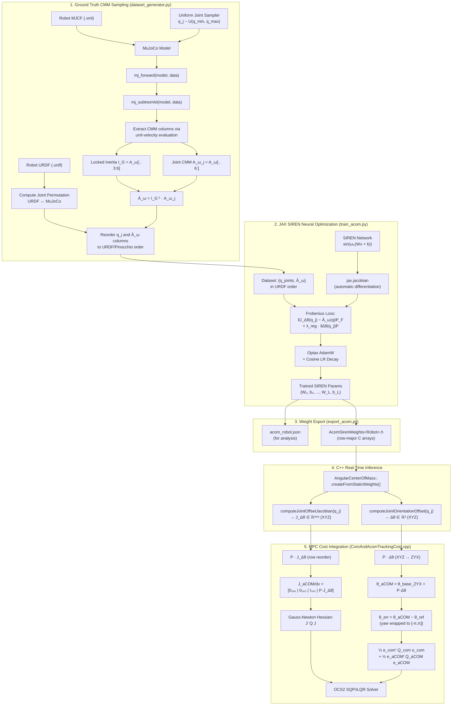
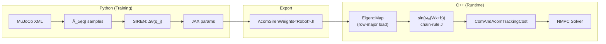

# Angular Center of Mass (aCOM) for Humanoid Robots

This package implements the **Angular Center of Mass (aCOM)** representation for multibody humanoid robots, based on:

> **"Integrable Whole-body Orientation Coordinates for Legged Robots"**
> *Yu-Ming Chen, Gabriel Nelson, Robert Griffin, Michael Posa, and Jerry Pratt*
> *IEEE/RSJ International Conference on Intelligent Robots and Systems (IROS), 2023.*

---

## 1. Problem Formulation & Theoretical Background

### 1.1 The Holonomic vs. Non-Holonomic Divide in Centroidal Dynamics

In legged locomotion:
- **Translational Center of Mass ($\mathbf{r}_{\text{CoM}}$)** is an exact, holonomic function of the robot configuration $\mathbf{q} \in SE(3) \times \mathbb{R}^{n_j}$:
  $$\mathbf{r}_{\text{CoM}}(\mathbf{q}) = \frac{1}{m_{\text{total}}} \sum_{i=1}^n m_i \mathbf{r}_i(\mathbf{q}), \quad \frac{d}{dt}\mathbf{r}_{\text{CoM}}(\mathbf{q}) = \mathbf{v}_{\text{CoM}}$$
  Consequently, translational motion planning and MPC can track an absolute position target $\mathbf{r}_{\text{CoM}} \in \mathbb{R}^3$ without integration drift.

- **Centroidal Angular Momentum ($\mathbf{L}_G$)** is fundamentally **non-holonomic**:
  $$\mathbf{L}_G = \mathbf{A}_\omega(\mathbf{q}) \dot{\mathbf{q}} = \mathbf{I}_G(\mathbf{q}) \boldsymbol{\omega}_b + \mathbf{A}_{\omega, j}(\mathbf{q}) \dot{\mathbf{q}}_j$$
  where $\mathbf{A}_\omega(\mathbf{q})$ is the angular block of the Centroidal Momentum Matrix (CMM), and $\mathbf{I}_G(\mathbf{q})$ is the whole-body locked rotational inertia at the CoM.

Dividing by the locked inertia yields the **instantaneous locked angular velocity** (connection 1-form $\bar{\mathbf{A}}_\omega$):
$$\boldsymbol{\omega}_{\text{locked}} = \mathbf{I}_G^{-1}(\mathbf{q})\mathbf{L}_G = \boldsymbol{\omega}_b + \bar{\mathbf{A}}_{\omega, j}(\mathbf{q})\dot{\mathbf{q}}_j, \quad \text{where } \bar{\mathbf{A}}_{\omega, j}(\mathbf{q}) = \mathbf{I}_G^{-1}(\mathbf{q}) \mathbf{A}_{\omega, j}(\mathbf{q})$$

Because the differential connection $\bar{\mathbf{A}}_{\omega, j}(\mathbf{q})$ has non-zero curvature ($d\bar{\mathbf{A}}_\omega + \frac{1}{2}[\bar{\mathbf{A}}_\omega, \bar{\mathbf{A}}_\omega] \neq 0$), integrating $\boldsymbol{\omega}_{\text{locked}}$ along a closed trajectory in joint space ($\oint \dot{\mathbf{q}}_j dt = 0$) results in a non-zero geometric phase (the "falling cat" rotation). **No exact holonomic whole-body orientation coordinate $\mathbf{R}(\mathbf{q}) \in SO(3)$ exists.**

---

### 1.2 The aCOM Coordinate Definition

The core idea of Pratt et al. is to construct an **integrable configuration-dependent approximation**:
$$\boldsymbol{\theta}_{\text{aCOM}}(\mathbf{q}): \mathcal{Q} \to \mathbb{R}^3$$
such that its time derivative $\dot{\boldsymbol{\theta}}_{\text{aCOM}} = \mathbf{J}_{\text{aCOM}}(\mathbf{q})\dot{\mathbf{q}}$ best approximates $\boldsymbol{\omega}_{\text{locked}}$.

#### $SE(3)$ Floating-Base Equivariance

To guarantee that pure floating-base rotations shift the whole-body orientation rigidly while translations have zero effect:
$$\boldsymbol{\theta}_{\text{aCOM}}(\mathbf{q}) = \boldsymbol{\theta}_{\text{base}} + \Delta \boldsymbol{\theta}(\mathbf{q}_j)$$
$$\mathbf{J}_{\text{aCOM}}(\mathbf{q}) = \begin{bmatrix} \mathbf{0}_{3 \times 3} & \mathbf{I}_{3 \times 3} & \frac{\partial \Delta \boldsymbol{\theta}}{\partial \mathbf{q}_j}(\mathbf{q}_j) \end{bmatrix}$$

where $\Delta \boldsymbol{\theta}(\mathbf{q}_j): \mathbb{R}^{n_j} \to \mathbb{R}^3$ represents the internal joint contribution to whole-body orientation.

#### Optimization Objective (Frobenius Loss on Jacobians)

The equivariance decomposition reduces the full optimization to matching only the joint block:
$$\min_{\Delta \boldsymbol{\theta}} \mathbb{E}_{\mathbf{q} \sim \mathcal{D}} \left\| \frac{\partial \Delta \boldsymbol{\theta}}{\partial \mathbf{q}_j}(\mathbf{q}_j) - \bar{\mathbf{A}}_{\omega, j}(\mathbf{q}) \right\|_F^2$$

The training loss used in practice includes a regularization term to keep the offset centered near zero:
$$\mathcal{L}_{\text{total}} = \underbrace{\mathbb{E}_{\mathbf{q}} \left\| \mathbf{J}_{\Delta\theta}(\mathbf{q}_j) - \bar{\mathbf{A}}_{\omega, j}(\mathbf{q}) \right\|_F^2}_{\mathcal{L}_{\text{frob}}} + \lambda_{\text{reg}} \underbrace{\mathbb{E}_{\mathbf{q}} \left\| \Delta\boldsymbol{\theta}(\mathbf{q}_j) \right\|^2}_{\mathcal{L}_{\text{reg}}}$$

---

### 1.3 Coordinate Conventions

> **Critical implementation detail:** The Python training and C++ runtime use different Euler angle orderings.

| Context | Convention | Order | Index Meaning |
|---|---|---|---|
| Python (SIREN output) | XYZ / RPY | `[0, 1, 2]` | `[Roll, Pitch, Yaw]` |
| C++ (OCS2 centroidal state) | ZYX | `[0, 1, 2]` | `[Yaw, Pitch, Roll]` |

A permutation matrix $\mathbf{P}$ (row swap 0 ↔ 2) is applied at the C++ boundary to convert:

$$\boldsymbol{\theta}_{\text{aCOM}}^{\text{ZYX}} = \boldsymbol{\theta}_{\text{base}}^{\text{ZYX}} + \mathbf{P} \cdot \Delta\boldsymbol{\theta}^{\text{XYZ}}(\mathbf{q}_j)$$

The Jacobian rows are reordered identically:

$$\mathbf{J}_{\text{aCOM}}^{\text{ZYX}} = \begin{bmatrix} \mathbf{0}_{3 \times 6} & \mathbf{0}_{3 \times 3} & \mathbf{I}_{3 \times 3} & \mathbf{P} \cdot \mathbf{J}_{\Delta\theta}^{\text{XYZ}} \end{bmatrix}$$

---

## 2. System Architecture & Pipeline

### 2.1 End-to-End Block Diagram



### 2.2 Data Flow Summary



---

## 3. Sinusoidal Representation Network (SIREN)

Standard MLPs with ReLU or GELU activations struggle to represent smooth differential forms and their Jacobians. We employ **Sinusoidal Representation Networks (SIREN)** with periodic activation functions:

$$\mathbf{h}_0 = \sin\left(\omega_0 (\mathbf{W}_0 \mathbf{q}_j + \mathbf{b}_0)\right)$$
$$\mathbf{h}_l = \sin\left(\omega_0 (\mathbf{W}_l \mathbf{h}_{l-1} + \mathbf{b}_l)\right), \quad l = 1, \dots, L-1$$
$$\Delta \boldsymbol{\theta}(\mathbf{q}_j) = \mathbf{W}_{\text{out}} \mathbf{h}_{L-1} + \mathbf{b}_{\text{out}}$$

### 3.1 SIREN Initialization

Following Sitzmann et al. (2020), special initialization ensures training stability:

| Layer | Weight Bound | Bias Bound |
|---|---|---|
| First ($l = 0$) | $w \sim U\left[-\frac{1}{n_{\text{in}}}, \frac{1}{n_{\text{in}}}\right]$ | $b \sim U\left[-\frac{1}{n_{\text{in}}}, \frac{1}{n_{\text{in}}}\right]$ |
| Hidden ($l > 0$) | $w \sim U\left[-\frac{\sqrt{6/n_{\text{in}}}}{\omega_0}, \frac{\sqrt{6/n_{\text{in}}}}{\omega_0}\right]$ | same as weights |
| Output | same as hidden | $b = 0$ |

### 3.2 Exact Analytical Jacobian via Chain Rule

Let $\mathbf{z}_l = \omega_0 (\mathbf{W}_l \mathbf{h}_{l-1} + \mathbf{b}_l)$. The exact layer derivatives are:
$$\frac{\partial \mathbf{h}_0}{\partial \mathbf{q}_j} = \omega_0 \operatorname{diag}\left(\cos(\mathbf{z}_0)\right) \mathbf{W}_0$$
$$\frac{\partial \mathbf{h}_l}{\partial \mathbf{h}_{l-1}} = \omega_0 \operatorname{diag}\left(\cos(\mathbf{z}_l)\right) \mathbf{W}_l$$
$$\mathbf{J}_{\Delta \theta}(\mathbf{q}_j) = \frac{\partial \Delta \boldsymbol{\theta}}{\partial \mathbf{q}_j} = \mathbf{W}_{\text{out}} \left( \prod_{l=L-1}^1 \frac{\partial \mathbf{h}_l}{\partial \mathbf{h}_{l-1}} \right) \frac{\partial \mathbf{h}_0}{\partial \mathbf{q}_j}$$

This chain-rule Jacobian is implemented identically in both:
- **Python** (`models.py`): via `jax.jacobian` (for training, verified against analytical)
- **C++** (`AngularCenterOfMass.cpp`): via explicit forward-mode chain rule (for real-time)

---

## 4. MPC Integration

### 4.1 ComAndAcomTrackingCost

When `useComAndAcomTracking: true` is set in `task.yaml`, the MPC replaces the standard base-pose quadratic cost with a combined **CoM + aCOM** cost:

$$\mathcal{L}_{\text{CoM+aCOM}}(\mathbf{x}, \mathbf{x}_{\text{ref}}) = \frac{1}{2} \mathbf{e}_{\text{CoM}}^\top \mathbf{Q}_{\text{CoM}} \, \mathbf{e}_{\text{CoM}} + \frac{1}{2} \mathbf{e}_{\text{aCOM}}^\top \mathbf{Q}_{\text{aCOM}} \, \mathbf{e}_{\text{aCOM}}$$

where:
$$\mathbf{e}_{\text{CoM}} = \mathbf{r}_{\text{CoM}}(\mathbf{q}) - \mathbf{r}_{\text{CoM}}(\mathbf{q}_{\text{ref}}) \in \mathbb{R}^3$$
$$\mathbf{e}_{\text{aCOM}} = \boldsymbol{\theta}_{\text{aCOM}}(\mathbf{q}) - \boldsymbol{\theta}_{\text{aCOM}}(\mathbf{q}_{\text{ref}}) \in \mathbb{R}^3$$

The yaw component of $\mathbf{e}_{\text{aCOM}}$ is wrapped to $[-\pi, \pi]$ via `moduloAngleWithReference` to handle the $\pm\pi$ discontinuity.

### 4.2 Gauss-Newton Quadratic Approximation

The cost function provides a quadratic approximation for the SQP/iLQR solver using Jacobians w.r.t. the centroidal state $\mathbf{x}$:

$$\mathbf{x} = \begin{bmatrix} \mathbf{h}_{\text{norm}} \\ \mathbf{p}_{\text{base}} \\ \boldsymbol{\theta}_{\text{base}}^{\text{ZYX}} \\ \mathbf{q}_j \end{bmatrix} \in \mathbb{R}^{n_x}, \quad \text{indices: } [0..5, \; 6..8, \; 9..11, \; 12..12{+}n_j]$$

#### CoM Jacobian

The CoM Jacobian w.r.t. centroidal state requires chaining the ZYX Euler angle derivative mapping $\mathbf{T}(\boldsymbol{\theta}_{\text{ZYX}})$ for the base orientation columns, because the Pinocchio Jacobian maps generalized *velocity* $\mathbf{v}$ (with angular velocity $\boldsymbol{\omega}$, not $\dot{\boldsymbol{\theta}}$):

$$\frac{\partial \mathbf{r}_{\text{CoM}}}{\partial \mathbf{x}} = \begin{bmatrix} \mathbf{0}_{3 \times 6} & \mathbf{J}_{\text{com}}^{[:, 0:3]} & \mathbf{J}_{\text{com}}^{[:, 3:6]} \cdot \mathbf{T}(\boldsymbol{\theta}) & \mathbf{J}_{\text{com}}^{[:, 6:]} \end{bmatrix}$$

where $\boldsymbol{\omega} = \mathbf{T}(\boldsymbol{\theta}_{\text{ZYX}}) \cdot \dot{\boldsymbol{\theta}}_{\text{ZYX}}$ maps Euler angle rates to angular velocity.

#### aCOM Jacobian

The aCOM Jacobian is structurally simpler due to the equivariance decomposition:

$$\frac{\partial \boldsymbol{\theta}_{\text{aCOM}}}{\partial \mathbf{x}} = \begin{bmatrix} \mathbf{0}_{3 \times 6} & \mathbf{0}_{3 \times 3} & \mathbf{I}_{3 \times 3} & \mathbf{P} \cdot \mathbf{J}_{\Delta\theta}(\mathbf{q}_j) \end{bmatrix}$$

#### Gradient and Hessian

$$\nabla_{\mathbf{x}} \mathcal{L} = \mathbf{J}_{\text{CoM}}^\top \mathbf{Q}_{\text{CoM}} \, \mathbf{e}_{\text{CoM}} + \mathbf{J}_{\text{aCOM}}^\top \mathbf{Q}_{\text{aCOM}} \, \mathbf{e}_{\text{aCOM}}$$
$$\nabla^2_{\mathbf{x}} \mathcal{L} \approx \mathbf{J}_{\text{CoM}}^\top \mathbf{Q}_{\text{CoM}} \, \mathbf{J}_{\text{CoM}} + \mathbf{J}_{\text{aCOM}}^\top \mathbf{Q}_{\text{aCOM}} \, \mathbf{J}_{\text{aCOM}}$$

### 4.3 Arm Swing Guard

When `useComAndAcomTracking` is enabled, the procedural arm swing reference generator is automatically disabled in `SwitchedModelReferenceManager`. This allows the aCOM cost to produce **emergent arm swing behavior**: the optimizer naturally counter-swings the arms to maintain whole-body orientation alignment during walking, resulting in more natural locomotion.

### 4.4 Configuration

Enable in `task.yaml`:
```yaml
useComAndAcomTracking: true

Q_com:
  scaling: 85
  "(0,0)": 0   # p_com_x (free to drift in walking direction)
  "(1,1)": 0   # p_com_y
  "(2,2)": 15  # p_com_z (height regulation)

Q_acom:
  scaling: 85
  "(0,0)": 15  # yaw (heading alignment)
  "(1,1)": 15  # pitch (forward lean regulation)
  "(2,2)": 25  # roll (lateral stability, highest weight)
```

When this flag is set, the factory zeros out the base-pose block in the state quadratic cost `Q` to avoid double-penalizing orientation.

---

## 5. File Structure

```
humanoid_learning/acom/
├── README.md                     # This document
├── __init__.py                   # Package exports
├── models.py                     # JAX SIREN model definition
├── dataset_generator.py          # MuJoCo-based CMM sampling
├── train_acom.py                 # Training loop with TensorBoard
├── train_main.py                 # CLI entrypoint
├── export_acom.py                # JSON and C++ header export
├── BUILD.bazel                   # Bazel build rules
└── tests/
    ├── test_acom.py              # 14 unit tests (pipeline + dataset)
    └── BUILD.bazel               # Test build rules

humanoid_nmpc/humanoid_common_mpc/
├── include/.../acom/
│   ├── AngularCenterOfMass.h     # C++ evaluator class
│   ├── AcomSirenWeightsAtlas.h    # Auto-generated Atlas weight arrays
│   └── AcomSirenWeightsG1.h      # Auto-generated G1 weight arrays
├── src/acom/
│   └── AngularCenterOfMass.cpp   # Forward pass + chain-rule Jacobian
├── src/cost/
│   └── ComAndAcomTrackingCost.cpp # MPC cost with CoM + aCOM tracking
└── test/
    ├── testAngularCenterOfMass.cpp      # 6 tests (shapes, FD, equivariance)
    └── testComAndAcomTrackingCost.cpp   # 3 tests (shapes, FD, CoM)
```

---

## 6. Usage Guide

### 6.1 Training an aCOM Model

```bash
# Train on Unitree G1 (29-DoF)
bazel run //humanoid_learning/acom:train_main -- \
    --robot g1 --num_samples 10000 --epochs 50 --output_dir /tmp/acom_g1

# Train on DRC Atlas (28-DoF) and install weights into C++ source tree
bazel run //humanoid_learning/acom:train_main -- \
    --robot atlas --num_samples 10000 --epochs 50 \
    --output_dir /tmp/acom_atlas --install_header
```

The `--install_header` flag copies the generated `AcomSirenWeights<Robot>.h` directly into the C++ include path, ready for the next `bazel build`.

### 6.2 Monitoring Training in TensorBoard

Training automatically streams live scalars, histograms, and diagnostic heatmap comparisons to TensorBoard.

```bash
tensorboard --logdir /tmp/acom_atlas/tb_logs
```

#### TensorBoard Telemetry Reference

| Dashboard Category | Metric Tag | Description |
| :--- | :--- | :--- |
| **Loss Curves** | `loss/train_total`, `loss/val_total` | Total objective $\mathcal{L}_{\text{total}} = \mathcal{L}_{\text{frob}} + \lambda_{\text{reg}} \|\Delta\boldsymbol{\theta}\|^2$ |
| | `loss/train_frobenius`, `loss/val_frobenius` | Frobenius error $\|\mathbf{J}_{\Delta\theta}(\mathbf{q}_j) - \bar{\mathbf{A}}_{\omega, j}(\mathbf{q})\|_F^2$ |
| | `loss/train_regularization`, `loss/val_regularization` | Offset centering penalty $\lambda_{\text{reg}} \|\Delta\boldsymbol{\theta}(\mathbf{q}_j)\|^2$ |
| | `loss/val_rmse_rad_per_rad` | RMSE per Jacobian entry: $\sqrt{\mathcal{L}_{\text{frob}} / (3 \cdot n_j)}$ |
| **Per-Axis Error** | `error_axes/{roll,pitch,yaw}_frob_loss` | Per-axis Frobenius fitting error |
| **Optimization** | `optim/learning_rate` | Cosine LR decay schedule |
| | `gradients/global_l2_norm` | Global $L_2$ gradient norm |
| | `gradients/layer_{l}_{weight,bias}_norm` | Per-layer gradient norms |
| **Output Stats** | `stats/mean_acom_offset_deg` | Mean $\|\Delta\boldsymbol{\theta}\|$ in degrees |
| | `stats/max_acom_offset_deg` | Max $\|\Delta\boldsymbol{\theta}\|$ in degrees |
| **Histograms** | `weights/`, `gradients/`, `activations/` | Weight, gradient, and offset distributions |
| **Diagnostics** | `diagnostics/jacobian_heatmap` | 3-panel heatmap: target $\bar{\mathbf{A}}$, predicted $\mathbf{J}_{\Delta\theta}$, error |

### 6.3 Running Tests

```bash
# Python: model, training, export, and dataset generator (14 tests)
bazel test //humanoid_learning/acom/tests:test_acom

# C++: analytical Jacobian, equivariance, and cost function (9 tests)
bazel test //humanoid_nmpc/humanoid_common_mpc:testAngularCenterOfMass
bazel test //humanoid_nmpc/humanoid_common_mpc:testComAndAcomTrackingCost
```

### 6.4 C++ Real-Time Integration

Include the zero-dependency C++ header and evaluate whole-body aCOM in microseconds:

```cpp
#include "humanoid_common_mpc/acom/AngularCenterOfMass.h"

// Load weights compiled into the binary
auto acom = AngularCenterOfMass::createFromStaticWeights();

// Evaluate orientation offset and Jacobian
vector3_t delta_theta = acom->computeJointOrientationOffset(q_joints);
matrix_t J_delta = acom->computeJointOffsetJacobian(q_joints);

// Full aCOM (requires generalized coordinates q = [pos, rpy, q_j])
vector3_t theta_acom = acom->computeAcomOrientation(q);
matrix_t J_acom = acom->computeAcomJacobian(q);
```

---

## 7. Benefits for Legged Control & MPC

1. **Drift-Free Holonomic Tracking**:
   Replaces velocity-level momentum bounds with a direct configuration error penalty in the MPC cost function:
   $$\mathcal{L}_{\text{rot}} = w_{\text{aCOM}} \left\| \boldsymbol{\theta}_{\text{aCOM}}(\mathbf{q}) - \boldsymbol{\theta}_{\text{ref}}(t) \right\|^2$$

2. **Emergent Arm Swing**:
   When the aCOM cost penalizes whole-body orientation error, the optimizer naturally counter-swings the robot's arms during walking to maintain orientation alignment. This produces realistic, dynamically-motivated arm swing without requiring a hand-crafted swing trajectory generator.

3. **Dynamic Decoupling**:
   Allows the robot to swing its arms or twist its torso vigorously while maintaining the true whole-body orientation aligned with the locomotion heading.

4. **Zero Runtime Overhead**:
   The small SIREN forward pass + analytical chain-rule Jacobian evaluates in $< 5\,\mu\text{s}$ in C++, making it suitable for 500 Hz NMPC and WBC loops.

---

## 8. Joint Ordering: URDF ↔ MuJoCo Permutation

MuJoCo and URDF/Pinocchio may index joints in different orders. Since the C++ MPC runtime uses Pinocchio (which follows URDF ordering), the training data must be in URDF order. The `AcomDatasetGenerator` accepts an optional `urdf_path` argument and computes a permutation array:

```python
gen = AcomDatasetGenerator(
    "robot_models/atlas/atlas.xml",
    urdf_path="robot_models/atlas/atlas.urdf"
)
# gen.joint_perm[i] = MuJoCo index of URDF's i-th joint
# Dataset outputs are automatically reordered to URDF order
dataset = gen.generate_dataset(num_samples=10000)
```

Without this permutation, the SIREN network would learn $\Delta\boldsymbol{\theta}$ as a function of MuJoCo-ordered joint angles, but be evaluated at C++ runtime with Pinocchio-ordered inputs — producing incorrect orientation offsets and Jacobians.
