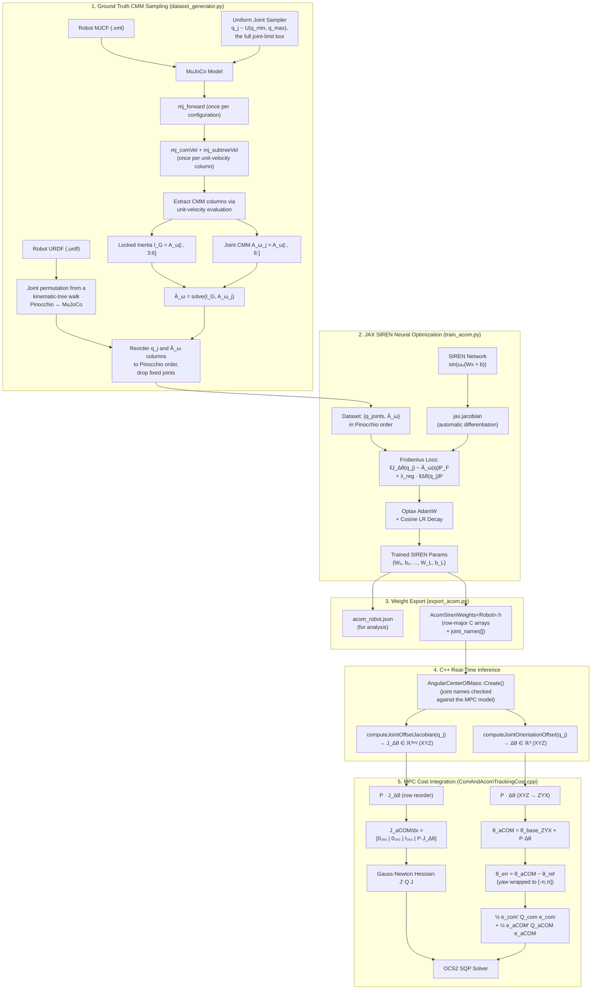
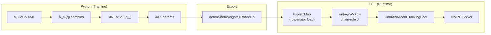
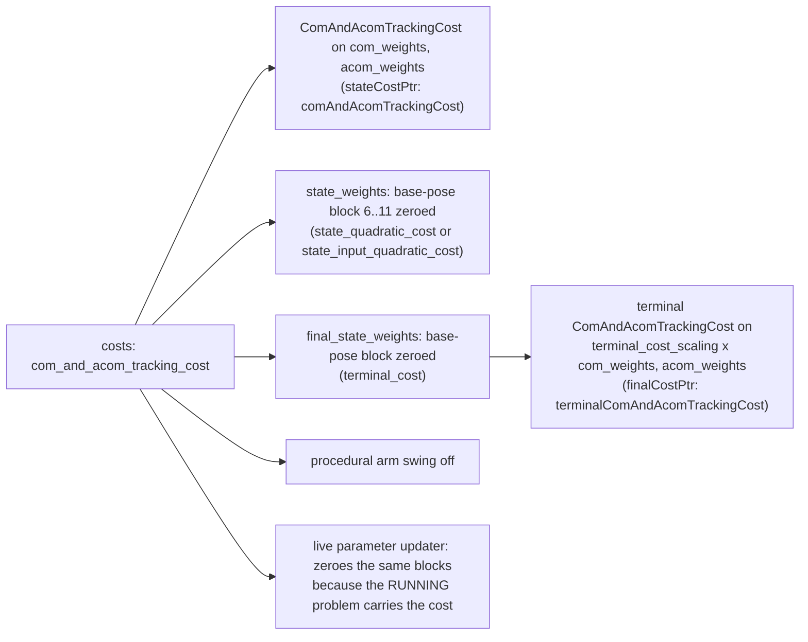

# Angular Center of Mass (aCOM) for Humanoid Robots

This package implements the **Angular Center of Mass (aCOM)** representation for multibody humanoid robots, based on:

> **"Integrable Whole-body Orientation Coordinates for Legged Robots"**
> *Yu-Ming Chen, Gabriel Nelson, Robert Griffin, Michael Posa, and Jerry Pratt*
> *IEEE/RSJ International Conference on Intelligent Robots and Systems (IROS), 2023.*

> **Validation status.** Three robots have a trained network compiled in, but only the DRC Atlas network is
> **validated** for closed-loop use. The Unitree G1 and EngineAI SA01 networks are **NOT VALIDATED**: they miss the
> acceptance bounds Atlas meets by a wide margin (section 6.3), and both robots ship without `com_and_acom_tracking_cost`
> in their `costs` list and without `heading_double_integrator` in their contact planner. Do not switch either on until
> its network has been retrained to Atlas's bounds; `testAcomAngularVelocityConsistency` fails if either is switched on
> while it is marked unvalidated.

---

## 1. Problem Formulation & Theoretical Background

### 1.1 The Holonomic vs. Non-Holonomic Divide in Centroidal Dynamics

In legged locomotion:
- **Translational Center of Mass ($\mathbf{r}_{\text{CoM}}$)** is an exact, holonomic function of the robot configuration $\mathbf{q} \in SE(3) \times \mathbb{R}^{n_j}$:
  $$\mathbf{r}_{\text{CoM}}(\mathbf{q}) = \frac{1}{m_{\text{total}}} \sum_{i=1}^n m_i \mathbf{r}_i(\mathbf{q}), \quad \frac{d}{dt}\mathbf{r}_{\text{CoM}}(\mathbf{q}) = \mathbf{v}_{\text{CoM}}$$
  Consequently, translational motion planning and MPC can track an absolute position target $\mathbf{r}_{\text{CoM}} \in \mathbb{R}^3$ without integration drift.

- **Centroidal Angular Momentum ($\mathbf{L}_G$)** is fundamentally **non-holonomic**:
  $$\mathbf{L}_G = \mathbf{A}_\omega(\mathbf{q}) \dot{\mathbf{q}} = \mathbf{I}_G(\mathbf{q}) \boldsymbol{\omega}_b + \mathbf{A}_{\omega, j}(\mathbf{q}) \dot{\mathbf{q}}_j$$
  where $\mathbf{A}_\omega(\mathbf{q})$ is the angular block of the Centroidal Momentum Matrix (CMM), and $\mathbf{I}_G(\mathbf{q})$ is the whole-body locked rotational inertia at the CoM.

Dividing by the locked inertia yields the **instantaneous locked angular velocity** (connection 1-form $\bar{\mathbf{A}}_\omega$):
$$\boldsymbol{\omega}_{\text{locked}} = \mathbf{I}_G^{-1}(\mathbf{q})\mathbf{L}_G = \boldsymbol{\omega}_b + \bar{\mathbf{A}}_{\omega, j}(\mathbf{q})\dot{\mathbf{q}}_j, \quad \text{where } \bar{\mathbf{A}}_{\omega, j}(\mathbf{q}) = \mathbf{I}_G^{-1}(\mathbf{q}) \mathbf{A}_{\omega, j}(\mathbf{q})$$

Because the differential connection $\bar{\mathbf{A}}_{\omega, j}(\mathbf{q})$ has non-zero curvature ($d\bar{\mathbf{A}}_\omega + \frac{1}{2}[\bar{\mathbf{A}}_\omega, \bar{\mathbf{A}}_\omega] \neq 0$), integrating $\boldsymbol{\omega}_{\text{locked}}$ along a closed trajectory in joint space ($\oint \dot{\mathbf{q}}_j dt = 0$) results in a non-zero geometric phase (the "falling cat" rotation). **No exact holonomic whole-body orientation coordinate $\mathbf{R}(\mathbf{q}) \in SO(3)$ exists.**

---

### 1.2 The aCOM Coordinate Definition

The core idea of Pratt et al. is to construct an **integrable configuration-dependent approximation**:
$$\boldsymbol{\theta}_{\text{aCOM}}(\mathbf{q}): \mathcal{Q} \to \mathbb{R}^3$$
such that its time derivative $\dot{\boldsymbol{\theta}}_{\text{aCOM}} = \mathbf{J}_{\text{aCOM}}(\mathbf{q})\dot{\mathbf{q}}$ best approximates $\boldsymbol{\omega}_{\text{locked}}$.

#### $SE(3)$ Floating-Base Equivariance

To guarantee that pure floating-base rotations shift the whole-body orientation rigidly while translations have zero effect:
$$\boldsymbol{\theta}_{\text{aCOM}}(\mathbf{q}) = \boldsymbol{\theta}_{\text{base}} + \Delta \boldsymbol{\theta}(\mathbf{q}_j)$$
$$\mathbf{J}_{\text{aCOM}}(\mathbf{q}) = \begin{bmatrix} \mathbf{0}_{3 \times 3} & \mathbf{I}_{3 \times 3} & \frac{\partial \Delta \boldsymbol{\theta}}{\partial \mathbf{q}_j}(\mathbf{q}_j) \end{bmatrix}$$

where $\Delta \boldsymbol{\theta}(\mathbf{q}_j): \mathbb{R}^{n_j} \to \mathbb{R}^3$ represents the internal joint contribution to whole-body orientation.

#### Optimization Objective (Frobenius Loss on Jacobians)

The equivariance decomposition reduces the full optimization to matching only the joint block:
$$\min_{\Delta \boldsymbol{\theta}} \mathbb{E}_{\mathbf{q} \sim \mathcal{D}} \left\| \frac{\partial \Delta \boldsymbol{\theta}}{\partial \mathbf{q}_j}(\mathbf{q}_j) - \bar{\mathbf{A}}_{\omega, j}(\mathbf{q}) \right\|_F^2$$

The training loss used in practice includes a regularization term to keep the offset centered near zero:
$$\mathcal{L}_{\text{total}} = \underbrace{\mathbb{E}_{\mathbf{q}} \left\| \mathbf{J}_{\Delta\theta}(\mathbf{q}_j) - \bar{\mathbf{A}}_{\omega, j}(\mathbf{q}) \right\|_F^2}_{\mathcal{L}_{\text{frob}}} + \lambda_{\text{reg}} \underbrace{\mathbb{E}_{\mathbf{q}} \left\| \Delta\boldsymbol{\theta}(\mathbf{q}_j) \right\|^2}_{\mathcal{L}_{\text{reg}}}$$

---

### 1.3 Coordinate Conventions

> **Critical implementation detail:** The Python training and C++ runtime use different Euler angle orderings.

| Context | Convention | Order | Index Meaning |
|---|---|---|---|
| Python (SIREN output) | XYZ / RPY | `[0, 1, 2]` | `[Roll, Pitch, Yaw]` |
| C++ (OCS2 centroidal state) | ZYX | `[0, 1, 2]` | `[Yaw, Pitch, Roll]` |

A permutation matrix $\mathbf{P}$ (row swap 0 ↔ 2) is applied at the C++ boundary to convert:

$$\boldsymbol{\theta}_{\text{aCOM}}^{\text{ZYX}} = \boldsymbol{\theta}_{\text{base}}^{\text{ZYX}} + \mathbf{P} \cdot \Delta\boldsymbol{\theta}^{\text{XYZ}}(\mathbf{q}_j)$$

The Jacobian rows are reordered identically:

$$\mathbf{J}_{\text{aCOM}}^{\text{ZYX}} = \begin{bmatrix} \mathbf{0}_{3 \times 6} & \mathbf{0}_{3 \times 3} & \mathbf{I}_{3 \times 3} & \mathbf{P} \cdot \mathbf{J}_{\Delta\theta}^{\text{XYZ}} \end{bmatrix}$$

---

## 2. System Architecture & Pipeline

### 2.1 End-to-End Block Diagram


```mermaid
flowchart TD
    subgraph DataGeneration ["1. Ground Truth CMM Sampling (dataset_generator.py)"]
        XML["Robot MJCF (.xml)"] --> MjModel["MuJoCo Model"]
        URDF["Robot URDF (.urdf)"] --> Perm["Joint permutation from a<br/>kinematic-tree walk<br/>Pinocchio ↔ MuJoCo"]
        Sampler["Uniform Joint Sampler<br/>q_j ~ U(q_min, q_max),<br/>the full joint-limit box"] --> MjModel
        MjModel --> MjFwd["mj_forward (once per configuration)"]
        MjFwd --> MjVel["mj_comVel + mj_subtreeVel<br/>(once per unit-velocity column)"]
        MjVel --> CMM["Extract CMM columns via<br/>unit-velocity evaluation"]
        CMM --> IG["Locked Inertia I_G = A_ω[:, 3:6]"]
        CMM --> Aomega["Joint CMM A_ω_j = A_ω[:, 6:]"]
        IG --> ABar["Ā_ω = solve(I_G, A_ω_j)"]
        Aomega --> ABar
        Perm --> Reorder["Reorder q_j and Ā_ω columns<br/>to Pinocchio order,<br/>drop fixed joints"]
        ABar --> Reorder
    end

    subgraph JAXTraining ["2. JAX SIREN Neural Optimization (train_acom.py)"]
        Reorder --> Dataset["Dataset: {q_joints, Ā_ω}<br/>in Pinocchio order"]
        Dataset --> Loss["Frobenius Loss:<br/>‖J_Δθ(q_j) − Ā_ω(q)‖²_F<br/>+ λ_reg · ‖Δθ(q_j)‖²"]
        SIREN["SIREN Network<br/>sin(ω₀(Wx + b))"] --> JacAD["jax.jacobian<br/>(automatic differentiation)"]
        JacAD --> Loss
        Loss --> Optax["Optax AdamW<br/>+ Cosine LR Decay"]
        Optax --> Params["Trained SIREN Params<br/>{W₀, b₀, ..., W_L, b_L}"]
    end

    subgraph Export ["3. Weight Export (export_acom.py)"]
        Params --> JSON["acom_robot.json<br/>(for analysis)"]
        Params --> Header["AcomSirenWeights&lt;Robot&gt;.h<br/>(row-major C arrays<br/>+ joint_names[])"]
    end

    subgraph CppInference ["4. C++ Real-Time Inference"]
        Header --> StaticLoad["AngularCenterOfMass::Create()<br/>(joint names checked<br/>against the MPC model)"]
        StaticLoad --> Forward["computeJointOrientationOffset(q_j)<br/>→ Δθ ∈ ℝ³ (XYZ)"]
        StaticLoad --> ChainRule["computeJointOffsetJacobian(q_j)<br/>→ J_Δθ ∈ ℝ³ˣⁿʲ (XYZ)"]
    end

    subgraph MPCIntegration ["5. MPC Cost Integration (ComAndAcomTrackingCost.cpp)"]
        Forward --> XYZtoZYX["P · Δθ (XYZ → ZYX)"]
        ChainRule --> JacReorder["P · J_Δθ (row reorder)"]
        XYZtoZYX --> ThetaACOM["θ_aCOM = θ_base_ZYX + P·Δθ"]
        ThetaACOM --> ThetaErr["θ_err = θ_aCOM − θ_ref<br/>(yaw wrapped to [-π,π])"]
        JacReorder --> JacFull["J_aCOM/dx =<br/>[0₃ₓ₆ | 0₃ₓ₃ | I₃ₓ₃ | P·J_Δθ]"]
        ThetaErr --> Cost["½ e_com' Q_com e_com<br/>+ ½ e_aCOM' Q_aCOM e_aCOM"]
        JacFull --> GaussNewton["Gauss-Newton Hessian:<br/>J' Q J"]
        GaussNewton --> SQP["OCS2 SQP Solver"]
        Cost --> SQP
    end
```

### 2.2 Data Flow Summary


```mermaid
flowchart LR
    subgraph Python ["Python (Training)"]
        A["MuJoCo XML"] --> B["Ā_ω(q) samples"]
        B --> C["SIREN: Δθ(q_j)"]
        C --> D["JAX params"]
    end

    subgraph Bridge ["Export"]
        D --> E["AcomSirenWeights&lt;Robot&gt;.h"]
    end

    subgraph Cpp ["C++ (Runtime)"]
        E --> F["Eigen::Map<br/>(row-major load)"]
        F --> G["sin(ω₀(Wx+b))<br/>chain-rule J"]
        G --> H["ComAndAcomTrackingCost"]
        H --> I["NMPC Solver"]
    end
```

---

## 3. Sinusoidal Representation Network (SIREN)

Standard MLPs with ReLU or GELU activations struggle to represent smooth differential forms and their Jacobians. We employ **Sinusoidal Representation Networks (SIREN)** with periodic activation functions:

$$\mathbf{h}_0 = \sin\left(\omega_0 (\mathbf{W}_0 \mathbf{q}_j + \mathbf{b}_0)\right)$$
$$\mathbf{h}_l = \sin\left(\omega_0 (\mathbf{W}_l \mathbf{h}_{l-1} + \mathbf{b}_l)\right), \quad l = 1, \dots, L-1$$
$$\Delta \boldsymbol{\theta}(\mathbf{q}_j) = \mathbf{W}_{\text{out}} \mathbf{h}_{L-1} + \mathbf{b}_{\text{out}}$$

### 3.1 SIREN Initialization

Following Sitzmann et al. (2020), special initialization ensures training stability:

| Layer | Weight Bound | Bias Bound |
|---|---|---|
| First ($l = 0$) | $w \sim U\left[-\frac{1}{n_{\text{in}}}, \frac{1}{n_{\text{in}}}\right]$ | $b \sim U\left[-\frac{1}{n_{\text{in}}}, \frac{1}{n_{\text{in}}}\right]$ |
| Hidden ($l > 0$) | $w \sim U\left[-\frac{\sqrt{6/n_{\text{in}}}}{\omega_0}, \frac{\sqrt{6/n_{\text{in}}}}{\omega_0}\right]$ | same as weights |
| Output | same as hidden | $b = 0$ |

### 3.2 Exact Analytical Jacobian via Chain Rule

Let $\mathbf{z}_l = \omega_0 (\mathbf{W}_l \mathbf{h}_{l-1} + \mathbf{b}_l)$. The exact layer derivatives are:
$$\frac{\partial \mathbf{h}_0}{\partial \mathbf{q}_j} = \omega_0 \operatorname{diag}\left(\cos(\mathbf{z}_0)\right) \mathbf{W}_0$$
$$\frac{\partial \mathbf{h}_l}{\partial \mathbf{h}_{l-1}} = \omega_0 \operatorname{diag}\left(\cos(\mathbf{z}_l)\right) \mathbf{W}_l$$
$$\mathbf{J}_{\Delta \theta}(\mathbf{q}_j) = \frac{\partial \Delta \boldsymbol{\theta}}{\partial \mathbf{q}_j} = \mathbf{W}_{\text{out}} \left( \prod_{l=L-1}^1 \frac{\partial \mathbf{h}_l}{\partial \mathbf{h}_{l-1}} \right) \frac{\partial \mathbf{h}_0}{\partial \mathbf{q}_j}$$

This chain-rule Jacobian is implemented identically in both:
- **Python** (`models.py`): via `jax.jacobian` (for training, verified against analytical)
- **C++** (`AngularCenterOfMass.cpp`): via explicit forward-mode chain rule (for real-time)

---

## 4. MPC Integration

### 4.1 ComAndAcomTrackingCost

CoM + aCOM tracking is the cost **`com_and_acom_tracking_cost`** of the task file's `costs` list, selected by name like
every other cost term. Listing it replaces base-pose regulation with a combined **CoM + aCOM** cost:

$$\mathcal{L}_{\text{CoM+aCOM}}(\mathbf{x}, \mathbf{x}_{\text{ref}}) = \frac{1}{2} \mathbf{e}_{\text{CoM}}^\top \mathbf{Q}_{\text{CoM}} \, \mathbf{e}_{\text{CoM}} + \frac{1}{2} \mathbf{e}_{\text{aCOM}}^\top \mathbf{Q}_{\text{aCOM}} \, \mathbf{e}_{\text{aCOM}}$$

where:
$$\mathbf{e}_{\text{CoM}} = \mathbf{r}_{\text{CoM}}(\mathbf{q}) - \mathbf{r}_{\text{CoM}}(\mathbf{q}_{\text{ref}}) \in \mathbb{R}^3$$
$$\mathbf{e}_{\text{aCOM}} = \boldsymbol{\theta}_{\text{aCOM}}(\mathbf{q}) - \boldsymbol{\theta}_{\text{aCOM}}(\mathbf{q}_{\text{ref}}) \in \mathbb{R}^3$$

The yaw component of $\mathbf{e}_{\text{aCOM}}$ is wrapped to $[-\pi, \pi]$ via `moduloAngleWithReference` to handle the $\pm\pi$ discontinuity.

Everything the replacement involves follows from that one entry (`CentroidalMpcInterface::setupOptimalControlProblem`):


```mermaid
flowchart LR
    entry["costs: com_and_acom_tracking_cost"] --> running["ComAndAcomTrackingCost on com_weights, acom_weights<br/>(stateCostPtr: comAndAcomTrackingCost)"]
    entry --> zeroQ["state_weights: base-pose block 6..11 zeroed<br/>(state_quadratic_cost or state_input_quadratic_cost)"]
    entry --> zeroQf["final_state_weights: base-pose block zeroed<br/>(terminal_cost)"]
    zeroQf --> terminal["terminal ComAndAcomTrackingCost on<br/>terminal_cost_scaling x com_weights, acom_weights<br/>(finalCostPtr: terminalComAndAcomTrackingCost)"]
    entry --> arms["procedural arm swing off"]
    entry --> updater["live parameter updater: zeroes the same blocks<br/>because the RUNNING problem carries the cost"]
```

- **Which quadratic state cost carries `state_weights` does not matter.** The base-pose block is zeroed in
  `state_quadratic_cost` and in `state_input_quadratic_cost` alike, and the ACoM cost is added beside either (or on its
  own).
- **The terminal node keeps CoM and orientation regulation.** With `terminal_cost`, the base-pose block of
  `final_state_weights` is zeroed as well, and the final cost gets a second `ComAndAcomTrackingCost` weighted by
  `terminal_cost_scaling` times `com_weights` and `acom_weights` - exactly how `final_state_weights` relates to
  `state_weights` for the rest of the state. Zeroing without that substitute would leave the last node - the one
  `terminal_cost_scaling` weights up - with no CoM, height or orientation weight at all. Under the DCM terminal cost
  (`dcm_terminal_cost` in `costs`, in place of `terminal_cost`, as Atlas ships) there is no `final_state_weights` and no
  terminal instance: the horizon ends on the capture-point cost.
- **Centroidal MPC only.** `WBMpcInterface` refuses the name: the whole-body state has joint angles where the
  centroidal state has the base pose, so the zeroed block would be one leg's weights.
- **The cost list is not hot-reloadable.** The parameter updater's `QuadraticCostWeightsApplier`
  (`humanoid_common_mpc/parameter_update/`) zeroes a reloaded `state_weights` and `final_state_weights` when the
  running problem carries the ACoM cost, whatever the reloaded file lists, and the updater warns when the two disagree;
  the new list takes effect at the next start.
- **The retired key is refused.** The cost replaced the top-level boolean `useComAndAcomTracking`; a task file that
  still carries it - in that spelling or as `use_com_and_acom_tracking`, with either value - does not parse: the strict
  parser refuses it with the replacement that the `retired_field` option of `task_file.proto` gives, which names
  `com_and_acom_tracking_cost`, so that a stale file never silently runs a different formulation.

### 4.2 Gauss-Newton Quadratic Approximation

The cost function provides a quadratic approximation for the OCS2 SQP solver using Jacobians w.r.t. the centroidal state $\mathbf{x}$:

$$\mathbf{x} = \begin{bmatrix} \mathbf{h}_{\text{norm}} \\ \mathbf{p}_{\text{base}} \\ \boldsymbol{\theta}_{\text{base}}^{\text{ZYX}} \\ \mathbf{q}_j \end{bmatrix} \in \mathbb{R}^{n_x}, \quad \text{indices: } [0..5, \; 6..8, \; 9..11, \; 12..12{+}n_j]$$

#### CoM Jacobian

> **Critical implementation detail:** the floating base of this Pinocchio model is a `JointModelComposite` of `JointModelTranslation` and `JointModelSphericalZYX` (see `getBaseJointcomposite` in `createPinocchioModel.cpp`), **not** a `JointModelFreeFlyer`. Consequently $n_q = n_v$ and the tangent vector is literally the time derivative of the generalized coordinates:
> $$\mathbf{v} = \begin{bmatrix} \dot{\mathbf{p}}_{\text{base}} & \dot{\boldsymbol{\theta}}_{\text{ZYX}} & \dot{\mathbf{q}}_j \end{bmatrix}^\top$$
> In particular $\mathbf{v}_{[3:6]}$ is the **Euler angle rate**, not the angular velocity $\boldsymbol{\omega}$. Pinocchio's CoM Jacobian is therefore already $\partial \mathbf{r}_{\text{CoM}} / \partial \mathbf{q}$, and **no** $\mathbf{T}(\boldsymbol{\theta})$ mapping may be chained onto its base orientation columns. Doing so double-counts the mapping and, at $\boldsymbol{\theta} = \mathbf{0}$, swaps the yaw and roll columns outright.

$$\frac{\partial \mathbf{r}_{\text{CoM}}}{\partial \mathbf{x}} = \begin{bmatrix} \mathbf{0}_{3 \times 6} & \mathbf{J}_{\text{com}}^{[:, 0:3]} & \mathbf{J}_{\text{com}}^{[:, 3:6]} & \mathbf{J}_{\text{com}}^{[:, 6:]} \end{bmatrix}$$

This convention is pinned by `testComAndAcomTrackingCost.cpp`, which builds the cost on the reduced Atlas model and
checks, at a tilted base with bent joints, that `getQuadraticApproximation`'s gradient equals central differences of
`getValue` and that its Hessian equals $\mathbf{J}^\top\mathbf{Q}\mathbf{J}$ with each $\mathbf{J}$ taken by finite
differences of the CoM position and of $\boldsymbol{\theta}_{\text{aCOM}}$. Re-chaining $\mathbf{T}(\boldsymbol{\theta})$,
shifting a block to the wrong state index, or dropping the XYZ-to-ZYX reordering fails it.

#### aCOM Jacobian

The aCOM Jacobian is structurally simpler due to the equivariance decomposition:

$$\frac{\partial \boldsymbol{\theta}_{\text{aCOM}}}{\partial \mathbf{x}} = \begin{bmatrix} \mathbf{0}_{3 \times 6} & \mathbf{0}_{3 \times 3} & \mathbf{I}_{3 \times 3} & \mathbf{P} \cdot \mathbf{J}_{\Delta\theta}(\mathbf{q}_j) \end{bmatrix}$$

#### Gradient and Hessian

$$\nabla_{\mathbf{x}} \mathcal{L} = \mathbf{J}_{\text{CoM}}^\top \mathbf{Q}_{\text{CoM}} \, \mathbf{e}_{\text{CoM}} + \mathbf{J}_{\text{aCOM}}^\top \mathbf{Q}_{\text{aCOM}} \, \mathbf{e}_{\text{aCOM}}$$
$$\nabla^2_{\mathbf{x}} \mathcal{L} \approx \mathbf{J}_{\text{CoM}}^\top \mathbf{Q}_{\text{CoM}} \, \mathbf{J}_{\text{CoM}} + \mathbf{J}_{\text{aCOM}}^\top \mathbf{Q}_{\text{aCOM}} \, \mathbf{J}_{\text{aCOM}}$$

### 4.3 Arm Swing Guard

While `com_and_acom_tracking_cost` is listed, `CentroidalMpcInterface` switches the procedural arm swing reference generator of `SwitchedModelReferenceManager` off (`setArmSwingReferenceActive`). This allows the aCOM cost to produce **emergent arm swing behavior**: the optimizer naturally counter-swings the arms to maintain whole-body orientation alignment during walking, resulting in more natural locomotion.

### 4.4 Configuration

Enable in the task file (the weights below show the layout;
`robot_models/drc_atlas/drc_atlas_centroidal_mpc/config/mpc/task.textproto` carries Atlas's tuned values). The weights
are the blocks `com_weights` and `acom_weights` (formerly `Q_com` and `Q_acom`), by name:
```textproto
costs: "state_quadratic_cost"
costs: "com_and_acom_tracking_cost"
# ...

com_weights {
  scaling: 1.0
  x: 1.0  # weight on p_com_x
  y: 1.0  # weight on p_com_y
  z: 1.0  # weight on p_com_z
}

# The aCOM is weighted in the centroidal state's ZYX Euler convention, as state_weights.base_orientation is.
acom_weights {
  scaling: 1.0
  yaw: 1.0  # weight on the aCOM yaw
  pitch: 1.0  # weight on the aCOM pitch
  roll: 1.0  # weight on the aCOM roll
}
```

With the cost listed, the factory zeroes the 6x6 base-pose block (the diagonal block at rows and columns 6..11:
$\mathbf{p}_{\text{base}}$ and the base Euler angles) of both the running `state_weights` and the terminal
`final_state_weights`, to avoid penalizing the same error twice in two parameterizations;
`ComAndAcomTrackingCost::zeroBasePoseWeights` defines that
block, and the live parameter updater calls the same function. `testAcomWiring` pins the wiring: the named cost
assembles, term by term and derivative by derivative, exactly the problem the retired boolean assembled on Atlas; the
block is zeroed beside either quadratic state cost; the terminal node keeps CoM and orientation regulation; and the
retired key is refused.

`ComAndAcomTrackingCost::Create` refuses to build the cost - with a `Status` that names the key to change - when
`com_weights` or `acom_weights` is missing, when no network is registered for `model_settings.robot_name`, or when the network was
trained on a joint vector other than the MPC model's (compared name by name, see section 8). Before that, a task file
that lists `com_and_acom_tracking_cost` without writing `com_weights` or `acom_weights` - as the G1 and SA01 files, which do not
list it, carry neither - is refused the same way by `HumanoidCostConstraintFactory`, naming the missing matrix.

---

## 5. File Structure

```
humanoid_learning/acom/
├── README.md                     # This document
├── __init__.py                   # Package exports
├── models.py                     # JAX SIREN model definition
├── dataset_generator.py          # MuJoCo-based CMM sampling
├── train_acom.py                 # Training loop with TensorBoard
├── train_main.py                 # CLI entrypoint, and the pipeline functions the notebook calls
├── export_acom.py                # JSON and C++ header export
├── BUILD.bazel                   # Bazel build rules
└── tests/
    ├── test_acom.py              # Pipeline, export, dataset generator, per-robot and notebook tests
    └── BUILD.bazel               # Test build rules

notebooks/
└── train_acom_siren.ipynb        # Interactive driver over train_main (make train-acom-jupyter)

humanoid_nmpc/humanoid_common_mpc/
├── include/.../acom/
│   ├── AngularCenterOfMass.h     # C++ evaluator class and its robot registry
│   ├── AcomSirenWeightsAtlas.h   # Auto-generated Atlas weight arrays (validated)
│   ├── AcomSirenWeightsG1.h      # Auto-generated G1 weight arrays (NOT VALIDATED)
│   └── AcomSirenWeightsSa01.h    # Auto-generated SA01 weight arrays (NOT VALIDATED)
├── src/acom/
│   └── AngularCenterOfMass.cpp   # Registry, forward pass + chain-rule Jacobian
├── src/cost/
│   └── ComAndAcomTrackingCost.cpp # MPC cost with CoM + aCOM tracking
└── test/
    ├── testAngularCenterOfMass.cpp              # FD Jacobian, equivariance, dimension guards
    ├── testComAndAcomTrackingCost.cpp           # The cost: gradient and Hessian vs finite differences, yaw wrap,
    │                                            # ZYX row weighting, clone, construction checks
    └── testAcomAngularVelocityConsistency.cpp   # Per-robot acceptance of every shipped header, joint order

humanoid_nmpc/humanoid_centroidal_mpc/test/
└── testAcomWiring.cpp                           # com_and_acom_tracking_cost in the assembled problem, and the
                                                 # heading model's evaluator across a hot reload
```

---

## 6. Usage Guide

### 6.1 Training an aCOM Model

```bash
# Train on Unitree G1 (23 active joints after fixing the wrists)
bazel run //humanoid_learning/acom:train_main -- \
    --robot g1 --output_dir /tmp/acom_g1

# Train on EngineAI SA01 (12 leg joints; model_settings.robot_name engineai_sa01)
bazel run //humanoid_learning/acom:train_main -- \
    --robot sa01 --output_dir /tmp/acom_sa01

# Train on DRC Atlas (24 active joints) and install weights into the C++ source tree
bazel run //humanoid_learning/acom:train_main -- \
    --robot atlas --output_dir /tmp/acom_atlas --install_header
```

`--robot` picks the model files in `train_main.py`'s `_ROBOT_CONFIGS`. Everything that has to agree with the MPC - the
robot's `model_settings.robot_name` and the joints it holds fixed (`model_settings.fixed_joint_names`) - is read out of
that robot's centroidal `task.textproto` at training time (strictly parsed into its schema, `humanoid_mpc_config.TaskFile`)
rather than repeated in the script.

The defaults - `--num_samples 20000 --hidden_dim 64 --epochs 150` - are a standard run, **not** a record of how each
shipped header was made. The Atlas header came from `--num_samples 80000 --epochs 300` (section 6.3); the recipe of the G1
and SA01 headers was not recorded. Every header exported since records its own: `train_main.py` writes the robot, its
`robot_name` and fixed joints, the sampling box, the dataset size, epochs, width, layer count, seeds and the exported
epoch into the header's banner. The architecture defaults (`--hidden_dim 64`, two sine layers) *are* those of every
shipped header; they used to be 5000 / 16 / 30, which meant following this section verbatim installed a network about
twice as inaccurate as the one it replaced.

`make train-acom-jupyter` opens `notebooks/train_acom_siren.ipynb`, an interactive front end that calls the same
`train_main.py` functions and so exports the same header; `test_acom` runs it end to end on a small configuration.

The `--install_header` flag copies the generated `AcomSirenWeights<Robot>.h` directly into the C++ include path, ready for the next `bazel build`. It requires `BUILD_WORKSPACE_DIRECTORY`, which `bazel run` sets.

Two guards sit on that flag, and they exist because the two ways of getting the architecture wrong fail very differently:

* `--num_layers` counts **sinusoidal layers only**, excluding the linear readout, and defaults to 2. The C++ loader `static_assert`s on it, so a wrong value fails to **compile** — loud, and caught immediately.
* `--hidden_dim` is **not** checked by the compiler. Every layer is `Eigen::Map`'d at runtime from the dimensions the header declares, so a narrower network installs, builds and runs perfectly while approximating the centroidal connection worse. `--install_header` therefore reads `W0_rows` out of the header currently on disk and refuses to replace it with a different width unless `--force_architecture` is given.

Training returns the parameters at the **lowest validation loss**, not those of the final epoch, and prints both so the gap is visible. On a run that is allowed to finish, that gap is small — the learning rate is cosine-annealed over exactly `--epochs`, so the last iterate is already the converged one, and on the shipped recipe best-versus-final is under 0.1 % of RMSE against a 1.8 % spread across seeds. It matters for runs that are interrupted, that diverge, or that are given an architecture which trains unstably: a wider network is not automatically a better one, and at `--hidden_dim 256` the validation curve oscillates by more than an order of magnitude between epochs.

### 6.2 Monitoring Training in TensorBoard

Training automatically streams live scalars, histograms, and diagnostic heatmap comparisons to TensorBoard.

```bash
tensorboard --logdir /tmp/acom_atlas/tb_logs
```

#### TensorBoard Telemetry Reference

| Dashboard Category | Metric Tag | Description |
| :--- | :--- | :--- |
| **Loss Curves** | `loss/train_total`, `loss/val_total` | Total objective $\mathcal{L}_{\text{total}} = \mathcal{L}_{\text{frob}} + \lambda_{\text{reg}} \|\Delta\boldsymbol{\theta}\|^2$ |
| | `loss/train_frobenius`, `loss/val_frobenius` | Frobenius error $\|\mathbf{J}_{\Delta\theta}(\mathbf{q}_j) - \bar{\mathbf{A}}_{\omega, j}(\mathbf{q})\|_F^2$ |
| | `loss/train_regularization`, `loss/val_regularization` | Offset centering penalty $\lambda_{\text{reg}} \|\Delta\boldsymbol{\theta}(\mathbf{q}_j)\|^2$ |
| | `loss/val_rmse_rad_per_rad` | RMSE per Jacobian entry: $\sqrt{\mathcal{L}_{\text{frob}} / (3 \cdot n_j)}$ |
| **Per-Axis Error** | `error_axes/roll_x_frob_loss`, `error_axes/pitch_y_frob_loss`, `error_axes/yaw_z_frob_loss` | Per-axis Frobenius fitting error, rows of the network's XYZ output |
| **Optimization** | `optim/learning_rate` | Cosine LR decay schedule |
| | `gradients/global_l2_norm` | Global $L_2$ gradient norm |
| | `gradients/layer_{l}_{weight,bias}_norm` | Per-layer gradient norms |
| **Output Stats** | `stats/mean_acom_offset_deg` | Mean $\|\Delta\boldsymbol{\theta}\|$ in degrees |
| | `stats/max_acom_offset_deg` | Max $\|\Delta\boldsymbol{\theta}\|$ in degrees |
| **Performance** | `perf/epoch_time_ms`, `perf/throughput_samples_per_sec` | Wall time per epoch and training throughput |
| **Histograms** | `weights/`, `gradients/`, `activations/` | Weight, gradient, and offset distributions |
| **Diagnostics** | `diagnostics/jacobian_heatmap` | 3-panel heatmap: target $\bar{\mathbf{A}}$, predicted $\mathbf{J}_{\Delta\theta}$, error |

### 6.3 Running Tests

```bash
# Python: model, training, export, and dataset generator
bazel test //humanoid_learning/acom/tests:test_acom

# C++: analytical Jacobian, equivariance, and dimension guards of the evaluator
bazel test //humanoid_nmpc/humanoid_common_mpc:testAngularCenterOfMass

# C++: the cost itself - gradient and Hessian against finite differences, yaw wrap, ZYX row weighting,
# clone(), and the construction checks
bazel test //humanoid_nmpc/humanoid_common_mpc:testComAndAcomTrackingCost

# C++: does each SHIPPED weight header actually approximate the centroidal angular velocity, and is it indexed by
# exactly the MPC model's joints?
bazel test //humanoid_nmpc/humanoid_common_mpc:testAcomAngularVelocityConsistency

# C++: the wiring into the MPC (section 4.1) - the named cost's problem against the retired boolean's, the base-pose
# block beside either quadratic state cost, the terminal instance, the retired key, and the planner's heading model
# following a hot reload; the updater's side is in testMpcParameterUpdaterModule, the whole-body refusal in
# testWBMpcFormulation
bazel test //humanoid_nmpc/humanoid_centroidal_mpc:testAcomWiring //humanoid_nmpc/humanoid_centroidal_mpc:testMpcParameterUpdaterModule \
    //humanoid_nmpc/humanoid_wb_mpc:testWBMpcFormulation
```

#### What the tests do and do not establish

Everything in `testAngularCenterOfMass`, and everything in the Python suite bar the synthetic-data convergence test, is
**structural**: shapes, floating-base equivariance, the analytic Jacobian against finite differences, the joint ordering
the generator derives, the header the exporter writes. All of it passes just as happily with an untrained network, with
zeroed weights, or with a header exported for a different robot - none of it looks at the quantity the network was fit
to. `testComAndAcomTrackingCost` checks that the cost is a correct Gauss-Newton model of itself, which is also
independent of how good the network is.

`testAcomAngularVelocityConsistency` is the acceptance test for the **training**, evaluated through the exported header
the robot actually runs rather than through the JAX parameters, for **every** robot with a compiled-in network (it
fails if a network is registered without a case of its own). It states the defining property directly:

$$\dot{\boldsymbol{\theta}}_{\text{aCOM}} \;\approx\; \boldsymbol{\omega}_{\text{locked}} = \mathbf{I}_G^{-1}\mathbf{L}_G$$

and, via the equivariant decomposition whose base block is exact by construction, reduces it to the joint block
$\mathbf{J}_{\Delta\theta} \approx \bar{\mathbf{A}}_{\omega,j}$ - the Frobenius objective of section 1.2, recomputed
with Pinocchio's `ccrba` on the reduced MPC model, over configurations drawn uniformly from the URDF joint-limit box.
That is the box `dataset_generator.py` samples now. The shipped headers were trained on that box trimmed by 10 % of
each joint's range at both ends - a margin since removed because it left G1's nominal knee angle outside the training
set - so the numbers below include the trimmed margins, where the error is larger (Atlas: about 0.17 mean inside the
trimmed box against 0.22 over the whole of it).

The same file checks, per robot, that the joint names recorded in the header equal the MPC model's joint for joint, that
`AngularCenterOfMass::Create` refuses a permuted joint list, and that the acceptance bound is tight enough to fail the
same network fed its joints in the wrong order.

**Measured on the shipped headers** (mean / worst over 200 configurations; the bounds each header must stay under are
in `kAcomRobotCases`):

<!-- LINT.IfChange(acom_acceptance_numbers) -->
| robot | status | relative Frobenius error $\|\mathbf{J}_{\Delta\theta}-\bar{\mathbf{A}}_{\omega,j}\|_F / \|\bar{\mathbf{A}}_{\omega,j}\|_F$ | relative rate error $\|\dot{\boldsymbol{\theta}}_{\text{aCOM}}-\boldsymbol{\omega}_{\text{locked}}\| / (\|\bar{\mathbf{A}}_{\omega,j}\|_F\|\dot{\mathbf{q}}_j\|)$ | constant-Jacobian baseline |
|---|---|---|---|---|
| `atlas` | validated | 0.219 / 0.375 | 0.042 / 0.138 | 0.378 |
| `g1` | **NOT VALIDATED** | 0.402 / 1.33 | 0.072 / 0.238 | 0.929 |
| `engineai_sa01` | **NOT VALIDATED** | 0.508 / 1.62 | 0.127 / 0.647 | 0.649 |
<!-- LINT.ThenChange(//humanoid_nmpc/humanoid_common_mpc/test/testAcomAngularVelocityConsistency.cpp:acom_acceptance_robots) -->

Atlas's bounds (0.30 / 0.50 and 0.08 / 0.25) sit well above its measurement on purpose, where a meaningful regression
lives. G1 and SA01 do not come close to them: on average their Jacobian is 40 % and 51 % off the target, and at their
worst configurations both networks are further from the target than no network at all (a relative error above 1).
Retraining SA01 with the default recipe reproduces its numbers, so this is a limit of the recipe or the hypothesis class
rather than a bad export. Their bounds in the test are their own measurements plus about 20 %: they pin "no worse than
what ships" and catch a mis-exported, transposed or wrong-robot header, but they do **not** mean the network is good
enough to use. Validating either robot means retraining until it meets Atlas's bounds, then marking it validated in
`kAcomRobotCases`.

Two remarks on reading those numbers. First, the residual has a **floor**: the connection has non-zero curvature, so no
exact integrable whole-body orientation exists at all - that is the premise of the paper, and these are acceptance
bounds on fit quality, not tolerances on an identity. Second, the test reports two baselines that need no training:
$\Delta\theta \equiv 0$ (the base orientation used as the whole-body orientation) scores exactly 1.0, and the best
**constant** Jacobian $\mathbb{E}[\bar{\mathbf{A}}_{\omega,j}]$ - a single matrix, no network - scores the last column.
Atlas's trained SIREN at 0.219 against 0.378 therefore captures about 42 % of the configuration-dependent variation that
a constant matrix misses. That is a real improvement and the test asserts it for every robot, but it is also the number
to beat when retraining.

**How much headroom is left in data and optimization on Atlas: very little.** The Atlas header comes from 80 000
samples over 300 epochs, four times the data and twice the epochs of the default recipe. That moved the mean relative
Frobenius error from 0.224 to 0.219 - about 2 %, against a 1.8 % spread across training seeds. The validation loss did
improve consistently (0.04493 to 0.04372), so the run is not noise, but the conclusion is that this error is not
sample-limited or optimizer-limited. What remains is the curvature obstruction itself - no exact integrable whole-body
orientation exists - plus the choice of hypothesis class and, most likely, the **sampling distribution**: training draws
each joint i.i.d. and uniform over its range, where mean $\|\Delta\theta\|$ is about 19°, while the Atlas nominal stance
sits at 2.17°. Nearly every training sample is a posture the robot never adopts. Concentrating the distribution around
the operating region, or mixing uniform samples with a nominal-centered ball, is the lever with real headroom left; it
trades tail accuracy for operating-point accuracy, so it is a deliberate design choice rather than a free win.

The rate error is much smaller than the Frobenius error because contracting a matrix error with a velocity averages over
its directions. Note that it is measured against $\|\bar{\mathbf{A}}_{\omega,j}\|_F\|\dot{\mathbf{q}}_j\|$ rather
than against $\|\boldsymbol{\omega}_{\text{locked}}\|$: the latter passes arbitrarily close to zero for velocity
directions near the connection's null space, so that ratio is unbounded for a fixed, perfectly good network and the test
would fail on the random seed rather than on the weights.

### 6.4 C++ Real-Time Integration

Include the zero-dependency C++ header and evaluate whole-body aCOM in microseconds:

```cpp
#include "humanoid_common_mpc/acom/AngularCenterOfMass.h"

// Load the weights compiled into the binary for this robot, checking that the network was trained on exactly the
// MPC model's joints. The Status names the key to change when it was not, or when the robot has no network.
absl::StatusOr<std::unique_ptr<AngularCenterOfMass>> acomOr =
    AngularCenterOfMass::Create(modelSettings.robotName, modelSettings.mpcModelJointNames);
if (!acomOr.ok()) return acomOr.status();
std::unique_ptr<AngularCenterOfMass> acom = *std::move(acomOr);

// Joint offset and its Jacobian, in the network's native XYZ ordering.
const vector3_t delta_theta = acom->computeJointOrientationOffset(q_joints);
const matrix_t J_delta = acom->computeJointOffsetJacobian(q_joints);

// Whole-body aCOM, in the centroidal state's ZYX ordering. Takes the Pinocchio
// generalized coordinates q = [pos_base(3), euler_zyx_base(3), q_joints(n_j)].
const vector3_t theta_acom = acom->computeAcomOrientation(q);
const matrix_t J_acom = acom->computeAcomJacobian(q);
```

`AngularCenterOfMass::registeredRobotNames()` lists the robots with a network. `Create()` is the only factory: the
older `createForRobot(robotName)`, which skipped the joint check and threw instead of returning a `Status`, is gone.

---

## 7. Benefits for Legged Control & MPC

1. **Drift-Free Holonomic Tracking**:
   Replaces velocity-level momentum bounds with a direct configuration error penalty in the MPC cost function:
   $$\mathcal{L}_{\text{rot}} = w_{\text{aCOM}} \left\| \boldsymbol{\theta}_{\text{aCOM}}(\mathbf{q}) - \boldsymbol{\theta}_{\text{ref}}(t) \right\|^2$$

2. **Emergent Arm Swing**:
   When the aCOM cost penalizes whole-body orientation error, the optimizer naturally counter-swings the robot's arms during walking to maintain orientation alignment. This produces realistic, dynamically-motivated arm swing without requiring a hand-crafted swing trajectory generator.

3. **Dynamic Decoupling**:
   Allows the robot to swing its arms or twist its torso vigorously while maintaining the true whole-body orientation aligned with the locomotion heading.

4. **Zero Runtime Overhead**:
   The small SIREN forward pass + analytical chain-rule Jacobian evaluates in $< 5\,\mu\text{s}$ in C++, making it suitable for 500 Hz NMPC and WBC loops.

---

## 8. Joint Ordering: Pinocchio ↔ MuJoCo Permutation

The C++ MPC indexes joints via Pinocchio, so the training data must use Pinocchio's joint ordering. Pinocchio numbers
joints by a **pre-order depth-first walk of the kinematic tree**, and it visits the children of a link **sorted by the
name of the joint** leading to them: urdfdom builds each link's child list by iterating its `std::map` of joints. That
is neither the order in which `<joint>` elements appear in the URDF file (`atlas.urdf` lists its joints alphabetically,
so document order and tree order disagree completely) nor a tree walk in document order (the Unitree R1 URDF lists its
arms before its head; Pinocchio visits `head_*` first). For Atlas, G1 and SA01 the tree walk happens to come out the same
either way.

`AcomDatasetGenerator` therefore reconstructs that ordering itself and permutes the dataset into it:

```python
gen = AcomDatasetGenerator(
    "robot_models/drc_atlas/drc_atlas_description/urdf/atlas.xml",
    urdf_path="robot_models/drc_atlas/drc_atlas_description/urdf/atlas.urdf",
    fixed_joints=["l_arm_wry", "l_arm_wrx", "r_arm_wry", "r_arm_wrx"],
)
# gen.pinocchio_joint_names[i] = name of Pinocchio's i-th joint
# gen.joint_perm[i]            = MuJoCo index of Pinocchio's i-th joint
dataset = gen.generate_dataset(num_samples=20000)
```

(`train_main.make_generator("atlas")` builds exactly this, with the fixed joints read from Atlas's `task.textproto`.)

For all three robots currently shipped, MuJoCo's MJCF also declares joints in Pinocchio's order, so `joint_perm` comes
out as the identity. That is asserted rather than assumed, by `test_joint_permutation_is_the_identity`: a non-identity
permutation is handled correctly, but would mean the two model files have drifted apart.

A joint-order mismatch is silent and severe. The joint *count* is unchanged, so every dimension check still passes, the
training loss still looks healthy, and the network simply evaluates the wrong joint at every index. Four guards catch
it:

1. `test_sibling_joints_are_ordered_by_name` pins the generator's rule on a URDF whose siblings are listed out of order,
   and `testAcomAngularVelocityConsistency`'s `pinocchioOrdersSiblingJointsByName` parses the same URDF with Pinocchio
   itself, which ties the rule to the parser the MPC runs.
2. `test_joint_order_matches_pinocchio_kinematic_tree` asserts parent joints precede their children on Atlas.
3. The exported header records the joint names it was trained on, as `joint_names[]`, and at start-up
   `AngularCenterOfMass::Create` - which `ComAndAcomTrackingCost::Create` calls with the reduced Pinocchio model's
   joints - compares them name by name with the MPC model and refuses a mismatch, naming the robot and the first joint
   that differs.
4. `testAcomAngularVelocityConsistency` makes the same comparison for every shipped header, against both
   `ModelSettings::mpcModelJointNames` and the reduced Pinocchio model.

### Fixed joints

The fixed joints are `model_settings.fixed_joint_names` of the robot's centroidal `task.textproto`, which `train_main.py` reads
directly, so there is no second list to keep in sync. Those joints are held at zero during sampling and then dropped
from the dataset, so the network's inputs are exactly the MPC model's joints; a fixed-joint name the model does not
have is rejected rather than ignored. Changing `fixed_joint_names` after training - even for another set of the same size -
is caught at start-up by the name check above, and needs a retrain.
