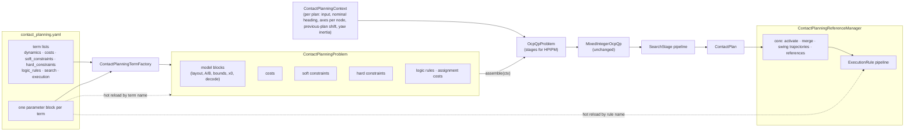

# Contact Planner Refactor: an OCP Assembled from Terms

Implementation proposal, since implemented on the branch this document lives on. Section 9 records what was built and
where the implementation deviates from the plan below; the plan itself is kept as written for the review record.

The mixed-integer contact planner (`humanoid_common_mpc/contact_planning/`, section 2 of
[humanoid_nmpc/docs/README.md](../README.md)) is formulated in one place: `LipContactPlanner::buildProblem()` writes the
reduced model, every cost, every constraint row and the input bounds straight into HPIPM stage matrices, and
`LipContactPlanner::propagate()` enforces the combinatorial rules in one fixpoint loop. The whole-body NMPC is built the
other way round: `WBMpcInterface::setupOptimalControlProblem()` assembles an OCS2 `OptimalControlProblem` from named
term objects, gated by the `costs` / `soft_constraints` / `hard_constraints` lists of the task file, and the parameter
updater hot-reloads every term by name. This proposal restructures the planner the same way, and gives the execution
heuristics of the reference manager (phase resetting, DCM step adjustment, cadence modulation, heading override) the
same treatment, so that the problem the planner solves and the corrections applied around it can be read off one
configuration file and changed at runtime.

The refactor is behaviour preserving by construction: the shipped DRC Atlas configuration must produce, term for term
and bit for bit, the QP and the propagation the planner builds today. Section 5 describes how that is verified.

---

## 1. Goals and non-goals

Goals

1. One `ContactPlanningProblem` object, mirroring OCS2's `OptimalControlProblem`, whose collections of dynamics blocks,
   costs, soft and hard constraints, contact logic rules and assignment costs are added one by one by a factory, each
   under a name.
2. The formulation is selected in `contact_planning.yaml` by term lists (`dynamics`, `costs`, `soft_constraints`,
   `hard_constraints`, `logic_rules`, `search`, `execution`), with one parameter block per term, in the style of the
   task file's `costs` / `soft_constraints` / `hard_constraints` lists.
3. Every term's parameters are hot-reloadable by name through the existing parameter updater, the GUI tab and the ROS
   parameter topic; the term lists themselves can also be re-assembled at runtime because the planner rebuilds its QP
   on every plan anyway.
4. The heuristics around the planner become named, individually selectable pipeline stages with their own parameter
   blocks: the search stages inside the planner (warm start, diving, event-shift local search, heading
   re-linearisation) and the execution rules in the reference manager (phase resetting, cadence modulation, DCM step
   adjustment, planned heading override).
5. The assembled formulation is printed at start-up and on every structural reload: the variable layout, every term with
   a one-line description of its math, and the row count per stage.

Non-goals

* No change to the mathematics of any existing term, rule or heuristic. New capability that falls out of the structure
  (per-term slack penalties, a term switched off that is on today) ships disabled or at today's values.
* No generalisation of the biped-specific terms to `N_CONTACTS > 2`. The terms that assume two feet keep a
  `static_assert(N_CONTACTS == 2)`; the structure makes a later generalisation local to those terms.
* No change to `MixedIntegerOcpQp` and `OcpQpHpipmSolver`: the branch-and-bound only rewrites the binaries' box bounds
  of the problem it is given, and stays unaware of terms.
* No change to the NMPC side: `ContactPlan`, `mergeModeSchedules`, `getSwingFootReference`, the target contact poses and
  the mode schedule hand-over are untouched.

---

## 2. Where the planner stands today

### 2.1 What is written inline

| Piece of the formulation | Where it lives today | Gated by |
| --- | --- | --- |
| LIP CoM dynamics (zero-order hold), foothold integrator | `addRunningNodeTerms`, `s.A` / `s.B` fill | always |
| Heading double integrator, foot yaw integrators | `addRunningNodeTerms`, `makeLayout` | `useAcomDynamics` |
| Input boxes (foot displacement `±bigM`, binaries `[0, 1]`, yaw torque, foot yaw delta) | `addRunningNodeTerms` | always / `useAcomDynamics` |
| Costs at every node: velocity tracking, step width, previous-foothold consistency, heading rate / heading / foot yaw tracking | `buildProblem` loop | weight `> 0` |
| Running costs: ZMP regularisation, foothold regularisation, yaw torque and foot yaw regularisation | `addRunningNodeTerms` | weight `> 0` |
| Terminal DCM capturability (on the last running node, needs `zmp_{N-1}`) | `addRunningNodeTerms`, `k == N - 1` | weight `> 0` |
| Hard rows: no flight, foot motion only in swing, yaw torque budget, foot yaw pinned in contact | `addRunningNodeTerms`, `RowBuilder` | always / `useAcomDynamics` |
| Soft rows: ZMP support region (single and double support), reachability, foot separation, hip yaw range | `addRunningNodeTerms`, `addStateConstraintRows` | always / `useAcomDynamics` |
| Soft-row penalty (one global quadratic and linear weight for every soft row) | `RowBuilder::writeTo` | always |
| Yaw-aligned constraint frame per node and its first-order heading term | `constraintAxes`, `frameTerm` | `useAcomDynamics` |
| Contact logic: phase durations, swing-fits-in-horizon, max-contact yielding, no flight, minimum double support, alternation | `propagate()` (one fixpoint loop, ~200 lines) | config values, `enforceAlternatingFeet` |
| Assignment costs: contact switch, plan consistency | `assignmentCost()` | weight `> 0` |
| Search: warm start from the previous plan, diving, event-shift local search, heading re-linearisation | `plan()`, `warmStartAssignment`, `localSearch`, `MiqpSettings::useDivingHeuristic` | limits `> 0`; diving is not configurable |
| Solver settings for the relaxations | `relaxationQpSettings` | `maxQpIterations` only |

Sizes: 8 states, 8 inputs and 27 general rows per running stage without the heading model; 12 / 12 / 37 with it. The
problem is built once per plan (plus once per re-linearisation pass), the branch-and-bound only changes bounds.

### 2.2 The execution layer

`ContactPlanningReferenceManager::modifyReferences()` is a fixed pipeline with feature flags:

1. activate the pending plan (stale / inconsistent plans dropped),
2. compute the measured and predicted CoM state, only when a closed-form correction is enabled,
3. `handleContactEvents`: cadence shifts (`enableEnergyCadenceModulation`) and phase resetting
   (`enablePhaseResetting`) through `adaptScheduleToContactEvents`, then shift the plan and request a re-plan,
4. merge the applied schedule with the plan at the plan's commit boundary,
5. `applyPlannedHeading` (`useAcomDynamics && planHeadingOverridesTarget`),
6. swing trajectories, with the ground-search descent of a late touch-down (`enablePhaseResetting`),
7. `updateDcmStepAdjustment` (`enableDcmStepAdjustment`, clipped to the reachability term's region),
8. target contact poses for the viewer.

Steps 1, 4, 6 and 8 are the core of the manager. Steps 3, 5 and 7 are heuristics that read and write the same state
(the per-foot `SwingTimingLatch`, the active plan, the shift log) and are the ones this proposal makes modular.

### 2.3 Configuration and runtime paths

* `ContactPlanningConfig` is one flat struct of about 70 keys covering the grid, the model, every weight and limit,
  the solver budget, threading, the execution heuristics and the heading model. `loadContactPlanningConfig()` reads
  them with `loadPtreeValue`, one line per key, tied by `LINT.IfChange` to the Atlas file and to the GUI's key groups.
* `ContactPlanningModelParameters::applyTo()` overwrites the model-derived entries (yaw torque limits, hip yaw bounds,
  `comHeight` and the ZMP box when left at 0) on every configuration, including hot reloads.
* Hot reload: the parameter updater watches `contact_planning.yaml` and the parameter topic, and calls
  `ContactPlannerModule::setConfig()` with a freshly parsed struct; the worker thread applies it before its next plan
  (`LipContactPlanner::setConfig`, which keeps the warm start unless the grid or the layout changed). The reference
  manager receives the same struct.
* The GUI tab renders hard-coded groups of keys as sliders and treats a hard-coded list as static.
* Consumers outside the planner read individual flags: `CentroidalMpcRobotSim` checks `enablePhaseResetting` against
  `simReportsGroundTruthContacts`; the integration test edits keys by regex.

---

## 3. Target architecture

### 3.1 The mirror of the OCS2 structure

| WB MPC (OCS2) | Planner today | Proposed |
| --- | --- | --- |
| `OptimalControlProblem` with term collections | `buildProblem()` | `ContactPlanningProblem` with `Collection<T>` members (the OCS2 `Collection` template, reused as is) |
| `SystemDynamicsBase` | inline `A` / `B` fill, `makeLayout` | `LipModelBlock` terms that declare variables, fill dynamics and bounds, set `x0`, decode the plan |
| `StateInputCost`, `StateCost`, `finalCost` | `addQuadraticResidual` calls | `LipCost` terms with a node set (running, terminal, all nodes, last running node) |
| soft `StateInputConstraint` + penalty | `RowBuilder::add(..., soft = true)` | `LipConstraint` terms with `Softness::SOFT` and their own slack penalty (default: today's global one) |
| hard equality / inequality constraints | `RowBuilder::add(..., soft = false)` | `LipConstraint` terms with `Softness::HARD` |
| (no analogue: the binaries are not part of the NMPC) | `propagate()`, `assignmentCost()` | `ContactLogicRule` and `AssignmentCost` terms over a shared `ContactLogicState` |
| `PreComputation` | `constraintAxes`, `frameTerm`, `previousPlanShift`, `yawInertia` | `ContactPlanningContext`, computed once per plan |
| `MpcFormulationTasks` and its YAML lists | none | `ContactPlanningFormulation`: term lists and per-term parameter blocks |
| `HumanoidCostConstraintFactory` | none | `ContactPlanningTermFactory` |
| `MpcParameterUpdaterModule` calling `get<T>(name).setWeights()` | `setConfig(wholeStruct)` | `ContactPlanningProblem::setParameters(name, block)` by term name, plus structural re-assembly when a list changed |
| SQP settings | inline in `plan()` | `SearchStage` pipeline: `warm_start_previous_plan`, `diving`, `event_shift_local_search`, `heading_relinearisation` |
| reference manager (`SwitchedModelReferenceManager`) | fixed pipeline with flags | `ExecutionRule` pipeline: `phase_resetting`, `energy_cadence_modulation`, `dcm_step_adjustment`, `planned_heading_override` |



### 3.2 `ContactPlanningProblem` and the term interfaces

```cpp
// Per-plan pre-computation, the analogue of ocs2::PreComputation. Built once in LipContactPlanner::plan() and once per
// heading re-linearisation pass; every term reads from it and none of them recomputes it.
struct ContactPlanningContext {
  const ContactPlannerInput& input;
  const Layout& layout;
  const HeadingNominal& nominal;                    // per node; the commanded ramp without the heading model
  std::vector<std::array<vector2_t, 2>> axes;       // per node: e_x, e_y of the constraint frame
  int previousPlanShift = -1;                       // -1: no usable previous plan
  const ContactPlan* previousPlan = nullptr;
  scalar_t yawInertia = 0.0;
  scalar_t dt, omega; int numNodes;
  // First-order heading term of e_axis(theta) . d around the nominal (today's frameTerm), zero without the heading block.
  std::pair<scalar_t, scalar_t> frameTerm(int node, int axis, const vector2_t& dNominal) const;
};

class ContactPlanningTerm {
 public:
  virtual ~ContactPlanningTerm() = default;
  virtual std::string describe() const = 0;                    // one line of math, printed at start-up
  virtual std::vector<std::string> requiredBlocks() const;     // model blocks this term needs, checked at assembly
  virtual void bind(const Layout& layout) = 0;                 // resolve variable indices once
  virtual void setParameters(const TermParameters& p) = 0;     // hot reload; validates, throws on bad values
  virtual TermParameters getParameters() const = 0;            // for the start-up print and the GUI
};

enum class NodeSet { RUNNING, TERMINAL, ALL, LAST_RUNNING };

class LipCost : public ContactPlanningTerm {
 public:
  virtual NodeSet nodeSet() const = 0;
  // Adds w (l_x' x + l_u' u + c)^2 terms to the stage (today's addQuadraticResidual, on a StageAccumulator).
  virtual void addToStage(const ContactPlanningContext& ctx, int node, StageAccumulator& stage) const = 0;
};

enum class Softness { HARD, SOFT };

class LipConstraint : public ContactPlanningTerm {
 public:
  virtual NodeSet nodeSet() const = 0;
  virtual Softness softness() const = 0;
  virtual void addRows(const ContactPlanningContext& ctx, int node, RowBuilder& rows) const = 0;
  // Soft terms: their own slack penalty, defaulting to the formulation-wide values (today's single pair).
  virtual SlackPenalty slackPenalty() const;
};

class LipModelBlock : public ContactPlanningTerm {
 public:
  virtual void declareVariables(LayoutBuilder& layout) const = 0;   // names, counts, per-node input bounds
  virtual void addDynamics(const ContactPlanningContext& ctx, int node, OcpQpStage& stage) const = 0;  // A, B, b
  virtual void setInitialState(const ContactPlanningContext& ctx, vector_t& x0) const = 0;
  virtual void decode(const ContactPlanningContext& ctx, const OcpQpSolution& sol, ContactPlan& plan) const = 0;
};

class ContactLogicRule : public ContactPlanningTerm {
 public:
  // One pass over the fixed prefix. Returns false on a contradiction; `changed` reports fixings, the driver iterates
  // to a fixpoint exactly as propagate() does today.
  virtual bool propagate(const ContactLogicState& state, MiqpAssignment& a, bool& changed) const = 0;
};

class AssignmentCost : public ContactPlanningTerm {
 public:
  virtual scalar_t cost(const ContactLogicState& state, const MiqpAssignment& a) const = 0;  // exact when complete, a lower bound otherwise
};

struct ContactPlanningProblem {
  Collection<LipModelBlock> model;         // order fixes the variable layout
  Collection<LipCost> costs;
  Collection<LipConstraint> softConstraints;
  Collection<LipConstraint> hardConstraints;
  Collection<ContactLogicRule> logicRules;
  Collection<AssignmentCost> assignmentCosts;
  SlackPenalty defaultSlackPenalty;

  Layout finalizeLayout();                                        // after the model blocks are added; binds every term
  OcpQpProblem assemble(const ContactPlanningContext& ctx) const;  // today's buildProblem, term by term
  bool propagate(const ContactLogicState& s, MiqpAssignment& a) const;
  scalar_t assignmentCost(const ContactLogicState& s, const MiqpAssignment& a) const;
  void setParameters(const std::string& term, const TermParameters& p);  // hot reload by name
  std::string summary() const;                                    // the start-up print
};
```

`StageAccumulator` is today's `addQuadraticResidual` on an `OcpQpStage`, and `RowBuilder` is today's class made
public; both move to `contact_planning/problem/`. `assemble()` loops over the nodes and, per node, over the model blocks,
the costs and the constraints in collection order, so that a term is a few lines of index arithmetic and nothing else.

### 3.3 Model blocks and the variable layout

The `Layout` becomes the concatenation of what the model blocks declare, in the order they are added:

| Block | States | Inputs | Notes |
| --- | --- | --- | --- |
| `lip_com` | `c_xy`, `v_xy` | `zmp_xy` | zero-order-hold LIP, `omega` from `gravity` / `comHeight` |
| `foothold_integrator` | `p_L`, `p_R` | `dp_L`, `dp_R`, `c_L`, `c_R` | owns the binaries, `dp` bounds `±bigM`, `c` in `[0, 1]`; declares the `MiqpBinaryVariable`s |
| `heading_double_integrator` | `theta`, `omega`, `psi_L`, `psi_R` | `tau_L`, `tau_R`, `dpsi_L`, `dpsi_R` | today's heading model; torque bound from the model parameters, yaw delta `±2π` |

The first two blocks are mandatory and always first, so that the `StateIndex` / `InputIndex` enums keep their values
and `MixedIntegerOcpQp` finds the binaries where it finds them today. `useAcomDynamics: true` becomes the presence of
`heading_double_integrator` in the `dynamics` list (the loader maps the legacy flag). Terms that need the heading block
list it in `requiredBlocks()`, and `finalizeLayout()` rejects a formulation that asks for `heading_tracking` without
it, in the way `loadMpcFormulationTasks` rejects `zero_velocity` as both hard and soft.

Every term resolves its indices once in `bind()` (`ctx.layout.state("theta")` style lookups) and works with cached
integers afterwards, so `assemble()` costs what `buildProblem()` costs now.

### 3.4 Costs and constraints, term by term

The default formulation is the exact inventory of section 2.1. Names are snake_case in YAML and matched with the same
normalisation as `stringToMpcCostType` (case-insensitive, separators ignored).

Costs

| Term | Node set | Today's parameter(s) | Description printed |
| --- | --- | --- | --- |
| `velocity_tracking` | all | `velocityTrackingWeight` | `w ‖v_k − v_cmd‖²` |
| `step_width` | all | `stepWidthWeight`, `nominalStepWidth` | `w (e_y·(p_L − p_R) − w_nom)²`, with the frame term |
| `previous_foothold_consistency` | all | `previousFootholdWeight` | `w ‖p_i,k − p_i,prev(k+shift)‖²` when a previous plan is usable |
| `zmp_regularization` | running | `zmpRegularizationWeight` | `w ‖zmp_k − c_k‖²` |
| `foothold_regularization` | running | `footholdRegularizationWeight` | `w Σ_i ‖dp_i,k‖²` |
| `terminal_dcm` | last running | `terminalDcmWeight` | `w e^{2ωΔt} ‖ξ_{N−1} − zmp_{N−1}‖²` |
| `heading_rate_tracking` | all | `headingRateTrackingWeight` | `w (ω_k − ω_cmd)²` |
| `heading_tracking` | all | `headingTrackingWeight` | `w (θ_k − θ_0 − ω_cmd k Δt)²` |
| `foot_yaw_tracking` | all | `footYawTrackingWeight` | `w Σ_i (ψ_i,k − θ_nom,k)²` |
| `yaw_torque_regularization` | running | `yawTorqueWeight` | `w Σ_i τ_i,k²` |
| `foot_yaw_regularization` | running | `footYawRegularizationWeight` | `w Σ_i dψ_i,k²` |
| `regularization` | all | (constants 1e-8 / 1e-6 today) | diagonal `Q` / `R` regularisation; becomes a named term so that it is visible and tunable |

Soft constraints (slack penalty: per term, default = today's `constraintSlackWeight` / `constraintSlackLinearWeight`)

| Term | Node set | Today's parameter(s) | Rows |
| --- | --- | --- | --- |
| `zmp_support_region` | running | `zmpHalfWidthX/Y`, `bigM` | 8 single-support box rows, 2 double-support heading rows, 2 double-support lateral rows |
| `reachability` | all | `reachX`, `reachYInner`, `reachYOuter` | 4 (per foot and axis), with the frame term |
| `foot_separation` | all | `maxStepLength`, `minStepWidth`, `maxStepWidth` | 2, with the frame term |
| `hip_yaw_range` | all | model-derived `footYawOffsetLower/Upper` | 1 per foot |

Hard constraints

| Term | Node set | Today's parameter(s) | Rows |
| --- | --- | --- | --- |
| `no_flight` | running | none | `1 ≤ c_L + c_R ≤ 2` |
| `foot_motion_in_swing_only` | running | `bigM` | 8: `±dp_ij + M c_i ≤ M` |
| `yaw_torque_budget` | running | model-derived `torsionalFrictionTorque`, `doubleSupportYawCouple` | 2 per foot |
| `foot_yaw_pinned_in_contact` | running | none | 2 per foot |

`bigM` is shared by two terms and by `ContactPlanningConfig::validate()` (`bigM > maxStepLength`); it stays a
formulation-level parameter (section 3.8), not a per-term one.

### 3.5 Contact logic rules and assignment costs

This is the part where a naive split would change behaviour. Today's `propagate()` is one fixpoint loop in which the
duration rule reads state that the double-support rule produces (`heldByDoubleSupport`, the contact ages, the state
before a node), so that an overdue foot yields to a double support or to the other foot. The proposal keeps that
coupling explicit and shared:

* `ContactLogicState` is the pre-computation of the logic layer, built once per plan from the input and the grid:
  node clocks (`switchTime`, `switchNode`, `switchedPhaseNodes`, `initialPhaseNodes` with their conservative
  rounding), the committed prefix, the duration limits in nodes, `lastSwungFoot`. Its `PrefixScan` part (per foot
  along the fixed prefix: `kappa`, `tauMin` / `tauMax`, contact age, `heldByDoubleSupport`, the touch-down nodes) is
  recomputed at the start of every fixpoint pass, exactly where `computeDoubleSupportHold()` runs today.
* The rules are run in today's order inside the same driver loop (`for pass < 4N: recompute scan; for rule: propagate;
  until no change`):

| Rule | Today's code | Parameters |
| --- | --- | --- |
| `phase_durations` | the per-foot forward pass: min / max swing and contact, the nearest-node tie break, the swing-fits-in-horizon rule and the max-contact yielding | `minSwingDuration`, `maxSwingDuration`, `minContactDuration`, `maxContactDuration` (shared block `gait_limits`) |
| `no_flight` | the cross constraint per node | none |
| `minimum_double_support` | the touch-down hold | `minDoubleSupportDuration` (`gait_limits`) |
| `alternating_feet` | the alternation pass | none (present in the list = `enforceAlternatingFeet: true`) |

  `swing_fits_in_horizon` and the max-contact yielding stay inside `phase_durations`: they are not separable from the
  forward pass without re-deriving it, and the goal is structure, not a re-derivation.

| Assignment cost | Today's code | Parameters |
| --- | --- | --- |
| `contact_switch` | `numSwitches * contactSwitchCost` | `contactSwitchCost` |
| `plan_consistency` | `numInconsistent * planConsistencyCost` | `planConsistencyCost` |

Because the fixpoint driver is order-independent in its result (a contradiction ends the search whichever rule finds
it, and fixings are monotone), the split cannot change which assignments are accepted, only how many passes it takes.
Section 5 makes that a tested fact rather than an argument.

### 3.6 The search pipeline

`LipContactPlanner::plan()` becomes: build the context, assemble the problem, run the branch-and-bound, then run the
configured `SearchStage`s in order on the incumbent:

| Stage | Today | Parameters |
| --- | --- | --- |
| `warm_start_previous_plan` | `warmStartAssignment()` and the `previousAssignment_` bookkeeping | none |
| `diving` | `MiqpSettings::useDivingHeuristic`, always on, `maxDiveIterations` not exposed | `maxDiveIterations` |
| `event_shift_local_search` | `localSearch()` | `iterations`, `maxTime` |
| `heading_relinearisation` | the re-linearisation loop at the end of `plan()` | `passes` (requires the heading block) |

`warm_start_previous_plan` and `diving` are inputs to `MixedIntegerOcpQp::solve()` rather than post-passes; the stage
interface has a `beforeSearch()` hook for them and an `afterSearch()` hook for the other two, so that the pipeline stays
one list in the YAML. The solver budget (`maxBranchAndBoundNodes`, `maxSolveTime`, `maxQpIterations`) stays a planner
setting, not a stage.

### 3.7 The execution pipeline in the reference manager

`modifyReferences()` keeps its core (activate, merge, swing trajectories, references, target poses) and delegates the
heuristics to an ordered list of `ExecutionRule`s that share an `ExecutionContext` (time, measured contacts, the active
plan, the measured and predicted CoM state, the swing latches, the shift log, the config of the planner terms the rule
needs):

| Rule | Today | Hook | Parameters |
| --- | --- | --- | --- |
| `energy_cadence_modulation` | `computeCadenceTouchDownShifts()` and the cadence branch of `adaptScheduleToContactEvents()` | `adaptSchedule(ctx, schedule)` | `gain`, `deadband`; clamps to `gait_limits` |
| `phase_resetting` | the early / late branches of `adaptScheduleToContactEvents()`, the ground-search descent in `updateSwingTrajectories()` | `adaptSchedule(ctx, schedule)`, `adaptSwingHeight(ctx, planner)` | `earlyTouchdownMinSwingRatio`, `earlyTouchdownMinContactDuration`, `maxLateTouchdownExtension`, `lateTouchdownExtensionStep`, `lateTouchdownSearchVelocity` |
| `dcm_step_adjustment` | `updateDcmStepAdjustment()`, `clipFootholdToReach()` | `correctFootholds(ctx) -> feet_array_t<vector2_t>` | `gain`, `maxOffset`; clips to the `reachability` term's region |
| `planned_heading_override` | `applyPlannedHeading()` | `overrideTarget(ctx, targetTrajectories)` | none (requires the heading block) |

The three schedule rules keep sharing the per-foot `SwingTimingLatch` through the context. Running them as separate
rules in the order early touch-down, cadence, late touch-down is equivalent to today's single per-foot loop: an early
touch-down truncates the swing at the current time and resets the latch, after which the cadence rule sees a foot in
contact (an event at the query time counts as passed) and the late rule sees an inactive latch, exactly the two
`continue`s of the current function. The existing `ContactEventTest` cases run unchanged through the new pipeline and
pin this down.

`ContactScheduleAdaptation.h` stays as the library of pure schedule queries and edits the rules are written with; only
`adaptScheduleToContactEvents()` is dissolved into the rules.

The core also gains the same two mechanisms the planner gets: `setParameters(rule, block)` for hot reload and
`summary()` for the start-up print, and `CentroidalMpcRobotSim`'s check becomes `hasExecutionRule("phase_resetting")`.

### 3.8 The formulation file

`contact_planning.yaml` keeps its top-level `contact_planning` key (the parameter updater, the GUI and
`resolveContactPlanningConfigFile()` rely on it) and is restructured underneath into planner settings, term lists and
one parameter block per term. The excerpt below is the DRC Atlas file migrated one-to-one; every value is the value
shipped today and every list reproduces today's formulation, including the two features the Atlas file has on
(`enablePhaseResetting: true`, `useAcomDynamics: true`).

```yaml
contact_planning:
  planner:                       # grid, commit window, solver budget, threading: properties of the planner, not of a term
    dt: 0.1
    numNodes: 12
    commitTime: 0.3
    maxBranchAndBoundNodes: 200
    maxSolveTime: 0.1
    maxQpIterations: 60
    runInBackgroundThread: true
    planningFrequency: 10.0
    verbose: false

  shared:                        # parameters read by more than one term
    gravity: 9.81
    comHeight: 0.85              # 0 = from the model
    bigM: 1.5                    # must exceed foot_separation.maxStepLength
    slack_penalty: { quadratic: 10000.0, linear: 100.0 }   # default of every soft constraint
    gait_limits:                 # logic rules, cadence modulation, node conversions
      minSwingDuration: 0.3
      maxSwingDuration: 0.5
      minContactDuration: 0.1
      maxContactDuration: 0.0
      minDoubleSupportDuration: 0.05

  dynamics:                      # order fixes the variable layout; the first two are mandatory
    - lip_com
    - foothold_integrator
    - heading_double_integrator  # was useAcomDynamics: true

  costs:
    - regularization
    - velocity_tracking
    - step_width
    - previous_foothold_consistency
    - zmp_regularization
    - foothold_regularization
    - terminal_dcm
    - heading_rate_tracking
    - heading_tracking
    - foot_yaw_tracking
    - yaw_torque_regularization
    - foot_yaw_regularization

  soft_constraints:
    - zmp_support_region
    - reachability
    - foot_separation
    - hip_yaw_range

  hard_constraints:
    - no_flight
    - foot_motion_in_swing_only
    - yaw_torque_budget
    - foot_yaw_pinned_in_contact

  logic_rules:
    - phase_durations
    - no_flight
    - minimum_double_support
    - alternating_feet           # was enforceAlternatingFeet: true

  assignment_costs:
    - contact_switch
    - plan_consistency

  search:
    - warm_start_previous_plan
    - diving
    - event_shift_local_search
    - heading_relinearisation

  execution:                     # each changes the closed loop: list only what is validated
    - phase_resetting            # was enablePhaseResetting: true
    - planned_heading_override   # was planHeadingOverridesTarget: true
    # - energy_cadence_modulation
    # - dcm_step_adjustment

  # ---- one block per term, named as the term ----
  velocity_tracking:          { weight: 50.0 }
  step_width:                 { weight: 10.0, nominalStepWidth: 0.25 }
  previous_foothold_consistency: { weight: 5.0 }
  zmp_regularization:         { weight: 0.1 }
  foothold_regularization:    { weight: 0.2 }
  terminal_dcm:               { weight: 50.0 }
  heading_rate_tracking:      { weight: 20.0 }
  heading_tracking:           { weight: 5.0 }
  foot_yaw_tracking:          { weight: 5.0 }
  yaw_torque_regularization:  { weight: 0.001 }
  foot_yaw_regularization:    { weight: 1.0 }
  regularization:             { state: 1.0e-8, input: 1.0e-6 }
  zmp_support_region:         { halfWidthX: 0.08, halfWidthY: 0.04 }       # 0 = from the footprint
  reachability:               { reachX: 0.6, reachYInner: 0.05, reachYOuter: 0.45 }
  foot_separation:            { maxStepLength: 0.7, minStepWidth: 0.15, maxStepWidth: 0.45 }
  contact_switch:             { cost: 0.3 }
  plan_consistency:           { cost: 0.5 }
  diving:                     { maxDiveIterations: 64 }
  event_shift_local_search:   { iterations: 10, maxTime: 0.05 }
  heading_relinearisation:    { passes: 1 }
  phase_resetting:
    earlyTouchdownMinSwingRatio: 0.25
    earlyTouchdownMinContactDuration: 0.02
    maxLateTouchdownExtension: 0.15
    lateTouchdownExtensionStep: 0.05
    lateTouchdownSearchVelocity: 0.05
  energy_cadence_modulation:  { gain: 0.01, deadband: 0.0 }
  dcm_step_adjustment:        { gain: 0.5, maxOffset: 0.05 }
```

Model-derived parameters stay out of the file: `ContactPlanningModelParameters::applyTo()` writes them into the
`yaw_torque_budget`, `hip_yaw_range`, `zmp_support_region` and `lip_com` blocks of the parsed formulation, on the initial
load and on every hot reload, as it does on the struct today.

The loader, `loadContactPlanningFormulation(yamlFile)`, returns a `ContactPlanningFormulation` (planner settings, the
shared block, the lists, a `name -> TermParameters` map) and validates it: unknown term names are an error listing the
supported ones (as `stringToMpcCostType` does), a term whose required block is missing is an error, a parameter block
for a term that is not listed is a warning. A legacy flat block (today's keys, no lists) is recognised and translated
into the default formulation with a one-time deprecation warning, so that nothing breaks while the files are migrated;
the translation table is the migration of the Atlas file itself and is deleted once no flat file is left.

### 3.9 Runtime configurability

The planner's advantage over the NMPC is that its terms hold no compiled models: assembling the problem is a few
microseconds of index arithmetic per node, so a change of the formulation is cheap at runtime.

* Parameter reload (the WB MPC path): the parameter updater keeps watching `contact_planning.yaml` and the parameter
  topic and keeps calling `ContactPlannerModule::setConfig()`, now with a `ContactPlanningFormulation`. The worker
  applies it between plans, as today: for every term in the map, `problem.setParameters(name, block)`; the reference
  manager does the same for its rules. Every `setParameters` validates its own block and throws, and the module rejects
  the whole reload on the first error, so that a bad edit never leaves the problem half updated (today's `validate()`
  behaviour).
* Structural reload: when a term list differs from the assembled problem, the worker re-assembles the problem through
  the factory. The warm start survives unless the grid or the layout changed (today's rule in
  `LipContactPlanner::setConfig`), which is a property of the `dynamics` list and the `planner` block only.
* GUI: `_render_contact_planning` renders one group per parameter block (title = term name, one slider per numeric
  scalar, booleans and integers static as today) and the term lists as read-only checklists, instead of the six
  hard-coded groups; the `LINT.IfChange` pair with the config loader goes away with the key list it guarded. The
  slider path is unchanged: it publishes `contact_planning.<term>.<key>` on the parameter topic and writes the file.
* Model-derived overrides are re-applied on every reload before validation, as today.

### 3.10 Introspection

`ContactPlanningProblem::summary()` and the reference manager's equivalent are logged at construction and after every
structural reload, in the style of the verbose block of `loadMpcFormulationTasks`:

```
[ContactPlanner] layout: x = [c_x c_y v_x v_y p_Lx p_Ly p_Rx p_Ry theta omega psi_L psi_R] (12), u = [zmp_x zmp_y dp_Lx dp_Ly dp_Rx dp_Ry c_L c_R tau_L tau_R dpsi_L dpsi_R] (12)
[ContactPlanner] costs (12): velocity_tracking  w ‖v_k − v_cmd‖²  w = 50 ...
[ContactPlanner] soft constraints (4, 16 rows running / 8 terminal): zmp_support_region ... slack (1e4, 100) ...
[ContactPlanner] hard constraints (4, 21 rows running): no_flight  1 ≤ c_L + c_R ≤ 2 ...
[ContactPlanner] logic rules (4): phase_durations  swing 3..5 nodes, contact ≥ 1 node ...
[ContactPlanner] search (4): warm_start_previous_plan, diving (64), event_shift_local_search (10 rounds, 0.05 s), heading_relinearisation (1 pass)
[ContactPlanningReferenceManager] execution (2): phase_resetting (...), planned_heading_override
```

The same summary is exposed through `ContactPlannerModule::getFormulationSummary()` for the tests and the telemetry.

---

## 4. File layout after the refactor

```
humanoid_common_mpc/include/humanoid_common_mpc/contact_planning/
  problem/       ContactPlanningProblem.h  ContactPlanningContext.h  Layout.h  StageAccumulator.h  RowBuilder.h  Terms.h
  model/         LipComDynamics.h  FootholdIntegrator.h  HeadingDoubleIntegrator.h
  cost/          TrackingCosts.h (velocity, step width, heading, foot yaw)  RegularizationCosts.h  TerminalDcmCost.h  PreviousFootholdCost.h
  constraint/    ZmpSupportRegionConstraint.h  ReachabilityConstraint.h  FootSeparationConstraint.h  HipYawRangeConstraint.h
                 NoFlightConstraint.h  FootMotionInSwingConstraint.h  YawTorqueBudgetConstraint.h  FootYawPinConstraint.h
  logic/         ContactLogicState.h  PhaseDurationRule.h  NoFlightRule.h  MinimumDoubleSupportRule.h  AlternatingFeetRule.h  AssignmentCosts.h
  search/        SearchStage.h  WarmStartStage.h  DivingStage.h  EventShiftLocalSearch.h  HeadingRelinearisation.h
  execution/     ExecutionRule.h  ExecutionContext.h  PhaseResettingRule.h  EnergyCadenceRule.h  DcmStepAdjustmentRule.h  PlannedHeadingOverride.h
  ContactPlanningFormulation.h      (settings, shared block, lists, parameter map, loader, legacy translation)
  ContactPlanningTermFactory.h      (name -> term, the analogue of HumanoidCostConstraintFactory)
  LipContactPlanner.h               (owns the problem and the search pipeline; the public test hooks stay as thin forwards)
  ContactPlannerModule.h  ContactPlanningReferenceManager.h  ContactScheduleAdaptation.h  ContactPlan.h  TargetContactPose.h
  MixedIntegerOcpQp.h  OcpQpHpipm.h  ContactPlanningModelParameters.h   (unchanged)
```

Optional, recommended: a separate Bazel target `contact_planning_core` for `problem/`, `model/`, `cost/`, `constraint/`,
`logic/`, `search/`, `MixedIntegerOcpQp` and `OcpQpHpipm`. None of them depends on Pinocchio or the reference manager,
so the planner's unit tests would stop rebuilding the whole common library. `ContactPlannerModule`, the reference
manager and the execution rules stay in `humanoid_common_mpc`.

---

## 5. Behaviour preservation

The refactor has no value if it changes a plan. Three tests make equivalence a checked property at every step of the
migration, and the old builder is kept, unchanged, as their reference until the last step:

1. Problem equivalence (`testContactPlanningProblemEquivalence`). `LegacyLipProblemBuilder` is today's `buildProblem()`
   moved verbatim into a test-only file. For a corpus of inputs (standing, walking at several commands, a push, a
   committed prefix with mid-node phase starts, a previous plan present, heading model on and off, a turn in place) the
   new `assemble()` must produce the same `OcpQpProblem`: identical dimensions, index vectors and row order, and every
   matrix equal to 1e-12. The term order of the default formulation is fixed to today's accumulation order, so the sums
   in `Q` / `R` are the same floating-point sums and the tolerance is only there for insurance.
2. Logic equivalence (`testContactLogicEquivalence`). For `numNodes = 6` every one of the 4096 complete assignments and
   a seeded sample of partial ones, under a grid of configurations (durations, double support on and off, alternation
   on and off, committed prefixes, mid-node phase starts), `LegacyPropagate` and the rule pipeline must agree on
   feasibility and on the propagated assignment, and `assignmentCost` must agree exactly.
3. Plan equivalence. The existing `testLipContactPlanner`, `testContactPhaseResetting` and
   `testContactPlanningIntegration` suites run unchanged; in addition the receding-horizon walks of
   `testLipContactPlanner` record the contact sequence and the footholds of each plan with the legacy planner and
   compare exactly (contacts) and to 1e-6 (trajectories) with the new one.

The default-off rule of this repository applies to everything the structure makes newly possible: the shipped Atlas
formulation lists exactly today's terms with today's values, `regularization` carries today's constants, per-term slack
penalties default to the shared pair, and `diving` keeps its `maxDiveIterations = 64`. A change of behaviour, if any is
wanted, is a separate change with its own validation in MuJoCo.

---

## 6. Migration plan

Each step is one reviewable change that leaves every test green and the Atlas behaviour identical. The order is a
strangler pattern: `buildProblem()` delegates to terms one by one and shrinks until it is the legacy reference only.

| Step | Scope | Exit criterion |
| --- | --- | --- |
| 0. Reference and harness | Copy `buildProblem()` / `propagate()` / `assignmentCost()` into `LegacyLipProblemBuilder` (test only); add the three equivalence tests against the planner itself (they pass trivially). | Tests in place, no production change. |
| 1. Context and accumulators | Extract `ContactPlanningContext` (axes per node, frame term, previous-plan shift, inertia), `StageAccumulator`, `RowBuilder` into `problem/`; `buildProblem()` uses them. | Problem equivalence passes. |
| 2. Problem and term interfaces, first costs | Add `ContactPlanningProblem`, `Terms.h`, `Layout`; port the costs (one small change per group: tracking, regularisation, terminal DCM, previous foothold) with `buildProblem()` delegating. | Problem equivalence passes after each group. |
| 3. Constraints | Port the soft and hard constraint terms; per-term slack penalty with the shared default. | Problem equivalence passes; row order identical. |
| 4. Model blocks | Port the LIP, foothold and heading blocks; `Layout` composed from the blocks; `useAcomDynamics` mapped to the block. `decode()` moves into the blocks. | Problem and plan equivalence pass; `StateIndex` enums unchanged. |
| 5. Logic | `ContactLogicState`, the four rules, the two assignment costs, the fixpoint driver. | Logic equivalence passes over the full grid. |
| 6. Search stages | `SearchStage` pipeline; `diving` becomes a stage with its parameter exposed. | Plan equivalence passes. |
| 7. Formulation file and factory | `ContactPlanningFormulation`, the loader with legacy translation, `ContactPlanningTermFactory`, the start-up print; migrate the Atlas `contact_planning.yaml`; parameter updater and `CentroidalMpcInterface` switched to the formulation; `ContactPlanningConfig` reduced to the planner settings and the shared block. | Integration test passes on the migrated file and on the legacy file through the translation. |
| 8. Execution rules | `ExecutionRule` pipeline in the reference manager; `adaptScheduleToContactEvents()` dissolved into the rules; `CentroidalMpcRobotSim` check updated. | `ContactEventTest` and the integration test pass unchanged. |
| 9. GUI and docs | Generic rendering of the term blocks in `mpc_params_tab.py`; section 2 of `humanoid_nmpc/docs/README.md` rewritten around the term names; `LINT.IfChange` pairs re-pointed. | GUI round trip on the migrated file. |
| 10. Cleanup | Delete the legacy builder and the translation once the equivalence tests have been converted into fixture-based regression tests (recorded problems of the corpus). | No legacy code left. |

Rough effort, one engineer familiar with the code: steps 0-1 two days, 2-4 one week, 5 three days (the logic split is
the delicate one), 6 one day, 7 three days, 8 three days, 9 two days, 10 one day. About four weeks end to end, with
the planner usable on the robot after every step.

---

## 7. Risks

| Risk | Where | Mitigation |
| --- | --- | --- |
| A rule split changes which assignments propagate feasible | step 5 | shared `PrefixScan` recomputed per pass, same rule order, exhaustive equivalence over `numNodes = 6` |
| Floating-point accumulation order changes `Q` / `R` in the last bits and the branch-and-bound breaks a tie differently | steps 2-4 | default term order = today's accumulation order; matrix equality to 1e-12; plan equivalence on the receding-horizon walks |
| Hot reload applies a half-valid formulation | step 7 | every `setParameters` validates first; the module applies a reload all-or-nothing, on the worker between plans, as today |
| Warm start dropped on every reload (the regression fixed in `LipContactPlanner::setConfig`) | step 7 | the structural-reload rule is the same predicate (grid and layout) |
| A shared parameter (`bigM`, `gait_limits`) edited in one place but read in another | step 7 | shared block with one owner; terms reference it in `setParameters`; `validate()` checks the cross-term conditions (`bigM > maxStepLength`, `commitNodes < numNodes`) |
| Execution rules see a different latch state than the single loop did | step 8 | rule order early, cadence, late; `ContactEventTest` unchanged |
| GUI or updater silently ignores the new layout | steps 7, 9 | the loader rejects unknown keys at the top of the block; the translation warns once; the GUI shows the lists |
| Term names drift between YAML, factory and docs | all | one table in `ContactPlanningTermFactory.cpp` guarded by `LINT.IfChange` to the Atlas file and the docs |

---

## 8. Open decisions

Recommendations first.

1. Nested per-term blocks (section 3.8) or keep the flat keys and add only the lists. Recommended: nested. The flat
   layout is what makes the formulation hard to read today, and the GUI's hard-coded groups exist only because the file
   has no structure to render. The legacy translation keeps old files working during the migration.
2. Term lists hot-swappable at runtime or fixed at construction like the NMPC. Recommended: hot-swappable. It costs
   nothing in the planner (no compiled models) and is the natural way to A/B a term in MuJoCo. The warm start rule
   stays the one that exists.
3. Per-term slack penalties. Recommended: yes, defaulting to the shared pair, so that the file does not grow until
   someone needs a stiffer reach than ZMP region.
4. `regularization` as a visible term with today's constants, or keep the constants hidden. Recommended: visible. It
   is part of the problem and belongs in the print.
5. Split `contact_planning_core` into its own Bazel target now or later. Recommended: at step 2, when the new files
   appear, because it costs one BUILD edit then and a dependency untangling later.
6. Names: `ContactPlanningProblem` / `LipCost` / `LipConstraint` / `LipModelBlock` / `ContactLogicRule` /
   `SearchStage` / `ExecutionRule`. Open to bikeshedding; the mapping to OCS2 names in section 3.1 is the constraint.

---

## 9. Implementation status

Implemented in one pass rather than in the ten steps of section 6, with the equivalence tests of section 5 as the guard
throughout. What exists:

* `ContactPlanningProblem` (`contact_planning/problem/`) with `TermCollection`s of model blocks, costs, soft and hard
  constraints, logic rules and assignment costs; `ContactPlanningContext` as the per-plan pre-computation;
  `StageAccumulator`, `RowBuilder`, `InputBoundsBuilder`, `Layout` / `LayoutBuilder` / `LipIndices`. One class per
  header and source throughout (`model/`, `cost/`, `constraint/`, `logic/`, `search/`, `execution/`), in the layout of
  the whole-body MPC packages; the shared base classes (`LipWeightedCost`, `LipConstraintBase`) have their own headers.
* `ContactPlanningFormulation` (the term lists, name normalisation, validation with the required-block and
  execution-order rules, `setHeadingModel()`), `ContactPlanningTermFactory`, and `ContactPlanningConfig` restructured
  into `planner`, `shared`, the formulation and one typed block per term. The loader reads the structured layout; a
  file with keys of the previous flat layout is rejected with a message that says how to migrate it.
* `LipContactPlanner` owns the assembled problem and the `SearchStage` pipeline (`warm_start_previous_plan`, `diving`
  with its `maxDiveIterations` exposed, `event_shift_local_search`, `heading_relinearisation`) and prints the
  formulation (`getFormulationSummary()`); `ContactPlannerModule` logs it at construction and after every structural
  reload, and re-assembles on a changed list with the warm-start rule of section 3.9.
* `ContactPlanningReferenceManager` runs the `ExecutionRule` pipeline (`phase_resetting`, `energy_cadence_modulation`,
  `dcm_step_adjustment`, `planned_heading_override`); `adaptScheduleToContactEvents()` stays as the entry point of the
  rule tests and runs the same pipeline.
* Bazel: `contact_planning_core` (everything without a robot model, with `humanoid_common_mpc_types` for the shared
  headers); the planner tests build against it.
* The DRC Atlas `contact_planning.yaml` migrated one-to-one; the tuning GUI renders the structured block generically
  (term lists read-only, one slider group per parameter block) and keeps the fixed groups for a flat file;
  `humanoid_nmpc/docs/README.md` section 2 updated, with a new section 2.10 on the formulation file.
* Tests: `testContactPlanningFormulation` (names, validation, the file layout and the rejection of the flat one),
  `testContactPlanningTerms` (layout, row counts, node sets, required blocks, factory errors, hot reload by term name,
  structural reload and the warm-start rule, search stage lists, execution rules), `testContactPlanningRegression`
  against fixtures under `test/data/contact_planning/`: per stage the dimensions and hashes of every matrix, of the
  input bounds and of the rows as a set, the feasible assignments of a six-node horizon under a grid of configurations
  with a hash of their costs, and eight-step receding-horizon walks with and without the heading model. The fixtures
  were recorded from the term-assembled planner at the point where the equivalence tests against a verbatim copy of
  the previous planner (the assembled QP entry for entry, every assignment of the six-node horizon and random partial
  ones, the same walks) passed; that copy and those tests were then deleted (step 10). The existing planner,
  phase-resetting, plan, target-pose, module and integration tests were migrated to the structured configuration and
  run unchanged otherwise.

Deviations from the plan:

* General rows are emitted grouped by term (the hard constraints, then the soft ones), where the previous planner
  interleaved them; the equivalence test compares the rows as a set. HPIPM solves the same problem, and the
  receding-horizon plans agree in their contact sequences and to 1e-6 in their trajectories.
* The two yaw torque rows and the two foot yaw pin rows of a foot were interleaved per foot before; they are two terms
  now (`yaw_torque_budget`, `foot_yaw_pinned_in_contact`), again a change of row order only.
* `adaptScheduleToContactEvents()` was kept (as a wrapper over the pipeline) instead of being dissolved, so that the
  thirty `ContactEventTest` cases pin the rules down without change.
* Step 10 is done: the legacy planner copy and the flat-layout translation are deleted, the equivalence tests replaced
  by the fixture-based regression tests. A flat file is rejected at load time with a migration hint; the tuning GUI
  shows the same hint instead of rendering it.
* `ContactLogicState` / `ContactLogicScan` carry the shared per-pass scan as designed; the `phase_durations` rule keeps
  the swing-fits-in-horizon and max-contact yielding logic inside it, as section 3.5 anticipated.
