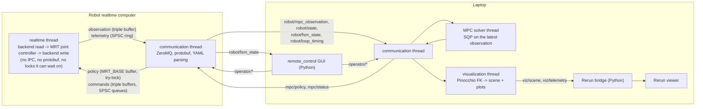

# Distributed runtime: robot, MPC and operator without ROS

This document describes how the humanoid NMPC runs as a set of processes that talk over **ZeroMQ** with
**Protocol Buffers** messages, and how it is visualized with **Rerun**. It replaces the ROS 2 graph (rclcpp/rclpy,
`ros2 launch`, RViz, PlotJuggler) that the repository used before.

The design is driven by one deployment:

- the **realtime loop** (state estimation and the whole-body controller, i.e. the MRT joint controller) runs on the
  **robot's realtime computer**;
- the **MPC solver** runs on a **laptop**, connected over Ethernet or Wi-Fi;
- the **operator tools** (the remote-control GUI, teleoperation, the Rerun viewer) run on the laptop too.

**The MPC must never disrupt the realtime loop's rate.** Every rule below follows from that.

## Processes



<!-- LINT.IfChange(process_table) -->
| Process | Binary | Runs on | Role |
|---|---|---|---|
| robot | `humanoid_centroidal_mpc_robot`, `humanoid_wb_mpc_robot` (`--backend=mujoco`: the MuJoCo simulator) | robot computer, in the robot-runtime container (in simulation: the robot-sim container on the laptop) | realtime loop: backend, MRT joint controller, FSM, telemetry ([`humanoid_common_mpc_app/robot`](../../humanoid_common_mpc_app/robot/README.md)) |
| MPC | `humanoid_centroidal_mpc_node`, `humanoid_wb_mpc_node` | laptop | SQP solver, motion manager, contact planner, parameter updater, visualization publisher |
| dummy sim | `humanoid_centroidal_mpc_dummy_sim`, `humanoid_wb_mpc_dummy_sim` | laptop | plant = OCS2 rollout of the MPC model (no MuJoCo), through the same remote link |
| GUI | `remote_control:base_velocity_controller_gui` (Python, Tk) | laptop | velocity, FSM, gains, joint targets, MPC parameters, dodgeball |
| teleop | `remote_control:xbox_velocity_publisher`, `remote_control:keyboard_velocity_publisher` (Python), `humanoid_common_mpc_app/teleop:velocity_keyboard_command` (C++, a typed line) | laptop | velocity from an Xbox controller or the keyboard |
| Rerun bridge | `humanoid_rerun_viewer` (Python) | laptop | IPC messages -> Rerun |
| launcher | `tools/launch` (Python) | each machine | starts the processes of one machine from a launch file |
<!-- LINT.ThenChange(//humanoid_nmpc/humanoid_centroidal_mpc_app/BUILD.bazel:laptop_binaries, //humanoid_nmpc/humanoid_wb_mpc_app/BUILD.bazel:laptop_binaries, //humanoid_nmpc/humanoid_common_mpc_app/teleop/BUILD.bazel:teleop_binary, //humanoid_nmpc/humanoid_centroidal_mpc_app/BUILD.bazel:robot_binaries, //humanoid_nmpc/humanoid_wb_mpc_app/BUILD.bazel:robot_binaries) -->

**Simulation runs the hardware topology.** The robot process and the MPC node are separate processes in every
launch, talking over the remote link (`RemoteMpcLink` <-> `MpcServer`); the MuJoCo simulator is the robot process's
backend (`--backend=mujoco`), where a hardware backend will plug in under its own name. The robot binaries do not host
the MPC: the in-process mode of before the split (`--mpc_link=in_process`) was removed with its copy of the MPC node's
assembly, and the retired flag is refused at start-up. `InProcessMpcLink` (the solver on a thread of the process,
through `ocs2::MPC_MRT_Interface`) stays for the controller unit tests and for the deterministic lockstep closed loop of
`humanoid_nmpc/humanoid_mpc_validation`, which runs its solver iterations itself (`InProcessMpcLink::Execution::kCaller`,
`runSolverIteration()`) on the simulation's clock.

## IPC: a ZeroMQ bus without a broker

`robot_runtime/robot_ipc` (C++) and its Python twin (`robot_runtime/robot_ipc/python/robot_ipc`) implement one
pattern:

- Every process that publishes binds **one PUB socket** at the endpoint of its **node name** in the network file.
- Every process that subscribes connects **one SUB socket to every endpoint** in the network file and filters by topic.
  Any process may therefore publish any topic, and a subscriber does not need to know which process publishes it.
  ZeroMQ reconnects on its own, so processes start in any order.
- There is no broker, no discovery and no multicast (which is unreliable over Wi-Fi).

The network file (`config/ipc/network.textproto`, chosen with `--network_config`) names the nodes. It is a textproto
of `robot_ipc_proto.NetworkConfig` (`robot_runtime/robot_ipc/proto/network_config.proto`):

```textproto
nodes { name: "robot"     host: "127.0.0.1"  port: 5600 }  # the robot process
nodes { name: "mpc"       host: "127.0.0.1"  port: 5610 }  # the MPC node
nodes { name: "operator"  host: "127.0.0.1"  port: 5620 }  # the remote_control GUI
nodes { name: "teleop"    host: "127.0.0.1"  port: 5621 }  # keyboard / Xbox teleoperation
```

For the hardware split both machines use the same file with the robot's and the laptop's addresses. The C++ and the
Python loader parse it strictly: an unknown field, a value of the wrong type or a syntax error is an error naming the
file, the line and the column, and an invalid node (a duplicate name or endpoint, a port outside 1-65535, an empty
host) is an error naming the node ([`robot_ipc`](../../../robot_runtime/robot_ipc/README.md#the-network-file)).

**Framing.** Each message is three frames: the topic, the full protobuf type name (`humanoid_mpc_msgs.MpcPolicy`), and
the serialized message. The type name lets the generic tool ([`tools/ipc`](../../../tools/ipc/README.md)) decode any
topic without a registry: `bazel run //tools/ipc:ipc_tool -- echo mpc/status`, `hz robot/mpc_observation`, `list`.

**Delivery.** A subscriber picks per topic:

- `kLatest`: each time the IO thread drains the socket, only the newest message of the topic is handed over. Used for
  every stream (observations, policies, velocity commands, parameter documents, joint targets, telemetry for the
  scene).
- `kAll`: every message, in order. Used for discrete events (FSM commands, dodgeball throws) and for plots.

PUB sockets never block: a slow or absent subscriber makes ZeroMQ drop at the high-water mark. `LINGER` is 0, so a
process exits immediately.

**Threads.** ZeroMQ sockets are owned by exactly one thread, the bus's IO thread. Handlers and periodic callbacks run
on it. `Bus::publish()` may be called from any non-realtime thread (it serializes on the caller and hands the bytes to
the IO thread). **The realtime thread never calls the bus.**

### Topics

The names are constants in `humanoid_nmpc/humanoid_mpc_ipc/include/humanoid_mpc_ipc/Topics.h` and
`humanoid_nmpc/humanoid_mpc_ipc/python/humanoid_mpc_ipc/topics.py`, tied together with `LINT.IfChange`.

<!-- LINT.IfChange(topic_table) -->
| Topic | Message | Publisher | Subscribers | Delivery | Rate |
|---|---|---|---|---|---|
| `robot/mpc_observation` | `MpcObservation` | robot | MPC | latest | every control cycle |
| `robot/state` | `RobotStateSample` | robot | MPC (visualization) | all | `telemetryFrequency` |
| `robot/fsm_state` | `FsmState` | robot | GUI | latest | on change and 2 Hz |
| `robot/loop_timing` | `LoopTiming` | robot | GUI, bridge | latest | 1 Hz |
| `mpc/policy` | `MpcPolicy` | MPC | robot, dummy sim | latest | every solve |
| `mpc/status` | `MpcStatus` | MPC | robot (solver health), GUI, bridge | latest | every solve attempt |
| `viz/scene` | `VisualizationScene` | MPC (visualization) | bridge | latest | `rerunSceneFrequency` |
| `viz/telemetry` | `TelemetrySeries` | MPC (visualization) | bridge | all | per `robot/state` sample |
| `operator/walking_velocity_command` | `WalkingVelocityCommand` | GUI, teleop | MPC; robot (gantry height in sim) | latest | 25 Hz |
| `operator/fsm_command` | `FsmCommand` | GUI | robot | all | on change |
| `operator/mpc_parameters` | `YamlDocument` | GUI | MPC; robot (controller-side keys) | latest | on edit |
| `operator/pd_gains` | `YamlDocument` | GUI | robot | latest | on edit |
| `operator/joint_targets` | `JointTargets` | GUI | robot | latest | on edit, JOINT_PD only |
| `operator/dodgeball_throw` | `YamlDocument` | GUI | robot (simulation) | all | on button press |
<!-- LINT.ThenChange(//humanoid_nmpc/humanoid_mpc_ipc/include/humanoid_mpc_ipc/Topics.h:topics, //humanoid_nmpc/remote_control/remote_control/operator_bus.py:operator_topics) -->

## The realtime thread

The realtime thread of the robot process does, every period, only this:

1. read the latest robot state from the backend (`RobotHWInterfaceBase`);
2. take the latest operator commands from lock-free mailboxes (`robot::TripleBuffer` for latest-value data, a
   bounded `robot::realtime::SpscQueue` for events);
3. run the MRT joint controller (`computeJointControlAction`), which evaluates the policy in use;
4. hand the joint action to the backend;
5. write the MPC observation into a triple buffer and, every `telemetryFrequency`, a telemetry sample into an SPSC
   ring.

It never calls ZeroMQ or protobuf, never parses YAML, never touches a file, never logs in steady state, and never
waits on a lock another thread can hold for long: the policy swap is `MRT_BASE::updatePolicy()`, a `try_lock` that
skips the swap if the communication thread is moving a new policy in.

The loop is paced with absolute deadlines (`clock_nanosleep(TIMER_ABSTIME)` on `CLOCK_MONOTONIC`). With
`--realtime_priority=N` (0 = off) it runs `SCHED_FIFO` at priority N with its memory locked (`mlockall`), on the
cores of `ThreadAffinity.h`. A setting the process may not have is reported and skipped, and the others still apply. The
MPC's solver thread can run `SCHED_FIFO` too, without locking the memory of the MPC process, which allocates as it
solves. Period statistics go out on `robot/loop_timing`. The building blocks for all of this
(`SpscQueue`, `PeriodicTimer`, `LoopTimingStats`, `configureCurrentThread`) are in `robot_runtime/robot_realtime`,
which depends on Abseil only.

The **communication thread** does everything else: it publishes observations and telemetry, receives and parses
policies (allocating, then `MRT_BASE::moveToBuffer`, which frees the replaced policy on this thread), parses the YAML
documents of the GUI into typed structures, and runs the reset handshake below.

## The MPC link

`humanoid_nmpc/humanoid_mpc_ipc` holds the conversions between OCS2 types and the messages
(`MpcMessageConversions.h`), the robot side of the link (`RemoteMpcLink.h`, target `:remote_mpc_link`) and the MPC
side (`MpcServer.h`, target `:mpc_server`); see [its README](../../humanoid_mpc_ipc/README.md).

The controller talks to an `MpcLink` (`humanoid_common_mpc/mrt/MpcLink.h`, still to be written), an `ocs2::MRT_BASE`
with a solver behind it. `RemoteMpcLink` derives `ocs2::MRT_BASE` directly until then:

| | `InProcessMpcLink` | `RemoteMpcLink` |
|---|---|---|
| solver | `ocs2::MPC_MRT_Interface` on a thread of this process, or on the caller's (`Execution::kCaller`) | the MPC node (`MpcServer`), over the bus |
| `setCurrentObservation()` | copy under the observation mutex (as before) | write into a triple buffer (no lock, no allocation) |
| policy in | `advanceMpc()` -> `moveToBuffer()` on the solver thread | `mpc/policy` -> parse -> `moveToBuffer()` on the bus's IO thread |
| resets | served by its solver thread | requested through the observation's counters, served by the MPC node |
| `resetMpcNode()` | resets at once | requests a full reset and returns at once |
| health | its own `MpcResetSupervisor` | the node's, reported in `MpcPolicy.solver_status` and `mpc/status`; plus the policy timeout |

### Resets across the network

The robot's `MpcResetSupervisor` keeps two counters, resets requested and full resets requested. They only grow.
Every `MpcObservation` carries them, so a lost message loses nothing and a duplicated one changes nothing.

1. The robot requests a reset (mode change into WB_MPC, a caught fall, a clock rewind, a diverging policy). Its
   communication thread sees the new count, calls `discardBufferedPolicy()` (the policy in use stops being "current"),
   and keeps the ticket open.
2. The MPC node sees `requested > served` in the next observation, resets (fully if `full_requested > full served`)
   from that observation, solves, and stamps every policy with the counters it has served. Its first reset, before its
   first solve, is a full one, and so is the reset after the robot process restarted (sequence numbers or counters that
   went backwards).
3. The robot drops any policy whose `resets_served` is below what it requested (solved before the reset it asked for)
   and completes the ticket when the first policy that serves it arrives. From then on the controller sees
   `isActivePolicyCurrent() && !hasOutstandingReset()`, exactly as with the in-process solver.

Failures are handled where the solver is: the MPC node's own `MpcResetSupervisor` resets and backs off. A failed solve
publishes no policy, so its health travels in every policy and in the `mpc/status` of every attempt; the robot mirrors
it into its supervisor, so the controller's hold in JOINT_PD while the MPC is unhealthy works unchanged. When the MPC
node reports a failed solve the robot drops the buffered policy, as the in-process solver does when it resets after the
failure: the policy in use is no longer current until one solved after the failure arrives. In that interval the
in-process controller sees `hasOutstandingReset()` (its supervisor requested the solver's reset), the remote one sees
`!isActivePolicyCurrent()` (the MPC node's supervisor requested it); the controller only reads the two together.

**Link loss.** If no policy solved from an observation of the last `mpcLink.policyTimeout` seconds of robot time has
arrived, the link reports itself unhealthy and the controller holds the robot in JOINT_PD, as for a failing solver; a
policy that is older than the timeout when it arrives, or whose horizon has ended by then, is dropped. A plan is never
executed past the end of its horizon: the link is lost, too, when the robot clock reaches the end of the newest policy.
The realtime thread checks both itself, every cycle, against the deadline the communication thread publishes with each
policy it accepts, so that a stalled communication thread cannot keep a stale plan in use. The communication thread
then drops the buffered policy and requests a full reset, as the in-process supervisor does once it declares a failing
solver unhealthy: the hold ends, with the usual entry blend, on the first policy solved after that reset, from the robot
as it is then, not on one that resumes the gait schedule the MPC kept running through the loss. A clock that runs
backwards restarts the timeout but does not end a loss. A policy solved from an observation the robot did not send
(another robot process on the bus, or an MPC node still answering a previous one) is dropped.

The realtime thread evaluates the policy in use with `RealtimePolicyEvaluator` (`humanoid_mpc_ipc`), which computes what
`MRT_BASE::evaluatePolicy()` does without its heap allocations and its logging; both MRT joint controllers use it, with
the in-process link too. The policy's `annotations` (the contact planner's target contact patches and the scaled walking
command) reach the robot process's communication thread through `RemoteMpcLink::takeAnnotations()`, which draws them in
the MuJoCo viewer.

### Bandwidth

A feedforward policy is about 46 KB, a linear one (feedback gains) about 480 KB for nx = nu = 30 over 60 nodes
(`humanoid_mpc_ipc:test_mpc_message_conversions` prints both). At 50-80 Hz the latter is 24-38 MB/s, too much for
Wi-Fi. `mpc.solutionTimeWindow` (OCS2's MPC settings) bounds the horizon that is sent: the MPC node cuts every policy
to it (`trimToSolutionWindow()`, GaussNewtonDDP's rule), also for `SqpSolver`, which ignores it in process. Every
shipped task file keeps the full horizon (-1) as before. Measured on the DRC Atlas (`make ipc-hz TOPIC=mpc/policy`):
742 KB per policy at 49 Hz, 36 MB/s, which loopback carries easily and a gigabit link with room; before a robot runs
over a slower link, set `solutionTimeWindow` to what the robot needs between two policies (a few MPC periods).

## Visualization with Rerun

The visualization publisher ([`humanoid_common_mpc_app/visualization`](../../humanoid_common_mpc_app/visualization/README.md))
runs on a low-priority thread of the MPC node: `humanoid_centroidal_mpc_node` and `humanoid_wb_mpc_node` always attach
it, as the ROS nodes always ran their visualizer. The solver thread's post-solve hook hands it the
latest observation and policy, and its `robot/state` subscription every sample, through lock-free mailboxes that never
block the solver; samples that do not fit its bounded queue are dropped and counted. It computes everything with
Pinocchio and the MPC's robot model, and publishes:

- `viz/scene`: the robot model instances (measured, with every joint of the URDF; terminal state; terminal target) as
  link poses, and the markers, at `rerunSceneFrequency` (30 Hz) at most;
- `viz/telemetry`: the plots, one message per `robot/state` sample: measured, reference and plan.

The Rerun bridge (`humanoid_nmpc/humanoid_rerun_viewer`, [its README](../../humanoid_rerun_viewer/README.md)) loads
the robot's URDF meshes once per instance, sends the blueprint, and maps every message onto Rerun archetypes. It
subscribes to `viz/scene`, `viz/telemetry`, `robot/fsm_state`, `mpc/status` and `robot/loop_timing`, and runs anywhere
on the bus. The sink is chosen by name: by default (`--rerun_sink spawn`) it spawns the native viewer;
`--rerun_sink serve_web` serves the web viewer instead (open `http://localhost:9090` from the host when the bridge runs
in the dev container), `connect` streams to a running viewer and `save` writes an `.rrd` file. Its README tabulates the
entity paths and the telemetry groups the visualization publisher must send: the contract between the two.

<!-- LINT.IfChange(rerun_mapping) -->
| RViz / PlotJuggler before | Rerun now |
|---|---|
| RobotModel + `robot_state_publisher` (measured) | `world/robots/measured` |
| "Terminal State RobotModel" | `world/robots/terminal_state` |
| "Terminal Target RobotModel" (off by default) | `world/robots/terminal_target` (hidden by default) |
| `cartesian_markers`: EE forces at the CoP, CoP, equivalent corner forces (off) | `world/markers/contact_forces`, `world/markers/center_of_pressure`, `world/markers/corner_forces` (hidden) |
| `optimized_state_markers`: EE, base and CoM trajectories, future footholds | `world/plan/end_effectors`, `world/plan/base`, `world/plan/com`, `world/plan/footholds` |
| `collision_markers` (off) | `world/markers/collision_spheres` (hidden) |
| PlotJuggler tabs (6) | the blueprint's plot tabs, same panels |
<!-- LINT.ThenChange(//humanoid_nmpc/humanoid_rerun_viewer/python/humanoid_rerun_viewer/scene_contract.py:robot_instances, //humanoid_nmpc/humanoid_rerun_viewer/python/humanoid_rerun_viewer/scene_contract.py:markers) -->

## Configuration

- **Command line** (Abseil flags): `--robot_name --task_file --reference_file --gait_file --urdf_file --mjcf_file
  --network_config --ipc_node --mpc_link --realtime_priority`; the robot binaries add `--backend --realtime_cores
  --backend_cores --headless` ([`humanoid_common_mpc_app/robot`](../../humanoid_common_mpc_app/robot/README.md#the-command-line)).
- **Task file** (`config/mpc/task.yaml`): `mpcLink.policyTimeout`, `telemetrySinks` (the robot process's telemetry, by
  name: `bus` publishes `robot/state`), `telemetryFrequency`, `telemetryFrames`, `rerunSceneFrequency`, `rerunPlanFrames`,
  and the existing controller and simulator keys
  ([`humanoid_common_mpc_app/robot`](../../humanoid_common_mpc_app/robot/README.md#the-task-file)).
- **Network file**: as above.

## Launching

Every robot configuration has three launch files in `robot_models/<robot>/<package>/launch/`, and every robot
description a fourth:

<!-- LINT.IfChange(launch_files) -->
| Launch file | Machine | Processes | Make target |
|---|---|---|---|
| `robot.textproto` | robot | the robot process (`--backend`, `--realtime_priority`, the cores); the robot images run it exported as `launch/<robot>.sh` | `launch-<robot>-robot`, `deploy-robot` |
| `mpc.textproto` | laptop | the MPC node, the remote-control GUI, the Rerun bridge | `launch-<robot>-mpc NETWORK=`, and the laptop side of `launch-<robot>-sim` |
| `dummy_sim.textproto` | laptop | the MPC node, the dummy simulator (bus node `robot`), the GUI, the bridge | `launch-<robot>-dummy-sim` |
| `<robot>_description/launch/sandbox.textproto` | laptop | the model sandbox (the URDF at its nominal or slider-set joint positions) and the bridge | `launch-<robot>-sandbox` |
<!-- LINT.ThenChange(//robot_models/tests/test_launch_files.py:robot_configurations, //Makefile:launch_targets) -->

Their variables name the robot's files relative to the repository root (`task_file`, `reference_file`, `urdf_file`,
`mjcf_file`, `gait_file`, `network_file`) and the settings a deployment changes (`backend`, `headless`,
`realtime_priority`, `realtime_cores`, `backend_cores`, `rerun_sink`); `--set name=value` overrides one.
`//robot_models/tests:test_launch_files` checks that every one parses, starts built binaries with flags they define and
files that exist, and keeps the robot process and the MPC apart.

`bazel run //tools/launch -- <launch file>` ([`tools/launch`](../../../tools/launch/README.md); the built binary is
`.bazel/bin/tools/launch/launch`) starts the processes a launch file lists, each in its own process group, prints
their output with a colored prefix, and stops all of them (SIGINT, then SIGTERM, then SIGKILL) when one marked
`required` exits or on Ctrl-C. A launch file is a textproto of `launch_proto.LaunchFile`
(`tools/launch/proto/launch_file.proto`), parsed strictly. `--machine robot` / `--machine laptop` starts only the
processes of one machine, for the hardware split; `--dry_run` prints the resolved commands and `--set name=value`
overrides a variable of the file. The Makefile's `launch-*` targets build with Bazel and call it.

## Deployment

The robot side ships as a container ([`tools/deploy`](../../../tools/deploy/README.md)): `//tools/deploy:robot_bundle`
(the robot binaries with their runfiles, every robot model, the entry scripts) built in the dev container, the
`robot-runtime` image of `docker/Dockerfile` built from it on the laptop - Ubuntu, the shared libraries the binaries
link, nothing to build with - and `docker-compose.robot.yaml`, which runs it with what the realtime loop needs. The
laptop runs the MPC node, the GUI and the Rerun bridge from the dev container.

**Bring-up.**

1. Write a network file with both machines' addresses (a copy of `config/ipc/two_machine.example.textproto`: every
   node binds `0.0.0.0`, the others connect to its `host`) and open the bus's ports, TCP 5600-5629, on both machines
   for the other one.
2. On the laptop: `make deploy-robot ROBOT=<robot> HOST=<robot's ssh host> NETWORK=<file> SERVICE=enable`. It builds
   the bundle and the image, ships the image over ssh (`docker save | docker load`, or `REGISTRY=`), installs
   `~/wb-humanoid-robot` (the compose file, the network file, a `.env`) and the systemd unit
   `wb-humanoid-robot@<robot>`, which starts the robot side now and at every boot.
3. On the laptop: `make launch-<robot>-mpc NETWORK=<file>`. The GUI's FSM selector then takes the robot from
   ZERO_TORQUE through JOINT_PD into WB_MPC.

`make launch-<robot>-robot HOST=<host>` runs the deployed robot side in the foreground instead of the unit, its log on
the laptop's terminal. The robot's computer needs Docker with the compose plugin, and nothing of the repository.

**Simulation mirrors the hardware.** `make launch-<robot>-sim` runs the same split on one machine: the robot side in the
`robot-sim` container - `robot-runtime` plus only the MuJoCo viewer's GL, with the same compose file, the same
`SCHED_FIFO` and locked memory - and the laptop side in the dev container, over the remote MPC link on the shipped
localhost network. Nothing runs the MPC inside the robot process (the robot binaries have no in-process mode;
`InProcessMpcLink` is for the controller unit tests and the lockstep closed loop). The robot container reads the checkout's `robot_models`, mounted
read-only, so that the PD gains and the task file's controller-side keys reload live while tuning (tools/deploy/README.md,
"Simulation"); a deployed robot reads its image's copy. `NETEM="delay 3ms 1ms loss 0.5%"` shapes
the bus's packets on loopback with tc-netem while the robot container runs, to rehearse the robot's link
(`tools/deploy/netem.sh`). Until a hardware backend exists, the robot deployment runs the MuJoCo backend headless on
the robot's computer: a true two-machine simulation. A hardware backend registers under a name of its own
(`RobotBackendRegistry`) and is selected with `WB_ROBOT_BACKEND` (`make deploy-robot BACKEND=`), but that is not all it
takes: the robot process's FSM bridge (`SimFsmBridge`) and fall recovery (`SimFallRecovery`) drive the simulator's
gantry and torque switch, and `RobotProcess::Create()` refuses a backend without a simulator (Unimplemented). A
hardware backend brings an FSM bridge of its own - the torque switch of its drives, no gantry and no simulator reset -
and the robot process takes it in place of the simulator's.

**Start order does not matter.** The robot process comes up in ZERO_TORQUE (on the gantry in simulation) whatever the
MPC does, and streams `robot/mpc_observation` until a policy arrives; the MPC node answers whichever robot process
sends observations, and a restart of either side is a full reset of the MPC (sequence numbers or counters going
backwards). ZeroMQ reconnects on its own, so either side may start, stop and restart in any order. The container's
restart policy brings a robot process that exits back - in ZERO_TORQUE, so an operator has to take it into WB_MPC
again.

**Link loss holds the robot.** Without a policy solved from an observation of the last `mpcLink.policyTimeout`
(0.5 s) of robot time, WB_MPC holds the JOINT_PD action, `robot/fsm_state` reports `mpc_healthy: false`, and the
first policy solved after the full reset it requests ends the hold with the usual entry blend ("Link loss" above). The
hold is not ramped in, so a false loss is a jump to the standing posture. A lost TCP segment costs a retransmission
timeout of at least 200 ms (Linux's TCP_RTO_MIN); with the earlier 0.2 s timeout, every single lost segment read as a
lost link - twice in one NETEM run (`delay 3ms 1ms loss 0.5%`), once under the robot standing free in WB_MPC. 0.5 s
outlasts one retransmission with margin and still leaves at least half of every shipped policy horizon (1.0-1.2 s).

**Realtime in the container.** The realtime thread runs `SCHED_FIFO` with its memory locked (`--realtime_priority`,
80 by default in `robot.textproto`): the compose file adds `CAP_SYS_NICE` and `CAP_IPC_LOCK` and sets the `rtprio` and
`memlock` limits, and nothing else - no privileged mode, no device. This needs a kernel without
`CONFIG_RT_GROUP_SCHED` (Ubuntu's kernels have none), or one whose cgroup gives Docker's containers a realtime budget;
otherwise `sched_setscheduler` fails in the container and the loop runs on the time-sharing scheduler, which the robot
process logs. A PREEMPT_RT kernel is recommended on the robot's computer, with the realtime cores kept free
(`isolcpus`, `WB_ROBOT_CPUSET`, `WB_ROBOT_REALTIME_CORES`). The container's memory is capped without swap
(`WB_ROBOT_MEMORY_LIMIT`, 4 GB), the rule of AGENTS.md for the robot.

Measured on the development workstation (20 cores, Ubuntu's PREEMPT_DYNAMIC generic kernel, no PREEMPT_RT), DRC Atlas
in `make launch-drc-atlas-sim` with the viewer on an X server, a scripted operator taking it from JOINT_PD into WB_MPC,
off the gantry, standing, walking at 0.3 m/s and stopping (25 s operated): the realtime thread `robot_rt` at
`SCHED_FIFO` 80 on cores 4-5 with the process's memory locked, 0 overruns, the 10 ms period held to within 0.2 ms, at
most 0.9 ms of compute per cycle; solves 9.0 ms median, 10.3 ms p99; the policy in use 20 ms old (40 ms at most) at the
robot. Under NETEM: the same loop timing, the policy 30 ms old (40 ms at most), no fall.

## From ROS 2

The repository ran on ROS 2 (Jazzy) before this runtime; every ROS package, launch file and configuration was deleted
with it, and the build no longer needs a ROS installation (Pinocchio comes from robotpkg, `docker/install_robotpkg.sh`).
What took the place of each part:

| ROS 2 | Now |
|---|---|
| The SQP nodes and dummy-sim nodes of the centroidal and whole-body MPC | `humanoid_*_mpc_node` and `humanoid_*_mpc_dummy_sim` ([`humanoid_centroidal_mpc_app`](../../humanoid_centroidal_mpc_app/README.md), [`humanoid_wb_mpc_app`](../../humanoid_wb_mpc_app/README.md)) |
| The MuJoCo sim nodes, with the MPC solved in the same process | the robot process `humanoid_*_mpc_robot` with the MuJoCo backend, against the MPC node over the bus ([`humanoid_common_mpc_app/robot`](../../humanoid_common_mpc_app/robot/README.md)) |
| The keyboard command node | `//humanoid_nmpc/humanoid_common_mpc_app/teleop:velocity_keyboard_command` |
| OCS2's ROS interfaces (`MPC_ROS_Interface`, `MRT_ROS_Interface`) and messages | `MpcServer` and `RemoteMpcLink` (`humanoid_nmpc/humanoid_mpc_ipc`), the Protocol Buffers messages of `humanoid_mpc_msgs` |
| The ROS messages of `humanoid_mpc_msgs` | its `.proto` files |
| The visualizer and the telemetry publishers, on the realtime control thread | the visualization publisher of the MPC process ([`humanoid_common_mpc_app/visualization`](../../humanoid_common_mpc_app/visualization/README.md)) |
| RViz and its configuration files | the Rerun bridge's 3D view (`humanoid_nmpc/humanoid_rerun_viewer`) |
| The URDF display launch files with joint_state_publisher_gui | the model sandbox (`humanoid_rerun_viewer:model_sandbox`, `make launch-<robot>-sandbox`): the URDF at a slider per joint |
| PlotJuggler and its layout | the Rerun bridge's plot tabs, panel for panel |
| `ros2 launch` and the `*.launch.py` files | `tools/launch` and its textproto launch files (`robot.textproto`, `mpc.textproto`, `dummy_sim.textproto`, `sandbox.textproto`) |
| `mujoco_sim.launch.py`: one process with the simulator and the MPC | the robot process in the robot-sim container and the MPC node in the dev container, over the bus (`make launch-<robot>-sim`) |
| `ros2 topic list/echo/hz` | `tools/ipc` (`bazel run //tools/ipc:ipc_tool -- list`) |
| The ament index that `setup_env.sh` filled with a copy of the source tree | the binaries' Bazel runfiles (`robot_runtime/robot_core/include/robot_core/ResourcePaths.h`) |
| The ROS MPC observation logger of `humanoid_common_mpc_pyutils` | its bus subscriber `mpc_observation_logger` (generic `x<i>`, `u<i>` CSV columns) |
