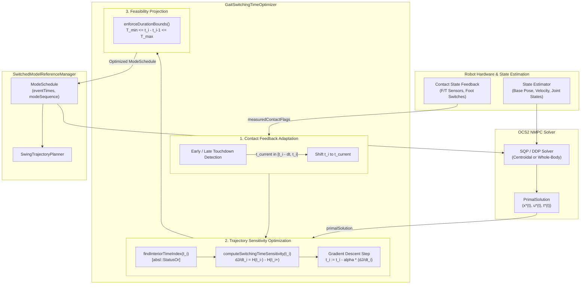

# Gait Switching Time Optimization & Contact Feedback

This module implements **Gait Switching Time Optimization** and **Early/Late Touchdown Reactive Adaptation** for hybrid humanoid Nonlinear Model Predictive Control (NMPC). It enables the MPC to dynamically adjust phase durations (single support vs. double support) based on both analytical cost-to-go sensitivities (Hamiltonian jumps) and real-time contact sensor feedback.

---

## 1. Mathematical Formulation

### 1.1 Hybrid Optimal Control Formulation

Humanoid locomotion is modeled as a switched dynamical system defined over a sequence of $N+1$ discrete contact modes $m_0, m_1, \dots, m_N$ separated by $N$ switching times (event times) $\mathbf{t}_e = [t_1, t_2, \dots, t_N]^T$:

$$\dot{x}(t) = f_{m_i}(x(t), u(t)), \quad t \in [t_i, t_{i+1}]$$

where $x(t) \in \mathbb{R}^{n_x}$ represents the robot state (centroidal momentum, base pose/twist, joint positions) and $u(t) \in \mathbb{R}^{n_u}$ represents the control inputs (contact wrenches or accelerations).

The optimal control problem over the horizon $[t_0, t_f]$ with $t_0 < t_1 < \dots < t_N < t_f$ is:

$$\min_{\mathbf{u}(\cdot), \mathbf{t}_e} J = \Phi(x(t_f)) + \sum_{i=0}^N \int_{t_i}^{t_{i+1}} L_{m_i}(x(t), u(t)) \, dt$$

subject to:
- System dynamics: $\dot{x}(t) = f_{m_i}(x(t), u(t))$
- Contact constraints: $g_{m_i}(x(t), u(t)) \le 0$
- Duration bounds: $T_{\min}(m_i) \le t_{i+1} - t_i \le T_{\max}(m_i)$

---

### 1.2 Switching Time Sensitivity (Hamiltonian Jump)

From the Pontryagin Maximum Principle (PMP) for switched systems, the analytical gradient of the total cost functional $J$ with respect to the $i$-th switching time $t_i$ between mode $m_{i-1}$ and mode $m_i$ is given by the jump in the Hamiltonian across the transition:

$$\frac{\partial J}{\partial t_i} = \mathcal{H}_{m_{i-1}}(x(t_i^-), u(t_i^-), \lambda(t_i^-)) - \mathcal{H}_{m_i}(x(t_i^+), u(t_i^+), \lambda(t_i^+))$$

where the Hamiltonian $\mathcal{H}_m(x, u, \lambda)$ is defined as:

$$\mathcal{H}_m(x, u, \lambda) = L_m(x, u) + \lambda^T f_m(x, u)$$

and $\lambda(t)$ is the costate (Lagrange multiplier) vector satisfying the adjoint dynamics $\dot{\lambda}(t) = -\nabla_x \mathcal{H}_m$.

#### Trajectory Sensitivity Approximation
Along the forward MPC solution trajectory, the instantaneous running cost difference and state-derivative continuity yield the sensitivity:

$$\frac{\partial J}{\partial t_i} \approx \left[ L_{m_{i-1}}(x(t_i^-), u(t_i^-)) - L_{m_i}(x(t_i^+), u(t_i^+)) \right] + \lambda(t_i)^T \left[ f_{m_{i-1}}(x(t_i^-), u(t_i^-)) - f_{m_i}(x(t_i^+), u(t_i^+)) \right]$$

For quadratic tracking objectives:

$$L_m(x, u) = \frac{1}{2} \| x - x_{\text{ref}} \|_{Q}^2 + \frac{1}{2} \| u - u_{\text{ref}, m} \|_{R}^2$$

The gradient update for event time $t_i$ with step size $\alpha > 0$ is:

$$t_i^{(k+1)} = t_i^{(k)} - \alpha \frac{\partial J}{\partial t_i}$$

---

### 1.3 Duration Bounds & Projection

To maintain kinematic feasibility and prevent phase collapse or excessive stance duration, event times are projected onto valid duration bounds:

$$t_i = t_{i-1} + \operatorname{clip}\left( t_i - t_{i-1}, \, T_{\min}(m_{i-1}), \, T_{\max}(m_{i-1}) \right)$$

where:
- Single Support (Swing) Duration: $T_{\text{swing}} \in [T_{\min,\text{single}}, T_{\max,\text{single}}] = [0.25, 0.50]\text{ s}$
- Double Support Duration: $T_{\text{double}} \in [T_{\min,\text{double}}, T_{\max,\text{double}}] = [0.05, 0.20]\text{ s}$

---

### 1.4 Early / Late Touchdown Reactive Adaptation

When contact sensors (force-torque sensors or contact switches) detect an early or late transition:

```
                      Scheduled Event Time t_i
                                 |
           [Early Window]        v        [Late Window]
    |----------------------------|----------------------------|
 t_i - Delta_t_early            t_i                  t_i + Delta_t_late
```

1. **Early Touchdown**:
   If foot contact is detected while the schedule is in swing mode at $t_{\text{current}} \in [t_i - \Delta t_{\text{window}}, t_i]$:
   $$t_i \leftarrow \max\left(t_{\text{current}}, \, t_{i-1} + T_{\min,\text{single}}\right)$$
   This immediately switches the MPC reference into double support to accept load transfer without generating spurious swing tracking errors.

2. **Late Touchdown**:
   If contact is not yet established at scheduled $t_i$, the swing phase is extended:
   $$t_i \leftarrow \min\left(t_{\text{current}} + \delta t_{\text{ext}}, \, t_{i-1} + T_{\max,\text{single}}\right)$$

---

## 2. Block Diagram



---

## 3. Parameter Reference

Configured in `task.yaml` under `gait_optimization`:

| Parameter | Type | Default | Description |
|---|---|---|---|
| `enabled` | `bool` | `true` | Master toggle for gait timing optimization |
| `enableTrajectorySensitivity` | `bool` | `true` | Enables Hamiltonian jump sensitivity optimization |
| `enableContactFeedback` | `bool` | `true` | Enables early/late touchdown reactive adaptation |
| `stepSize` | `double` | `0.05` | Gradient descent step size $\alpha$ for switching times |
| `maxIterations` | `int` | `3` | Maximum optimization iterations per solver cycle |
| `earlyTouchDownTimeWindow` | `double` | `0.15` | Window $\Delta t_{\text{early}}$ (s) before scheduled touchdown |
| `minSingleSupportDuration` | `double` | `0.25` | Lower bound $T_{\min,\text{single}}$ (s) for single support |
| `maxSingleSupportDuration` | `double` | `0.50` | Upper bound $T_{\max,\text{single}}$ (s) for single support |
| `minDoubleSupportDuration` | `double` | `0.05` | Lower bound $T_{\min,\text{double}}$ (s) for double support |
| `maxDoubleSupportDuration` | `double` | `0.20` | Upper bound $T_{\max,\text{double}}$ (s) for double support |

---

## 4. Code Architecture

- [`GaitOptimizationSettings.h`](file:///home/nico-palomo/workspace/wb_humanoid_mpc/humanoid_nmpc/humanoid_common_mpc/include/humanoid_common_mpc/gait/GaitOptimizationSettings.h): Configuration struct and YAML parser with `absl::StatusOr`.
- [`GaitSwitchingTimeOptimizer.h`](file:///home/nico-palomo/workspace/wb_humanoid_mpc/humanoid_nmpc/humanoid_common_mpc/include/humanoid_common_mpc/gait/GaitSwitchingTimeOptimizer.h): Core optimization engine exposing `optimizeEventTimes`, `adaptFromContactFeedback`, `enforceDurationBounds`, and `computeSwitchingTimeSensitivity`.
- [`SwitchedModelReferenceManager.cpp`](file:///home/nico-palomo/workspace/wb_humanoid_mpc/humanoid_nmpc/humanoid_common_mpc/src/reference_manager/SwitchedModelReferenceManager.cpp): Integrates gait adaptation into OCS2 reference callbacks.
- [`testGaitSwitchingTimeOptimization.cpp`](file:///home/nico-palomo/workspace/wb_humanoid_mpc/humanoid_nmpc/humanoid_centroidal_mpc_test/src/testGaitSwitchingTimeOptimization.cpp): Comprehensive unit tests verifying bounds, sensitivity optimization, feedback, and `absl::StatusOr` error propagation.
