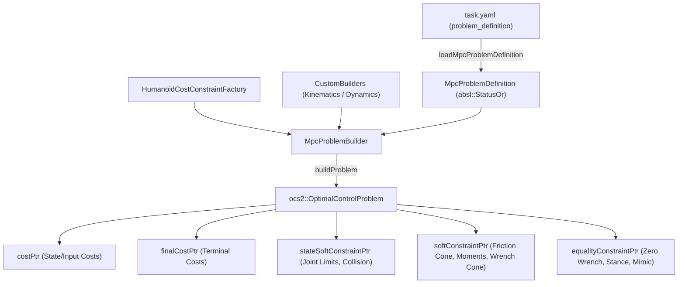

# Runtime-Configurable MPC Problem Definition

This module provides a declarative, runtime-configurable architecture for defining Optimal Control Problems (OCP) in Nonlinear Model Predictive Control (NMPC). Costs, terminal costs, state soft constraints, soft constraints, and equality constraints can be dynamically declared, toggled, and parameterized entirely through robot-specific `task.yaml` files without requiring source code modifications.

---

## Overview

The runtime MPC problem configuration system consists of two primary components:

1. **[`MpcProblemDefinition`](../../include/humanoid_common_mpc/problem/MpcProblemDefinition.h)**: Parses and holds declarative term specifications from YAML with robust validation, strict typing, and `absl::StatusOr` result structures.
2. **[`MpcProblemBuilder`](../../include/humanoid_common_mpc/problem/MpcProblemBuilder.h)**: Instantiates and registers cost and constraint objects into the OCS2 `OptimalControlProblem`, supporting both standard factory-built terms and customizable lambda hooks (`CustomBuilders`).



---

## YAML Configuration Schema

The `problem_definition` block is placed at the top level of a robot's `task.yaml` file:

```yaml
problem_definition:
  costs:
    state_input_cost:
      type: StateInputQuadraticCost
      config_path: stateInputCost
      enabled: true
    task_space_foot_cost:
      type: FootTrackingCost
      config_path: task_space_foot_cost_weights
      per_contact: true
      enabled: true
    task_space_kinematics_cost:
      type: TaskSpaceKinematicsCost
      config_path: task_space_costs
      enabled: true
    icp_cost:
      type: ICPCost
      config_path: icp_cost_weights
      enabled: true
    external_torque_cost:
      type: ExternalTorqueQuadraticCost
      per_contact: true
      enabled: true

  terminal_costs:
    terminal_cost:
      type: TerminalCost
      config_path: terminalCost
      enabled: true

  state_soft_constraints:
    joint_limits:
      type: JointLimitsConstraint
      config_path: jointLimits
      penalty: RelaxedBarrierPenalty
      enabled: true
    foot_collision:
      type: FootCollisionConstraint
      config_path: collision_constraint
      penalty: RelaxedBarrierPenalty
      enabled: true

  soft_constraints:
    friction_force_cone:
      type: FrictionForceConeConstraint
      config_path: contacts.frictionForceConeSoftConstraint
      penalty: RelaxedBarrierPenalty
      per_contact: true
      enabled: true
    contact_moment_xy:
      type: ContactMomentXYConstraint
      config_path: contacts.contactMomentXYSoftConstraint
      penalty: RelaxedBarrierPenalty
      per_contact: true
      enabled: true
    contact_wrench_cone:
      type: ContactWrenchConeConstraint
      config_path: contacts.contactWrenchConeSoftConstraint
      penalty: RelaxedBarrierPenalty
      per_contact: true
      enabled: false

  equality_constraints:
    zero_wrench:
      type: ZeroWrenchConstraint
      per_contact: true
      enabled: true
    zero_velocity:
      type: ZeroVelocityConstraint
      per_contact: true
      enabled: true
    normal_velocity:
      type: NormalVelocityConstraint
      per_contact: true
      enabled: true
    joint_mimic:
      type: JointMimicConstraint
      config_path: mimicJoints
      per_contact: true
      enabled: true
```

---

## Supported Term Types

### 1. Cost Terms (`costs`)

| Term Type | Description | `per_contact` | Builder / Source |
| :--- | :--- | :---: | :--- |
| `StateInputQuadraticCost` | Quadratic penalty on state $(x - x_{ref})^T Q (x - x_{ref})$ and input $(u - u_{ref})^T R (u - u_{ref})$ | No | `HumanoidCostConstraintFactory` |
| `FootTrackingCost` | End-effector Cartesian pose/twist tracking cost for swing feet | Yes | Custom Builder (`CentroidalMpcEndEffectorFootCost` or `EndEffectorDynamicsFootCost`) |
| `TaskSpaceKinematicsCost` | Arm, pelvis, and torso Cartesian tracking costs | No | Custom Builder (`addTaskSpaceKinematicsCosts`) |
| `ICPCost` | Instantaneous Capture Point (ICP) tracking cost | No | Custom Builder (`ICPCost`) |
| `ExternalTorqueQuadraticCost` | Quadratic penalty on external contact torques $(M_{x}, M_{y}, M_{z})$ | Yes | `HumanoidCostConstraintFactory` |

### 2. Terminal Cost Terms (`terminal_costs`)

| Term Type | Description | `per_contact` | Builder / Source |
| :--- | :--- | :---: | :--- |
| `TerminalCost` | Final state quadratic cost $(x(T) - x_{ref}(T))^T Q_f (x(T) - x_{ref}(T))$ | No | `HumanoidCostConstraintFactory` |

### 3. State Soft Constraint Terms (`state_soft_constraints`)

| Term Type | Description | Penalty Function | Builder / Source |
| :--- | :--- | :--- | :--- |
| `JointLimitsConstraint` | Pinocchio model lower and upper joint limits $[q_{min}, q_{max}]$ | `RelaxedBarrierPenalty` | `HumanoidCostConstraintFactory` |
| `FootCollisionConstraint` | Foot-to-foot and knee-to-knee spherical obstacle/self-collision avoidance | `RelaxedBarrierPenalty` | `HumanoidCostConstraintFactory` |

### 4. Soft Constraint Terms (`soft_constraints`)

| Term Type | Description | `per_contact` | Penalty Function |
| :--- | :--- | :---: | :--- |
| `FrictionForceConeConstraint` | Cone constraint $\sqrt{F_x^2 + F_y^2} \le \mu F_z$ | Yes | `RelaxedBarrierPenalty` |
| `ContactMomentXYConstraint` | Yaw and roll moment limits based on normal force $F_z$ | Yes | `RelaxedBarrierPenalty` |
| `ContactWrenchConeConstraint` | Combined polyhedral 6D contact wrench cone ($Au + b \ge 0$) | Yes | `RelaxedBarrierPenalty` |

### 5. Equality Constraint Terms (`equality_constraints`)

| Term Type | Description | `per_contact` | Builder / Source |
| :--- | :--- | :---: | :--- |
| `ZeroWrenchConstraint` | Enforces zero wrench ($F = 0, M = 0$) during swing phase | Yes | `HumanoidCostConstraintFactory` |
| `ZeroVelocityConstraint` | Enforces zero Cartesian linear and angular velocity during stance phase | Yes | Custom Builder (`getStanceFootConstraint`) |
| `NormalVelocityConstraint` | Enforces normal velocity tracking along swing trajectory | Yes | Custom Builder (`getNormalVelocityConstraint`) |
| `JointMimicConstraint` | Enforces kinematic/dynamic joint coupling constraints ($q_{child} = k \cdot q_{parent}$) | Yes | Custom Builder (`getJointMimicConstraint`) |

---

## C++ API & Extensibility

### Loading Problem Definition

```cpp
#include <humanoid_common_mpc/problem/MpcProblemDefinition.h>

const absl::StatusOr<MpcProblemDefinition> problemDefStatus =
    loadMpcProblemDefinition(taskFile, "problem_definition", verbose);
if (!problemDefStatus.ok()) {
  // Handle error (e.g. log status or throw)
  std::cerr << "Error: " << problemDefStatus.status() << "\n";
}
```

### Building the Optimal Control Problem

```cpp
#include <humanoid_common_mpc/problem/MpcProblemBuilder.h>

MpcProblemBuilder::CustomBuilders customBuilders;
customBuilders.footTrackingCostBuilder = [...](size_t contactIndex, absl::string_view name)
    -> absl::StatusOr<std::unique_ptr<StateInputCost>> {
  return std::make_unique<CustomFootCost>(...);
};

const MpcProblemBuilder problemBuilder(problemDefStatus.value(), factory, modelSettings, std::move(customBuilders));
const absl::Status status = problemBuilder.buildProblem(*problemPtr);
if (!status.ok()) {
  throw std::runtime_error("Failed to build OCP: " + status.ToString());
}
```
