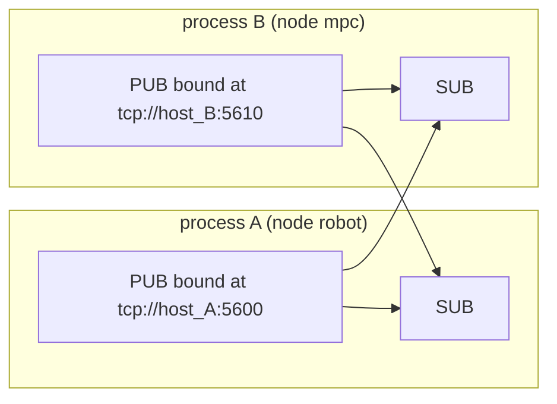

# robot_ipc

The ZeroMQ bus of the distributed runtime, in C++ (`robot::ipc`, target `:robot_ipc`) and in Python
(`import robot_ipc`, target `:robot_ipc_py`). The design, the processes and the topics of the humanoid are in
[`humanoid_nmpc/docs/distributed_runtime/README.md`](../../humanoid_nmpc/docs/distributed_runtime/README.md); this
package is generic and knows none of them.

## The pattern



- A bus with a node name binds **one PUB socket** at the endpoint the network file gives that node. A bus without one
  (`nodeName` empty) only subscribes, and binds nothing.
- Every bus connects **one SUB socket to every endpoint** of the network, its own included, so any process may publish
  any topic and a process receives its own topics too. ZeroMQ reconnects on its own, so processes start in any order
  and survive each other's restarts.
- **Framing**: three frames, `[topic][full protobuf type name][serialized message]`, e.g.
  `["mpc/policy", "humanoid_mpc_msgs.MpcPolicy", <bytes>]`. The C++ and the Python bus frame identically
  (`:cross_language_test`).
- **Exact topics**: ZeroMQ filters by prefix; the bus delivers a message only when frame 0 equals the subscribed topic,
  so `test/a` never receives `test/ab`.
- **Delivery**, per subscription: `kLatest` (`"latest"`) hands over only the newest message of the topic each time the
  IO thread drains the socket, and drops the older ones unparsed; `kAll` (`"all"`) hands over every message in order.

## Threads

Both sockets belong to the bus's **IO thread** (the "receive thread" in Python), which `start()` launches. Handlers and
periodic callbacks run on it, one at a time.

| Call | From | Notes |
|---|---|---|
| `subscribe<Msg>()`, `subscribeRaw()`, `addPeriodicCallback()`, `connect()` | any thread, while the bus is not running | refused while it runs and from a handler |
| `start()`, `stop()` | any thread | idempotent; `stop()` joins; from a handler, `stop()` only asks the loop to end |
| `publish()` | any non-realtime thread | serializes on the caller, queues the frames, wakes the IO thread through an eventfd |
| `publishFromIoThread()` | handlers and periodic callbacks | straight onto the socket, after whatever `publish()` queued before |
| `topicStatistics()`, `statistics()` | any thread | atomic counters |

**A realtime thread never calls the bus.** It exchanges data with a periodic callback through lock-free mailboxes
(`robot::TripleBuffer`, an SPSC queue); the robot process runs such a callback every millisecond. `publish()` takes a
mutex that the IO thread only holds to swap two vectors, but it allocates and serializes, so it has no place on a
realtime thread either.

Nothing throws out of the IO thread: a handler or callback that throws is logged (rate-limited) and counted, and the
bus carries on. Errors of the API are `absl::Status` values in C++ and exceptions in Python (`BusError` for the state
of the bus, `ValueError` and `NetworkConfigError` for bad arguments).

## C++

```cpp
#include "robot_ipc/Bus.h"
#include "robot_ipc/NetworkConfig.h"

ASSIGN_OR_RETURN(robot::ipc::NetworkConfig network, robot::ipc::loadNetworkConfig("config/ipc/network.textproto"));
robot::ipc::BusOptions options;
options.nodeName = "mpc";
options.network = std::move(network);
ASSIGN_OR_RETURN(std::unique_ptr<robot::ipc::Bus> bus, robot::ipc::Bus::Create(std::move(options)));
RETURN_IF_ERROR(bus->subscribe<humanoid_mpc_msgs::MpcObservation>(
    "robot/mpc_observation", robot::ipc::Delivery::kLatest,
    [](const humanoid_mpc_msgs::MpcObservation& observation) { /* on the IO thread */ }));
RETURN_IF_ERROR(bus->start());
bus->publish("mpc/policy", policy).IgnoreError();  // ResourceExhausted when the queue is full
```

| Header | Declares |
|---|---|
| `NodeEndpoint.h` | `NodeEndpoint{name, host, port, bindHost}`, `bindEndpoint()`, `connectEndpoint()`, `kEphemeralPort`, `isWildcardHost()` |
| `NetworkConfig.h` | `NetworkConfig{nodes}`, `find()`, `loadNetworkConfig()`, `parseNetworkConfig()`, `validateNetworkConfig()`, `formatNetworkConfig()`, `localhostNetworkConfig()` |
| `Delivery.h` | `Delivery::kLatest`, `Delivery::kAll`, `deliveryName()`, `parseDelivery()` |
| `BusOptions.h` | `BusOptions`: node name, network, poll period, high-water marks, publish queue, heartbeats, reconnects |
| `TopicStatistics.h` | `TopicStatistics`: sent, sendDropped, received, delivered, superseded, rejected, handlerErrors |
| `Bus.h` | `Bus` |

A `subscribe<Msg>()` handler gets a `const Msg&` that is valid for the call only: the bus parses every message of the
topic into the same object, so that its repeated fields keep their capacity. A message of another type than `Msg`, or
one that does not parse, is rejected and counted.

## Python

```python
import robot_ipc
from humanoid_mpc_msgs import mpc_status_pb2

network = robot_ipc.load_network_config("config/ipc/network.textproto")
bus = robot_ipc.Bus("operator", network)
bus.subscribe("mpc/status", mpc_status_pb2.MpcStatus, on_status, delivery="latest")
with bus:  # start() on entry, close() on exit
    bus.publish("operator/fsm_command", command)  # False when the queue was full
```

`Bus(node_name, network, *, io_poll_period, send_high_water_mark, receive_high_water_mark, publish_queue_capacity,
max_messages_per_drain, heartbeat_interval, heartbeat_timeout, reconnect_interval, reconnect_interval_max)`, with
`subscribe()`, `subscribe_raw()`, `subscribe_all_topics()` (every message of every topic, for tools), `connect()`,
`add_periodic_callback()`, `start()`, `stop()`, `close()`, `publish()`, `publish_raw()`, `publish_from_io_thread()`,
`topic_statistics()`, `statistics()`, `bound_endpoint`, `bound_port`. The network file has `load_network_config()`,
`parse_network_config()`, `validate_network_config()`, `format_network_config()` and `localhost_network_config()`, as
in C++. `robot_ipc.decode(type_name, payload)` parses a
payload by its type name through the protobuf default descriptor pool (import the `*_pb2` modules first);
`robot_ipc.message_class(type_name)` returns the class.

## The network file

`config/ipc/network.textproto` at the repository root (`//config/ipc:network.textproto`) is a textproto of
`robot_ipc_proto.NetworkConfig`, whose schema [`proto/network_config.proto`](proto/network_config.proto) documents
every field:

```textproto
# proto-file: robot_runtime/robot_ipc/proto/network_config.proto
# proto-message: robot_ipc_proto.NetworkConfig
nodes { name: "robot"     host: "127.0.0.1"  port: 5600 }  # the robot process
nodes { name: "mpc"       host: "127.0.0.1"  port: 5610 }  # the MPC node
nodes { name: "operator"  host: "127.0.0.1"  port: 5620 }  # the remote_control GUI
nodes { name: "teleop"    host: "127.0.0.1"  port: 5621 }  # keyboard / Xbox teleoperation
nodes { name: "config_push"  host: "127.0.0.1"  port: 5622 }  # push_robot_config: a configuration file to the robot
```

| Field | Required | Meaning |
|---|---|---|
| `name` | yes | the node name a process publishes as: letters, digits, `_` and `-`, unique |
| `host` | yes | the address the other processes connect to, and the one the node binds; `"0.0.0.0"` (or `"*"`) binds every interface and is reached over loopback, so it only suits one machine |
| `port` | yes | the TCP port, 1-65535 |
| `bind_host` | no | the interface to bind instead of `host`, e.g. `"0.0.0.0"` on a machine whose peers know its address but whose interfaces change |

Both loaders parse the file strictly with protobuf's text format (`google::protobuf::TextFormat`, `text_format`): a
syntax error, an unknown field, a value of the wrong type or a field given twice is an error that names the file, the
line and the column, e.g. `config/ipc/network.textproto:2:21: Message type "robot_ipc_proto.NetworkConfig.Node" has no
field named "prot".` They then validate the nodes, and an error names the node by its position and name, e.g.
`config/ipc/network.textproto: nodes[0] (robot).port: 70000 is not a port in [1, 65535]`. A left-out `name`, `host` or
`port` is such an error too (proto3 reads it as empty or 0). `formatNetworkConfig()` / `format_network_config()` write
a network back as a file, one line per node.

A network built in code may give a node `kEphemeralPort` (0), which binds a port the kernel picks (`boundEndpoint()`,
`boundPort()`); other buses then reach it through `connect()`. The tests use that so that they never collide on a port.

The schema's targets are `:network_config_proto`, `:network_config_cc_proto` (`#include
"robot_ipc_proto/network_config.pb.h"`) and `:network_config_py_proto` (`from robot_ipc_proto import
network_config_pb2`); the file names its nproto struct, `robot::ipc::msgs::NetworkConfig`, which leaves
`robot::ipc::NetworkConfig`, the loader's type, free. The strict parser itself (`src/Textproto.h`, target
`:textproto`) is private to the package; the other configuration files can share it once it moves to a package of
its own.

## Sockets

| Option | Value | Why |
|---|---|---|
| `ZMQ_LINGER` | 0 | a process exits at once |
| `ZMQ_SNDHWM`, `ZMQ_RCVHWM` | 1000 (`BusOptions`) | a PUB socket never blocks; at the high-water mark ZeroMQ drops for that subscriber, which no counter of the publisher sees |
| `ZMQ_HEARTBEAT_IVL` / `_TIMEOUT` / `_TTL` | 1 s / 3 s / 3 s | a peer that went silent is disconnected, and the SUB socket starts reconnecting |
| `ZMQ_TCP_KEEPALIVE` | on, idle 2 s, interval 1 s, 3 probes | the transport notices a vanished machine too |
| `ZMQ_RECONNECT_IVL` / `_MAX` | 100 ms / 1 s | a restarted node is back within a second |
| `ZMQ_IMMEDIATE` (SUB) | 1 | no pipe for a node that is not up |

Only IPv4 addresses and host names are supported.

## Statistics

Per topic, readable from any thread: `sent` (written to the PUB socket), `sendDropped` (refused because the publish
queue was full), `received` (read from the SUB socket with exactly this topic), `delivered`, `superseded` (`kLatest`:
replaced by a newer message of the same drain), `rejected` (not three frames, another type, or not parseable) and
`handlerErrors`. After a drain, `received == delivered + superseded + rejected`.

## Tests

`bazel test //robot_runtime/robot_ipc/...` runs, over loopback TCP on ephemeral ports:

- `:network_config_test`, `:network_config_py_test`: parsing; a table of malformed textprotos, each rejected with its
  line and column; a table of invalid nodes, each rejected naming the node; `format` and `parse` round-tripping; the
  shipped file equal to `localhostNetworkConfig()`. The two languages check the same tables (`LINT.IfChange`);
- `:bus_test`, `:bus_py_test`: exact topics, `kLatest` against `kAll` on a burst, several publishing threads, a
  subscriber started before its publisher, a restarted publisher, a prompt `stop()`, drops at the publish queue's
  capacity, malformed messages from a bare ZeroMQ socket, throwing handlers, periodic callbacks;
- `:cross_language_test`: Python publishes, the C++ `:bus_echo` binary answers, and the other way round;
- `:textproto_test`: the strict parser on its own: unknown fields, fields given twice, deprecated fields and syntax
  errors each name their line and column.

The protos (`proto/network_config.proto`, package `robot_ipc_proto`; the test messages `test/test_sample.proto`,
`test/test_event.proto` and `test/test_settings.proto`, package `robot_ipc_test`) follow the repository's proto rules: one message per file named
after it, its `// Next ID` comment and `reserved ... to max;` line, and the nproto struct option.
